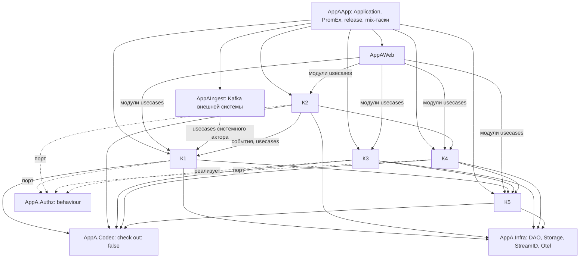

# Целевая архитектура потребителя A: сборка из исследованных подходов

- Дата: 2026-10-02
- Входы: `research/01-elixir-architectures.md` (подходы, первоисточники; ссылки вида [BND] — оттуда),
  `research/02-consumer-a-structure.md` (структура потребителя A на `e380d63`; ссылки вида «02 §12.2»).
- Рамка: свод `docs/rules/**` и ADR библиотеки не учитывались. Библиотека `Core.*` — данность: агрегаты
  decide/evolve, хранилище событий, проекции, outbox, репозитории и кодеки остаются её механизмом.
- Статус: предложение. Каждый элемент подтверждается или меняется опросом; решения — в `decisions.md`.

## Итог

Одно OTP-приложение. Предметный контекст — граница Boundary с явными `deps` / `exports`. Внутри контекста
код разложен по агрегату (вертикаль); usecases агрегата — по модулю на актора и общий модуль чтения. Агрегат
(decide/evolve) — functional core, usecase — imperative shell: проверяет доступ через порт, грузит, решает,
пишет, при необходимости ждёт проекцию. Порт-behaviour — только там, где адаптеров два и больше: внешние
системы, кеш, авторизация. Контексты связаны вызовом чужих модулей usecases и событиями, контракт которых
(модуль события и топик) экспортирует производитель. Всё, что сейчас перечисляется в центральных реестрах,
контекст объявляет у себя, а корень приложения собирает список контекстов. Входы по HTTP и из внешнего
брокера — отдельные interface-границы; реакции на доменные события — в реагирующем контексте.

## Почему сборка, а не готовая архитектура

- Ни один первоисточник не описывает ES-приложение на ~800 модулей; подходы делятся на «единицу
  модульности» и «устройство внутри единицы» и сочетаются (01, «Совместимость элементов»).
- Все четыре живых open-source приложения границ механически не держат (01 §11): копировать нечего.
- У потребителя A главные трения — не направления зависимостей между контекстами (циклов нет, 02 §3), а
  реестры, дублирование и раздробленность понятия (02, «Итог»). Значит, выбор единицы модульности решает
  меньше половины задачи; вторая половина — устройство внутри контекста.

## Схема границ

Все узлы — границы верхнего уровня: `AppA` сам границей не является (`decisions.md`, Q17). `AppAApp` —
композиционный корень (граница `XyzApp` у Jurić [TME3]): единственный, кто знает все контексты и выбирает
реализацию порта авторизации. Стрелки — `deps` Boundary. Инфраструктура и корень — A16, имена — A17.

## Элементы сборки

Формат: решение → против какого трения → опора → цена.

### A1. Одно OTP-приложение; контекст — граница Boundary

- Каждый контекст — граница верхнего уровня с явными `deps` и `exports`; `AppA` сам границей не является.
  `AppAWeb` и `AppAIngest` зовут только экспортированные модули usecases; корень приложения — отдельная
  граница. Предупреждения Boundary в CI — ошибки (`decisions.md`, Q1, Q17).
- Трение: Boundary стоит только на `AppA` / `AppAWeb`, внутри направления держатся конвенцией (02 §3, §12.9);
  связь `Perms` → К3 не видна в `alias` (02 §12.10).
- Опора: Boundary проверяет вызовы компилятором [BND, BND-DOC]; «single project + boundary» даёт то же, что
  umbrella без раздельного деплоя [SJ-F1].
- Цена: каждый модуль классифицирован; списки `exports`; test support — граница без проверок [BND-DOC];
  включение по частям через `check: [out: false]` [BND-70]. Подграницы зависеть от подграниц чужой границы
  не могут, ре-экспорт через родителя требует двойного списка — отсюда границы верхнего уровня (Q17).

### A2. Интерфейс контекста — модули usecases агрегата

- Граница контекста экспортирует модули usecases акторов (`<Aggregate>.<Actor>.Usecases`) и общий модуль
  чтения агрегата (`<Aggregate>.Usecases`) с декларацией допущенных акторов; в модуле актора — только его
  usecases. Плюс View, типы ID и события-контракты. Агрегат, репозиторий, схемы и проекция не
  экспортируются (`decisions.md`, Q7).
- Трение: модули-оглавления контекстов пусты — только `@moduledoc` (02 §9); контроллер держит usecases двух
  срезов (02 §4); чтение повторено в двух срезах (02 §12.4); К2 читает ReadRepo и ждёт проекцию К1 напрямую
  (02 §6).
- Опора: «The context is your public API, the other modules are private» [PX6]; модуль контекста шлёт
  команду и читает проекцию в Conduit [CDT]; code interface Ash как контракт домена (01 §7).
- Цена: у К1 экспортов — по несколько модулей на каждый из 10 агрегатов. Длинный `exports` Boundary считает
  признаком дробления [BND-DOC] — здесь он отражает число ресурсов и акторов.

### A3. Внутри контекста — вертикаль по агрегату; срезов по актору нет

- Каталог агрегата содержит всё о нём: решение, команды, события, репозиторий, read-модель с проекцией,
  usecases. Срезы-каталоги `common` / `actor_x` / `actor_y` / `system` / `admin` на уровне контекста
  упраздняются; у актора — подкаталог в каталоге агрегата: usecases и, при своём ACL-фильтре или своей
  форме данных, ReadRepo и View (`decisions.md`, Q2, Q22). Не принадлежащее одному агрегату — каталоги
  контекста по виду: `values/`, `errors.ex`, read-модель по назначению, `reactions/` (Q21).
- Конструктор сценариев и справочники — подграницы К1; агрегаты А1–А7 — в одной границе К1 (`decisions.md`,
  Q15). Шаг конструктора объявляет и поведение, и форму нагрузки (02 §12.11). То, что из подграниц нужно web
  и ingest (usecases справочников, объявления шагов), К1 ре-экспортирует поимённо.
- Трение: срезы `actor_x` / `actor_y` делят одно пространство разрешений и дублируют ≥ 12 функций чтения,
  недостижимых из `lib/` (02 §12.4); запись и чтение справочника — в двух срезах и двух каталогах (02 §8,
  поток 3); co-change по истории вертикальный: К1.common + `actor_x` — 28, `actor_x` + `actor_y` — 13
  (02 §10).
- Опора: Conduit — каталог контекста с агрегатами, проекциями и запросами внутри [CDT]; Phoenix не
  регламентирует внутренности контекста [PX6].
- Цена: перенос всего `lib/app_a/domain`; актор остаётся в структуре — модулем usecases внутри агрегата.

### A4. Файл — по понятию, а не по артефакту

Отклонён (`decisions.md`, Q3): гранулярность файлов остаётся прежней.

### A5. Контекст объявляет своё, корень собирает

- Контекст отдаёт списки: проекции, плагины кодека, пространства разрешений, дети супервизора,
  наблюдаемые процессы. `Application`, кодек, дерево проекций, PromEx и тестовые прогоны проекций строятся
  из одного списка контекстов в `AppAApp`.
- Трение: самое сильное по доказательствам — добавление справочника трогает 64–74 файла и одни и те же
  6–7 центральных списков (02 §12.2); реестр кодека на 104 строки — 35 коммитов (02 §12.2).
- Опора: компонент со своим деревом — DESO [DES1], `supervisor.ex` контекста в Conduit [CDT].
- Цена: корень границы контекста несёт объявления; цикл «кодек ↔ контексты» снимает A15.

### A6. Справочники внешней системы — одна единица К1 с одним механизмом

- С1..С4 остаются в К1 своей единицей; вид справочника объявляет реквизиты (разбор записи — в `AppAIngest`), общий
  механизм приёма, записи, проекции и чтения — один глубокий модуль. Отдельный контекст — когда справочники
  начнёт читать второй контекст (`decisions.md`, Q5).
- Трение: С1..С4 — листья графа К1 (02 §3); после подстановки имени 73–82 % кода каталога совпадают,
  system-usecases — 83–100 %, различие живёт в `Record` (02 §12.3).
- Опора: deletion test — удаление копий концентрирует сложность в одном месте (02 §9); единица растёт там,
  где меняется вместе (02 §10: отпечаток трёх коммитов).
- Цена: механизм-макрос — compile-time связь всех справочников с ним (01 §10).

### A7. Read-модель не маппит таблицы чужого контекста

- Внутри контекста join своих таблиц проекций допустим. Данные чужого контекста — событиями в свою проекцию
  или вызовом его модуля usecases: К3.А3 строит копию нужных полей К5 из событий К5 (`decisions.md`, Q8).
- Трение: К3.А3 маппит таблицу проекции К5 (02 §12.5). Цикл понятий А1 ↔ А2 внутри К1 — только на стороне
  чтения и остаётся.
- Опора: Phoenix и Jurić допускают общие таблицы [PX4, SJ-F4], DDD — нет [EE-REF]; компромисс по месту:
  внутри контекста — Phoenix, между контекстами — DDD (01, «Конфликтуют»).
- Цена: ещё одна проекция К3 на событиях К5 и её пересборка.

### A8. Связь контекстов: модули usecases для запросов, события для реакций

- Запрос или команда другому контексту — вызов его модуля usecases. Реакция на чужое изменение — подписка на
  событие; модуль события и топик экспортирует производитель, у потребителя нет литерала топика. К2 читает К1
  читающим usecase с `wait:` — ожидание последнего события потока покрывает событие реакции (`decisions.md`,
  Q9).
- Трение: топики — строковые литералы в двух модулях двух контекстов (02 §12.6); правила К2 ждут проекцию
  К1 и читают её ReadRepo, адаптер канала К2 читает write-Repo К4 (02 §6).
- Опора: события в `exports` при `deps: [Accounts]` (01, «Сочетаются», Э7 и Э2); handler Conduit ловит
  событие чужого контекста [CDT]; Published Language [EE-REF].
- Контракт — сами доменные события производителя; отдельные интеграционные события — когда события начнёт
  читать система вне приложения (`decisions.md`, Q20).
- Цена: события-контракты — публичный API, их версионирование становится заботой производителя.

### A9. Авторизация — порт на входе usecase

- Usecase начинается с проверки доступа через порт `AppA.Authz`. Декларация доступа: на модуле актора — тип
  учётной записи и пространство разрешений, на usecase — операция. Боевая реализация — К3 с кешем, выбор —
  в корне; тесты предметной логики — с тестовой реализацией; авторизация каждой операции — отдельным
  интеграционным тестом (`decisions.md`, Q10).
- Трение: `check_user/2` вшит в каждый из 30 usecases, источник — К3 через скрытую зависимость (02 §3);
  тест usecase поднимает три контекста, тесты на 600+ строк, 60 модулей `async: false` (02 §12.8).
- Опора: middleware авторизации у Commanded [CMD-CMD]; инверсия через behaviour [TME2]; Mox — `async: true`
  на одном моке [MOX]; на каждый мок — интеграционный тест [JV1].
- Цена: порт с двумя реализациями; интеграционный тест авторизации на операцию.

### A10. Read-after-write — опция операции, а не забота web

- Изменяющий usecase принимает `wait:` и сам ждёт проекцию после commit, возвращая представление; web
  проекций не знает (`decisions.md`, Q6).
- Трение: 9 контроллеров зовут `<Agg>.Projection.await` модуля домена и повторяют `awaiting/1` (02 §12.7).
- Опора: `consistency: :strong` на dispatch у Commanded [CMD-CMD].
- Цена: usecase знает свою проекцию — это и есть её место (A3).

### A11. Входящие адаптеры — по виду входа

- Сообщения внешнего источника (обработчики Kafka, разбор Avro, дерево DLQ) — граница `AppAIngest` рядом с
  `AppAWeb`, `deps` только на модули usecases. Реакция на доменное событие (синхронизация К1, уведомления
  К2, инвалидатор кеша К3) — в реагирующем контексте. Oban-воркер — в контексте, чей usecase он выполняет;
  постановку задачи этот контекст экспортирует функцией, которую зовут в своей транзакции.
  mix- и release-задачи — в корне `AppAApp`. Дерево подписчика с DLQ — один параметризуемый модуль
  (`decisions.md`, Q11). Внутри контекста реакция и воркер лежат в каталоге агрегата, чей usecase вызывают;
  несколько агрегатов — `reactions/` контекста (Q16).
- Трение: корни подписчиков К1 и К2 совпадают на 92 %, К3.R1 — на 65 % (02 §7); корни компонентов лежат то
  в `system`, то в `common` (02 §7).
- Опора: протокол-специфичное — interface [TME2], вход — primary-адаптер [AC1]; реакция на событие живёт
  в контексте, как handler и process manager Commanded [CMD-PM, CDT].
- Цена: ещё одна граница верхнего уровня; правило «реакция — у реагирующего» требует, чтобы производитель
  экспортировал модули событий и топик (A8).

### A12. Процессы контекста — его поддерево

Покрыт A5 (`decisions.md`, Q4).

### A13. Тесты по уровням

- Агрегат — given/when/then без БД, `async: true`, включая С1..С4 и А6; usecase — с тестовой реализацией
  `AppA.Authz` и данными только своего контекста; авторизация — интеграционный тест на операцию с боевой
  реализацией; web — по ресурсу; сквозные пути — немногочисленные flow-тесты (`decisions.md`, Q14).
- Трение: решения С1..С4 и А6 без тестов агрегата (02 §12.8); вход в тест usecase — три контекста (02 §11).
- Опора: тест ядра без двойников [GB2]; given/when/then Commanded [CMD-T]; тест через интерфейс по умолчанию,
  с оговоркой о масштабе [TME5].

### A14. Web — по ресурсу, с общим поведением по умолчанию

- Ресурс web — контроллер, разбор параметров, схемы; презентер по умолчанию общий, свой — только при
  отличии; шаг конструктора объявляет форму нагрузки, web строит из неё OpenAPI-схему (`decisions.md`, Q12).
- Трение: 10 из 20 презентеров с одинаковым телом (02 §4); карта «шаг → схема» ведётся вручную (02 §12.11).

### A15. Кодек — граница верхнего уровня без проверки исходящих ссылок

- Фасады кодека и Prim-профили — граница `AppA.Codec` с `check: [out: false]`: ссылки на плагины не
  проверяются, `deps` у неё нет. Контексты экспортируют плагины и `codec_plugins/0`, объявляют
  `deps: [AppA.Codec]` (`decisions.md`, Q17; заменяет Q13).
- Трение: цикл «реестр кодека ↔ контексты» (02 §12.10); реестр на 104 строки — 35 коммитов (02 §12.2).
- Опора: граница с `out: false` не имеет `deps` и не попадает в поиск циклов (`boundary` 0.10.4,
  `checker.ex:34-40, 136-150`, `definition.ex:169`).
- Цена: исходящие ссылки кодека не проверяются; фасад по-прежнему зависит от всех плагинов при компиляции
  (`lib/core/codec/facade.ex:44-57`) — каскад перекомпиляции не уменьшается.

### A16. Инфраструктура, порт авторизации и корень

- `AppA.Infra` — граница-сток без зависимостей на домен: `DAO`, `Storage`, `StreamID`, `Otel`, телеметрия
  подписчиков; от неё зависят контексты, web и ingest — нет. `AppA.Authz` — порт и макрос декларации
  доступа; реализация и проверка типа учётной записи — в К3 через К5. `ContextFactory` — экспорт К5,
  `Command.execute_all/3` — внутренний модуль К3. Корень `AppAApp` — `Application`, сборка контекстов, дерево
  outbox, PromEx, `MetricsServer`, `Release`, mix-таски. `AppATest` — test support с
  `check: [in: false, out: false]` (`decisions.md`, Q18).
- Трение: инфраструктура знает внутренности домена — `Perms` читает К3, реестр деклараций ищет модули по
  префиксу (02 §12.10); проверка «web не зовёт DAO» держится тестом (02 §4).
- Опора: sink-граница `Xyz.Infra` закрывает Repo от всех вне core [TME3]; test support — граница без
  проверок [BND-DOC].

### A17. Пространство имён и корневой модуль контекста

- Префикс `AppA.Domain.<BC>` остаётся, модуля `AppA.Domain` нет. Корневой модуль контекста — корень его
  границы: `use Boundary`, объявления A5 и `@moduledoc` с картой контекста (`decisions.md`, Q19).
- Трение: модули-оглавления держат только `@moduledoc` (02 §9).

## Отвергнутые варианты

| Вариант | Почему нет |
|---|---|
| Umbrella / poncho | раздельного деплоя нет; общий конфиг и версии [MIX-P]; ту же границу даёт Boundary [SJ-F1] |
| Контексты без принуждения | так живут hexpm и Plausible (01 §11); у A уже дрейф: скрытые связи, циклы (02 §12.9) |
| Срез на операцию (VSA) | умножает мелкие модули — обратное трению 02 §12.1; против — [SJ-F5] |
| Порт на каждый репозиторий | 35 из 36 с одним адаптером — гипотетические швы (02 §9); [JV1] |
| Commanded / Ash как фреймворк | дублируют механизм `Core.*` (01 §6, §7); идеи — в A2 и A10 |
| Общая граница схем (`XyzSchemas`) | противоречит A7: схема — деталь контекста (01, «Конфликтуют») |
| Минимум: Boundary поверх срезов | снимает 02 §12.2, 12.6, 12.7, 12.9, 12.10; оставляет 12.1, 12.3, 12.4, 12.8 |

## Влияние на библиотеку

Не решения этой работы — список того, что сборка потребует от core-ex или упрётся в него:

- параметризуемое дерево подписчика с DLQ (A11);
- `wait:` у изменяющего usecase поверх `Projection.await/3` (A10);
- фасад кодека собирается при компиляции из плагинов всех контекстов (A15): каскад перекомпиляции —
  предмет отдельного решения в библиотеке.

Решения о контракте для всех потребителей — `decisions.md`, раунды 6 и 7.

## Куда ведёт

1. Опрос по элементам A1–A17 → `decisions.md` (раунды 1–4).
2. Решения, которые трудно отменить, — кандидаты в ADR потребителя A.
3. Сверка итога с `docs/rules/app/**` и ADR-0023 / 0024 / 0025 core-ex: каждое расхождение — кандидат на
   правку контракта для всех потребителей.
4. Spec миграции потребителя A и тикеты — по итогу сверки.
