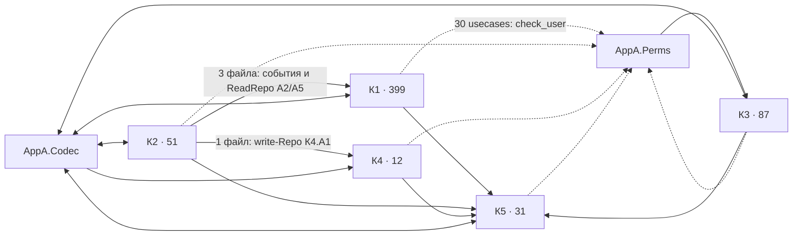
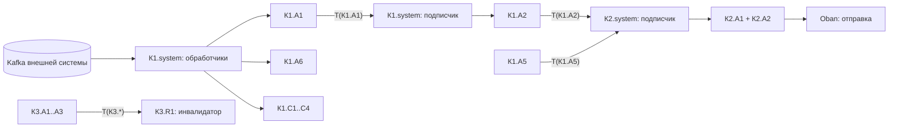

# Потребитель A: фактическая структура приложения

- Дата: 2026-10-02
- HEAD потребителя A: `e380d63` (233 коммита, 2026-08-19 … 2026-10-01)
- Библиотека: core-ex `v0.10.0` git-тегом

## Вопрос

Как на деле устроен потребитель A: из каких модулей (в смысле codebase-design — от функции до среза) он
состоит, куда направлены зависимости, где проходят реальные швы (seam), насколько локальны изменение и
проверка (locality), что даёт вызывающему глубина модулей (depth, leverage) и где понять одно понятие
значит обойти много мелких модулей. Оценка — по связности, направлениям зависимостей, тестируемости и
навигации; соответствие своду правил не оценивается.

## Методика

- Только чтение: `find`, `grep`, `wc`, `git log --name-only`. Компилятор, тесты и `mix` не запускались.
- Единица верхнего уровня — каталог `lib/app_a/domain/<контекст>/<срез>`; прочие `lib/app_a/<x>` —
  инфраструктурные модули; web — `public_api`, `system_api` и корень `lib/app_a_web` (`shared`).
- Зависимость X → Y — файл единицы X упоминает модуль единицы Y полным именем (в том числе в `alias`).
  `@moduledoc`, `@doc` и комментарии вырезаны до поиска. Число в матрице — количество файлов-источников.
- Размер — физические строки файла; «строки кода» — без `@moduledoc`/`@doc`/комментариев.
- Co-change — по `git log --name-only`; коммиты, задевшие больше 6 единиц `lib/`, считаются «широкими» и
  разобраны отдельно, иначе они заглушают реальные пары.
- Словарь — codebase-design: module, interface, depth, seam, adapter, leverage, locality, deletion test.

### Метки

Предметные имена заменены нейтральными метками; соответствие хранится вне репозитория.

| Метка | Роль |
|---|---|
| К1 | основной контекст: приём документов внешней системы и их обработка по сценариям шагов |
| К2 | уведомления: заводит уведомления по событиям К1 и отправляет их по каналам |
| К3 | разрешения: разрешения, роли из них, роли учётной записи, эффективные разрешения |
| К4 | профили: контактные сведения сотрудника вне учётной записи |
| К5 | учётные записи и текущий пользователь запроса |
| `common` / `system` / `admin` | срезы: ядро контекста / системный актор / администратор |
| `actor_x` / `actor_y` | срезы двух ролей сотрудника: исполнитель / руководитель (тип учётной записи один) |
| К1.А1 | входящий документ внешней системы: грузится из Kafka, на справочники ссылается по id |
| К1.А2 | документ обработки с жизненным циклом, не больше одного на А1 |
| К1.А3 | проверка позиции А2 по шагам сценария |
| К1.А4 | проверка сопутствующего объекта по шагам сценария |
| К1.А5 | итоговый документ по результатам проверок |
| К1.А6 | документ-корректировка внешней системы к А1 |
| К1.А7 | вложение-файл: байты в объектном хранилище, строка состояния в БД |
| К1.С1..С4 | справочники внешней системы |
| конструктор | конструктор сценариев шагов К1: шаги, шаблоны, реестр, кодек шагов |
| К2.А1 / К2.А2 | уведомление получателю / отправка уведомления по каналу |
| К3.А1 / А2 / А3 / R1 | разрешение / роль / роли учётной записи / эффективные разрешения (read-модель без таблицы) |
| К4.А1, К5.А1 | профиль; учётная запись |
| Т(X) | топик событий агрегата X во внутреннем брокере (RabbitMQ Stream) |

## 1. Дерево `lib/`, `test/`, `config/`, `priv/`

`lib/` — 785 файлов, 946 `defmodule`, 47 417 строк; строк кода из них 28 982 (61 %), остальное —
документация модулей и функций.

```text
lib/                                    785
├── app_a.ex, app_a_web.ex              корни Boundary: `AppA` (deps: [], exports: :all), `AppAWeb`
├── mix/tasks/                            2  quick_start, seed_demo
├── app_a/                              626
│   ├── 12 файлов корня                      application, projections, codec, command, context_factory, dao,
│   │                                        stream_id, metrics_server, otel, prom_ex, release, storage
│   ├── perms/ 8 (registry/ 3)               механизм разрешений: Declare, Ops, PermChecker, Registry, Catalog
│   ├── prom_ex/ 6, storage/ 3, codec/ 4, release/ 2, auth/ 2, otel/ 1, outbox/ 1, dao/ 1, subscribers/ 1
│   └── domain/                         585  5 индексных модулей (только @moduledoc) + 5 контекстов
│       ├── к1/                         399  common 362 · actor_x 6 · actor_y 7 · system 24
│       ├── к2/                          51  common 45 · actor_x 1 · system 5
│       ├── к3/                          87  common 83 · admin 3 · system 1
│       ├── к4/                          12  common 11 · admin 1
│       └── к5/                          31  common 26 · admin 4 · system 1
└── app_a_web/                          155
    ├── 6 файлов корня                       endpoint, router, accepted, fallback_controller, error_json, error_mapper
    ├── plugs/ 3, presenters/ 1, schemas/ 8
    ├── public_api/v1/                  101  9 ресурсов + api_spec + presenters/ 2 + schemas/ 4
    └── system_api/v1/                   36  security/ 25 (3 ресурса) · <к5.а1>/ 10 (ресурс + подресурс К4)
```

Внутри `к1/common` (362 файла) — каталог на агрегат или понятие:

| Понятие | Файлов | Понятие | Файлов |
|---|---|---|---|
| А2 | 45 | А6 | 24 |
| А1 | 40 | С1, С2, С4 | по 22 |
| конструктор | 36 | С3 | 23 |
| А4 | 35 | А7 | 17 |
| А3 | 34 | значения V1..V5 | 15 |
| А5 | 27 | | |

Типовой каталог event-sourced агрегата: `<а>.ex` (decide/evolve), `<а>/cmd.ex` + `cmd/*`, `<а>/event.ex` +
`event/*` + `event/codec.ex`, `errors.ex`, `outbox.ex`, `projection.ex`, `repo.ex` + `repo/pg.ex`,
`read_repo.ex` + `read_repo/pg.ex` + `read_repo/pg/{schema,specs}.ex` (+ `schema/*`), `view.ex`, Prim/Enum
значений. Глубина `lib/app_a/domain/к1/common/<а>/read_repo/pg/schema/*.ex` — 9 уровней пути.

```text
test/                                   359  239 *_test.exs; ≈30,6 тыс. строк .exs
├── test_helper.exs
├── app_a/                              215  9 файлов корня
│   ├── domain/                         184  к1 116 (common 87 · actor_x 6 · actor_y 4 · system 19)
│   │                                        к2 24 · к3 28 · к4 7 · к5 9
│   └── perms/ 6, prom_ex/ 8, release/ 2, storage/ 2, auth/ 1, dao/ 1, es/ 1, repo/ 1
├── app_a_web/                           24  public_api/ 11 · system_api/ 6 · plugs/ 1 · корень 6
└── support/                            119  38 модулей (фикстуры, seed, case, контракты, пробы)
                                             + fixtures/events/ — 81 golden JSON в 15 каталогах агрегатов
```

- `config/` — 5 файлов, 538 строк; `runtime.exs` — 298. Тумблеры и параметры компонентов лежат под
  ключами модулей домена: корни подписчиков К1 и К2, корень загрузки из Kafka, инвалидатор К3.R1,
  адаптер канала К2, источник данных правил К2, usecase А7. Подмена реализации репозитория — одна
  (`К3.R1.ReadRepo` → `Cached`, в test — обратно на `Pg`); остальные 35 из 36 репозиториев выводятся
  конвенцией `<Behaviour>.Pg` (115 вызовов `Core.Config.repo!/1`).
- `priv/` — `dao/migrations` (51 миграция), `dao/seeds.exs`, `static/` (2).

## 2. Единицы верхнего уровня

Использование макросов `Core.*` по всему `lib/` (вызовы `use`):

| Макрос | Раз | Макрос | Раз |
|---|---|---|---|
| `Es.Event` | 81 | `Core.Es.Aggregate` / `.Repo` / `.Repo.Pg` | по 15 |
| `Core.Es.Cmd` | 60 | `Core.Es.Projection` | 14 |
| `Core.Prim.DateTime` | 49 | `Core.Codec.Plugin` | 13 |
| `Core.Prim.String` | 34 | `Es.Event.Codec` | 15 |
| `Core.Enum` | 29 | `Es.Outbox` | 9 |
| `Core.View` | 20 | `Core.Es.KeyReservation` | 4 |
| `Repo.Pg` / `Repo` (read и state-stored) | 20 / 19 | `Core.Repo.Pg.Schema` | 20 |
| `Core.Prim.UUID` | 19 | `AppA.Perms.Declare` | 30 |

Состав единиц (файлов / строк):

- **К1.common** (362 / 21 199):
  - ES-агрегатов 10 (А1–А6, С1–С4): 59 событий, 40 команд, 10 кодеков событий, 5 outbox (А1–А5),
    10 проекций, 1 резерв ключа (А4);
  - state-stored без событий — А7 (write- и read-Repo на одну таблицу);
  - конструктор: 36 файлов, 4 826 строк; 13 модулей шагов на макросе конструктора (10 вида 1, 3 вида 2),
    шаблон, реестр, кодек шагов;
  - значения V1–V5 (15 файлов).
- **К1.actor_x** (6 / 1 406) — usecases исполнителя: А2, А3, А4, А5, А7, чтение А1.
- **К1.actor_y** (7 / 732) — usecases руководителя: назначение в А2/А3/А4, отмена А2/А4, приоритет А1,
  чтение А1–А5, С1, С4.
- **К1.system** (24 / 2 579) — 8 usecases (А1, А2, А6, А7, С1–С4); 5 обработчиков Kafka + 5 `Record`
  (разбор Avro) + фильтр + нормализатор id + корень дерева Kafka; Stream-подписчик + корень; Oban-воркер
  уборки А7.
- **К2.common** (45 / 2 825) — К2.А1, К2.А2: state-stored без событий (write- и read-Repo на одну
  таблицу); правила: реестр, макрос-билдер, П1 (события К1.А2), П2 (события К1.А5), источник данных;
  канал: behaviour, 3 адаптера (2 боевых и заглушка), реестр; шаблон, заготовка.
- **К2.actor_x** (1 / 158) — лента, счётчик непрочитанных, отметка прочтения.
- **К2.system** (5 / 580) — 2 usecases (завести по событию, отправить), Stream-подписчик + корень,
  Oban-воркер отправки.
- **К3.common** (83 / 3 561) — ES-агрегаты А1–А3: 15 событий, 14 команд, 3 outbox, 3 проекции, 2 резерва
  ключей. R1: свёртка потоков `Pg`, кеш `Cached` (Cachex), инвалидатор (Stream-подписчик), корень
  дерева. Тип пространства имён.
- **К3.admin** (3 / 713) — администрирование А1–А3; **К3.system** (1 / 205) — начальное заведение по
  реестру разрешений.
- **К4.common** (11 / 331) — ES-агрегат А1 (2 события, 1 команда), без проекции и outbox; id потока —
  id К5.А1. **К4.admin** (1 / 139).
- **К5.common** (26 / 1 131) — ES-агрегат А1 (5 событий, 5 команд, outbox, проекция, резерв ключа),
  аксессор текущего пользователя, 2 служебные учётные записи.
- **К5.admin** (4 / 272) — администрирование + собственный ReadRepo с фильтром доступа; **К5.system**
  (1 / 97) — начальные учётные записи.
- **`AppA.Perms`** (8 / 964) — `use AppA.Perms.Declare, ns: …` в usecase даёт `check_user/2`; реестр
  деклараций собирается на старте обходом модулей с префиксом `AppA.Domain.`; каталог пространств имён —
  ручной список.
- **Прочая инфраструктура** (34 / 2 334) — Application, список проекций, реестр плагинов кодека
  (47 плагинов), 2 фасада + 2 Prim-профиля, фабрика контекста, outbox-дерево, storage (behaviour + S3 +
  Mock), PromEx (+6 плагинов), release (+QuickStart 54 строки, SeedDemo 760), otel,
  `Command.execute_all/3`.
- **web** (155 / 7 926) — 14 контроллеров, 101 модуль OpenAPI-схем, 20 презентеров, 9 разборщиков
  параметров, 3 плага.

## 3. Матрица зависимостей

Код без документации, число файлов-источников. Пустая клетка — ссылок нет.

| Источник ↓ / цель → | К1.c | К2.c | К3.c | К4.c | К5.c | свой common | инфраструктура |
|---|---|---|---|---|---|---|---|
| К1.common | — | | | | 123 | — | codec 16, dao 21, stream_id 3 |
| К1.actor_x | 6 | | | | 5 | 6 | perms 6, codec 1, dao 1, storage 1 |
| К1.actor_y | 7 | | | | 4 | 7 | perms 7 |
| К1.system | 19 | | | | 7 | 19 | perms 8, context_factory 3, dao 2, subscribers 2, storage 1 |
| К2.common | 3 | — | | 1 | 13 | — | codec 7, dao 3 |
| К2.actor_x | | 1 | | | 1 | 1 | perms 1, dao 1 |
| К2.system | | 4 | | | 2 | 4 | perms 2, codec 2, context_factory 2, dao 2, subscribers 2 |
| К3.common | | | — | | 42 | — | codec 4, dao 3, subscribers 2, context_factory 1 |
| К3.admin | | | 3 | | 3 | 3 | perms 3, command 2, codec 1 |
| К3.system | | | 1 | | 1 | 1 | perms 1, command 1, dao 1 |
| К4.common | | | | — | 7 | — | |
| К4.admin | | | | 1 | 1 | 1 | perms 1 |
| К5.common | | | | | — | — | codec 1, dao 1 |
| К5.admin / К5.system | | | | | 4 / 1 | 4 / 1 | perms 1 / dao 1 |

Обратные направления (инфраструктура и web → домен):

| Источник | Цели |
|---|---|
| `AppA.Codec` (реестр плагинов) | К1.c, К2.c, К3.c, К4.c, К5.c — 47 модулей-плагинов перечислены литералом |
| `AppA.Perms` | К3.c (6 файлов: R1, тип пространства имён), К5.c (2), `AppA.Auth` |
| `AppA.Projections` | К1.c (10 проекций), К3.c (3), К5.c (1) |
| `AppA.Application` | К1.system (2 корня), К2.system (1), К3.common (корень R1), web (Endpoint) |
| `AppA.PromEx.Workers` | те же 4 корня + outbox + дерево проекций: списки процессов для наблюдения |
| `AppA.ContextFactory`, `AppA.Auth` | К5.c |
| `AppA.Release` | 9 единиц: К1.{c, actor_x, system}, К3.{c, admin, system}, К5.{c, admin, system} |
| web `public_api` | К1.c 51, К1.actor_x 6, К1.actor_y 6, К2.c 4, К2.actor_x 1, К5.c 7, codec 13, web shared 11 |
| web `system_api` | К3.c 8, К3.admin 3, К4.c 2, К4.admin 1, К5.c 6, К5.admin 1, codec 6, web shared 6 |



Наблюдения:

- **Между контекстами циклов нет.** К5 ни на кого не ссылается; К1, К3, К4 зависят только от К5; К2 —
  единственный потребитель другого предметного контекста (К1) и К4.
- **К5.common — общая зависимость:** 123 файла К1.common, 42 файла К3.common. В чужих контекстах тип id
  учётной записи К5.А1 встречается 363 раза (`by:` событий и команд, поля состояния); аксессор текущего
  пользователя — 23 полных упоминания, write-Repo К5.А1 — 6.
- **Срез не ссылается на срез.** В коде нет ни одной ссылки `actor_x ↔ actor_y ↔ system`; связь срезов
  одного ресурса появляется только в web (контроллер держит оба среза) и в тестах (раздел 11).
- **`common` не ссылается на свои срезы** в коде; единственные такие ссылки — в `@moduledoc`.
- **Неявная зависимость от К3.** Каждый из 30 usecase-модулей через `AppA.Perms.Declare` зависит от
  `AppA.Perms`, а тот — от К3.common (R1). В прямой матрице К1/К2/К4/К5 → К3 не видно.
- **Цикл через реестр кодека.** Common-ы зовут фасады `AppA.Codec.Internal/External` (28 файлов), фасад
  собирается из `AppA.Codec.plugins()`, а реестр перечисляет плагины из тех же common-ов.
- **Boundary — только на верхнем уровне:** `AppA` (`deps: []`, `exports: :all`), `AppAWeb` (`deps: [AppA]`),
  top-level `Application` и `PromEx`. Контексты и срезы внутри `AppA` границей не являются, их
  направления держатся конвенцией.

### Внутри К1.common

Зависимости между понятиями (файлов-источников; код без документации):

| От \ к | А1 | А2 | А3 | А4 | А5 | А6 | А7 | С* | конструктор |
|---|---|---|---|---|---|---|---|---|---|
| А1 | — | 6 | | | | 1 | | 10 | |
| А2 | 5 | — | 8 | 5 | 5 | | | 14 | 6 |
| А3 | 6 | 7 | — | | | | 4 | 3 | 11 |
| А4 | | | | — | | | 5 | | 11 |
| А5 | | 8 | 4 | | — | | 3 | 3 | |
| А6 | 3 | | | | | — | | 3 | |
| конструктор | 1 | | | | | | 6 | | — |

Столбец С* — файлы, ссылающиеся хотя бы на один справочник. Справочники С1..С4 — листья: на понятия К1
вне С* они не ссылаются. Значения V1–V5 в таблицу не вошли.

Циклы на уровне понятий: А1 ↔ А2 (А1 → А2 только read-сторона: представление, фильтр и схемы
read-модели А1 читают статус и таблицы А2), А2 ↔ А3, А2 ↔ А5, А1 ↔ А6.

## 4. Web-слой

- **Контроллеры зовут только usecases** — ни одной ссылки на `Repo`/`ReadRepo`/DAO (держится тестом
  `test/app_a_web/architecture_test.exs`). Но 9 из 14 контроллеров передают в `AppAWeb.Accepted` захват
  `&<Agg>.Projection.await(<Agg>, id, &1)`: read-after-write делается в web — usecase возвращает
  `{id, version}`, контроллер ждёт проекцию домена напрямую и затем перечитывает представление тем же
  usecase.
- **Один ресурс — несколько срезов.** Контроллеры А2, А3, А4, А1 держат `alias` на usecases и `actor_x`, и
  `actor_y`; по разрешениям контроллер не ветвится — срез выбирает маршрут.
- **Презентеры** — 20 модулей; у 10 тело одно и то же: `OutCodec.dump/1 |> Helper.Keys.camelize/1`
  (у одного — двумя клаузами). Остальные добавляют 1–3 `Map.update!` для Enum или собирают спецификацию
  шагов конструктора.
- **Схемы OpenAPI** — 101 модуль из 155 файлов web (71 в `public_api`, 22 в `system_api`, 8 общих).
  Нагрузки шагов описаны вручную: 11 схем для вида 1, 5 для вида 2, карта «код шага → схема» —
  литерал в `.../<а3>/schemas/payloads.ex`; рассинхрон с реестром шагов ловит тест.
- **Плаги** — 3: контекст `Repo.Sc`, идентификация (id пользователя из заголовка без аутентификации;
  неразборчивый — аноним), рендер ошибок OpenApiSpex. Ошибки — `FallbackController` → `ErrorMapper`
  (своё — только `:not_permitted` → 403, остальное — таблица `Core.Web.ErrorMapper`).

Две поверхности:

| | `public_api` (`/publicapi/v1`) | `system_api` (`/systemapi/v1`) |
|---|---|---|
| Акторы | исполнитель и руководитель (один тип учётной записи) | администратор |
| Ресурсы | К1: А1–А5, А7, С1, С4; К2.А1 | К3.А1–А3 (под `security/`), К5.А1, К4.А1 подресурсом К5.А1 |
| Контроллеров | 9 | 5 |
| Маршрутов | 50 | 31 |
| Файлов | 101 | 36 |
| Срезы домена | `actor_x`, `actor_y` (К1), `actor_x` (К2) | `admin` (К3, К4, К5) |
| Ожидание проекции | А1–А5 | К3.А1–А3, К5.А1 |

Общие у поверхностей: pipeline идентификации, `AppAWeb.Accepted`, `FallbackController`, корневые
`schemas/` (конверт, `Prefer`, параметры, `Written`, события истории). Раздельные: `ApiSpec` на поверхность,
каталоги ресурсов. Устройство каталогов различается: в `public_api` каждый ресурс держит свои `schemas/`,
`presenters/`, `params/`; в `system_api` три ресурса К3 делят `security/{schemas,presenters}`.

## 5. Входящие адаптеры кроме HTTP

- **Stream-подписчик синхронизации К1** (`к1/system/subscriber.ex` + корень): Т(К1.А1) →
  `К1.System.Usecases.А2.sync_items/2`. Подписчик берёт только заголовки; состав usecase читает из потока
  А1.
- **Stream-подписчик уведомлений** (`к2/system/subscriber.ex` + корень): Т(К1.А2), Т(К1.А5) → реестр
  правил К2 → правило → `К2.System.Usecases.А1.create_from_event/4`.
- **Инвалидатор кеша R1** (`к3/common/r1/read_repo/invalidator.ex`): Т(К3.А1..А3) → сброс ключей
  Cachex; usecase не зовёт.
- **Обработчики Kafka, 5 видов** (`к1/system/handlers/*` + `Record` + корень): топики внешней системы →
  `К1.System.Usecases.{А1, А6, С1..С4}`. Отказы — в таблицу DLQ, её перечитывает второе дерево.
- **Oban, отправка уведомления** (`к2/system/workers/`): → usecase отправки `К2.System.Usecases.А2`. Задачу
  ставит usecase К2.system внутри своей транзакции.
- **Oban, уборка А7** (`к1/system/workers/`): → `К1.System.Usecases.А7`; расписание — `config/runtime.exs`.
- **mix `quick_start`** (`lib/mix/tasks/`): → `AppA.Release.QuickStart` → usecases `К5.System`, `К3.System`.
- **mix `seed_demo`** (`lib/mix/tasks/`): → `AppA.Release.SeedDemo` (760 строк) → 14 usecase-модулей
  3 контекстов и 6 срезов + внутренний модуль резерва ключа К5.
- **release-задачи** (`AppA.Release`): `migrate`, `rollback`, `quick_start`, `seed_demo` (через rpc),
  `dlq_requeue`.

Все подписчики и воркеры получают контекст системной учётной записи из `AppA.ContextFactory.system/0`.
Обработчики — чистые колбэки `from_message/1` + `on_message/3` над `Mq.Message`, брокер не знают
(сами описывают себя как «тестируется на байтах»).

## 6. Взаимодействие единиц

| Механизм | Кто с кем | Факт |
|---|---|---|
| Прямой вызов | все → К5.common | типы id, аксессор текущего пользователя |
| Прямой вызов | срезы → `AppA.Perms` → К3.R1 | проверка разрешений в каждом usecase |
| Прямой вызов | К2.common → К1.common | правила читают ReadRepo А2/А5 и ждут их проекций (`Projection.await`) |
| Прямой вызов | К2.common → К4.common | адаптер канала читает write-Repo К4.А1 (свёртка потока) |
| outbox → Stream | К1.А1 → К1.system | К1 потребляет собственный топик |
| outbox → Stream | К1.А2, К1.А5 → К2.system | имя топика — строковый литерал и в outbox, и в правиле К2 |
| outbox → Stream | К3.А1..А3 → К3.R1 | инвалидация кеша |
| outbox без потребителя в приложении | К1.А3, К1.А4, К5.А1 | 3 из 9 топиков |
| Kafka внешней системы | → К1.system | 5 видов обработчиков |
| Oban | К2.system → К2.system | постановка задачи и исполнитель в одном срезе |
| Общие таблицы read-моделей | К1.А1 читает 8 чужих таблиц | А2 ×2, А6 ×2, С1..С4 — 8 read-only схем |
| Общие таблицы read-моделей | К1.А3 → С2, С3 | 2 схемы |
| Общие таблицы read-моделей | К3.А3 → таблица проекции К5.А1 | единственная межконтекстная таблица |
| Общие таблицы хранилища | все ES-агрегаты | одна `es_events`, одна таблица резервов ключей, outbox, DLQ |



## 7. Дерево процессов

Корень — `AppA.Application.start/2`, `one_for_one`; перед стартом — проверки конфигурации, загрузка
реестра разрешений, настройка otel. Дети объявлены одним литеральным списком в `application.ex`; пять
поддеревьев объявлены в своих модулях.

```mermaid
graph TD
  R["AppA.Supervisor · one_for_one"] --> PE["AppA.PromEx"]
  R --> DAO["AppA.DAO"]
  R --> MS["AppA.MetricsServer"]
  R --> DNS["DNSCluster"]
  R --> PS["Phoenix.PubSub"]
  R --> SM["AppA.Storage.Mock · :ignore вне test"]
  R --> SC["Core.Mq.Stream.Connection"]
  R --> K3["К3.R1.ReadRepo.Supervisor · one_for_one"]
  K3 --> K3a["Cachex"]
  K3 --> K3b["MqSubscriberReliable.Supervisor: инвалидатор, 3 топика"]
  R --> K2["К2.System.Subscriber.Supervisor · :ignore по тумблеру"]
  K2 --> K2a["MqSubscriberReliable.Supervisor: 2 топика"]
  R --> K1s["К1.System.Subscriber.Supervisor · :ignore по тумблеру"]
  K1s --> K1sa["MqSubscriberReliable.Supervisor: 1 топик"]
  R --> K1h["К1.System.Handlers.Supervisor · rest_for_one, :ignore"]
  K1h --> K1h1["клиент brod"]
  K1h --> K1h2["MqSubscriberReliable.Supervisor: Kafka.Reader + обработчик на топик"]
  K1h --> K1h3["MqSubscriberReliable.Supervisor: Dlq.Reader + тот же обработчик"]
  R --> PR["Core.Es.Projection.Supervisor · 14 проекций из AppA.Projections"]
  R --> OB["AppA.Outbox.Supervisor · rest_for_one, :ignore"]
  OB --> OB1["Stream.Writer"]
  OB --> OB2["Poller"]
  OB --> OB3["Cleaner"]
  R --> OBN["Oban · 2 очереди"]
  R --> EP["AppAWeb.Endpoint"]
```



- Корни компонентов лежат в разных срезах: К1 и К2 — в `system`, К3 — в `common`.
- Корни подписчиков К1 и К2 — по 161 строке; строки кода совпадают на 92 %, различие — константы (имя
  компонента, имя подписчика, префикс DLQ, тексты логов, модуль подписчика). Корень К3.R1 (168 строк)
  совпадает с ними на 65 % строк кода и добавляет Cachex.
- Каждый корень знает о наблюдении: `watch_list/0` и `readers/0`; `AppA.PromEx.Workers` перечисляет их
  вручную. Новый компонент регистрируется в двух местах — список детей и список наблюдения.

## 8. Сквозные потоки и locality

### Поток 1. HTTP-команда над К1.А2 → событие → проекция → ответ представлением

`POST /publicapi/v1/<а2>/:id/<команда>` с ожиданием проекции. Файлы по пути (43 в 21 каталоге):

| Каталог | Файлы |
|---|---|
| `lib/app_a_web/` | router, accepted, fallback_controller, error_mapper |
| `lib/app_a_web/plugs/` | контекст `Repo.Sc`, идентификация |
| `lib/app_a_web/schemas/` | params, prefer, envelope, written |
| `lib/app_a_web/public_api/v1/<а2>/` (+ `presenters/`, `schemas/`) | controller; презентер; 4 схемы ответа |
| `lib/app_a/domain/к1/actor_x/usecases/` | usecase А2 (357 строк, 10 публичных функций) |
| `lib/app_a/perms/` | declare, perm_checker |
| `lib/app_a/domain/к3/common/r1/` | read_repo, read_repo/cached |
| `lib/app_a/domain/к5/common/` | аксессор текущего пользователя |
| `lib/app_a/domain/к1/common/` | агрегат |
| `.../<а2>/` | cmd, event, errors, status, outbox, projection, read_repo, view, repo |
| `.../<а2>/{cmd,event,repo,read_repo}/` | команда; событие и кодек событий; repo/pg; read_repo/pg |
| `.../<а2>/read_repo/pg/` (+ `schema/`) | schema, specs; schema/item |
| `lib/app_a/`, `lib/app_a/codec/` | codec (реестр), projections (регистрация проекции), фасад External |

В каталоге агрегата — 18 из 43 файлов (42 %). Остальное — web (16), проверка разрешений через два
контекста (5), реестры (3), usecase (1).

### Поток 2. Событие К1.А2 → уведомление → отправка → чтение ленты по API

58 файлов в ≈25 каталогах двух контекстов и инфраструктуры:

- **Производитель, К1 — 15:** outbox, repo/pg (опция `outbox:`), событие и его семейство, кодек событий,
  проекция, ReadRepo + pg + 2 схемы + specs, view, outbox-дерево, Application, runtime-конфигурация.
- **Приём, К2.system и инфраструктура — 5:** корень подписчика, подписчик, usecase заведения,
  телеметрия подписчиков, воркер.
- **Правила и данные, К2.common — 7:** реестр правил, макрос правила, П1, источник данных, заготовка,
  шаблон, параметры.
- **Запись и отправка, К2.common — 18:** К2.А1 + repo + pg + schema + specs + вид + предмет; К2.А2 + repo +
  pg + schema + статус; канал + реестр + behaviour + сообщение + адаптер; usecase отправки.
- **Чтение ленты, web и К2.actor_x — 13:** router, контроллер, разбор фильтра, презентер, 2 схемы,
  usecase, read_repo + pg + schema + specs, строка ленты, фильтр.

Контрактов между производителем и потребителем три, и все — неявные: строка топика (литерал в двух
модулях), модуль-семейство событий К1.А2 (правило декодирует конверт им) и read-модель К1.А2 (правило
ждёт её проекцию и читает её ReadRepo).

### Поток 3. Справочник из Kafka → агрегат → проекция → список по API

Запись внешней системы о С1 → поиск `POST /publicapi/v1/<с1>/search`. 37 файлов в 20 каталогах:

- **Приём — 7:** `runtime.exs` (топики), Application, корень Kafka, фильтр, обработчик С1, `Record` С1,
  нормализатор id.
- **Команда — 15:** usecase `system`, `Perms.Declare`, аксессор текущего пользователя, агрегат, cmd +
  `cmd/sync`, источник, реквизиты, семейство событий + 2 события + кодек, errors, repo + repo/pg.
- **Проекция — 2:** projection, `AppA.Projections`.
- **Чтение — 13:** router, контроллер, usecase `actor_y`, read_repo + pg + schema + specs, view, презентер,
  2 схемы, реестр кодека, фасад.

Запись и чтение одного справочника разнесены по двум срезам (`system` пишет, `actor_y` читает) и двум
каталогам `к1/common/<с1>` и `к1/system/handlers/<с1>`.

## 9. Размеры модулей

| Строк в файле | Файлов | Доля |
|---|---|---|
| < 20 | 170 | 22 % |
| 20–49 | 341 | 43 % |
| 50–99 | 142 | 18 % |
| 100–199 | 92 | 12 % |
| 200–399 | 35 | 4 % |
| ≥ 400 | 5 | 1 % |

Медиана — 32 строки. Меньше 10 строк кода (без документации) — у 205 файлов из 785.

Файлы < 20 строк: события 57, команды 32, `repo/pg` и `read_repo/pg` 14, web-схемы 11, outbox 9, Enum 2,
презентер 1, прочие 44 (Prim значений, индексные модули контекстов, конфигурация фасадов кодека, Ecto-схемы
чужих таблиц, union-модули `Cmd`).

Крупнейшие 15 (строк всего / строк кода):

| # | Модуль | Всего | Кода |
|---|---|---|---|
| 1 | `AppA.Release.SeedDemo` | 760 | 546 |
| 2 | агрегат К1.А2 | 725 | 425 |
| 3 | агрегат К1.А3 | 590 | 357 |
| 4 | агрегат К1.А4 | 498 | 288 |
| 5 | шаг конструктора (макрос) | 456 | 236 |
| 6 | контроллер `<а3>` | 382 | 301 |
| 7 | кодек шагов конструктора | 373 | 260 |
| 8 | контроллер `<а4>` | 367 | 290 |
| 9 | usecase А2 (`actor_x`) | 357 | 228 |
| 10 | usecase А5 (`actor_x`) | 348 | 245 |
| 11 | `AppA.Perms.Declare` | 347 | 234 |
| 12 | состояние шага конструктора | 329 | 196 |
| 13 | агрегат К1.А5 | 326 | 167 |
| 14 | контроллер `<а2>` | 307 | 237 |
| 15 | агрегат К1.А1 | 295 | 127 |

Кандидаты в shallow-модули и deletion test:

- **`<а>/outbox.ex`** — 9 модулей по 12 строк, интерфейс — один `use Es.Outbox, topic:, event:`.
  Deletion test: вызывающий один — опция `outbox:` в `repo/pg.ex` того же агрегата; удаление переносит
  туда две опции, в N местах сложность не появляется. Потребители топика им не пользуются — держат свой
  литерал.
- **Пары `repo.ex` + `repo/pg.ex`, `read_repo.ex` + `read_repo/pg.ex`** — 36 behaviour (18 write, 18 read),
  обычно 18–34 строки, вызов макроса. У 35 из 36 один адаптер: шов гипотетический, второй адаптер есть
  только у К3.R1 (`Pg` + `Cached`); тесты фейков репозиториев не подставляют. Удаление behaviour сложность
  не переносит — она в макросах `Core`.
- **Презентеры с телом `OutCodec.dump/1` → `Helper.Keys.camelize/1`** — 10 из 20, одна функция, 2 строки
  тела. Удаление переносит 2 строки в контроллер; сложность не накапливается — проход насквозь.
- **Чтение в `actor_y`, дублирующее `actor_x`** — ≥ 12 функций в 5 модулях, тело совпадает построчно.
  Вызывающих в `lib/` нет, только тесты `actor_y`: удаление убирает код без переноса.
- **Usecases `actor_y` для С1 и С4** — 2 модуля по 34–35 строк: `check_user` + `@read_repo.page`. Держат
  декларацию пространства имён разрешений; без них проверка уехала бы в контроллер — сдвиг, а не
  исчезновение.
- **Фильтр сообщений Kafka** — 17 строк, всегда `true`: заглушка под будущие заголовки, удаление ничего не
  переносит.
- **Индексные модули контекстов** — 5 модулей по 14–38 строк, только `@moduledoc`. Кода нет; удаление
  теряет оглавление контекста, а не поведение.
- **`<а>/event.ex` (семейство событий)** — 15 модулей: union-тип + `name/1`, `names/0` через кодек. Имя
  семейства нужно правилам К2 и опциям макросов; удаление разнесло бы union по вызывающим.
- **`AppA.Command.execute_all/3`** — 35 строк, свёртка команд, 3 вызывающих файла в К3. Удаление повторит
  `reduce_while` в каждом: глубина небольшая, но окупается.

Для контраста — модули с высоким leverage: конструктор (36 файлов за макросом шага, реестром и
шаблоном; 13 шагов объявляются одним `use`), `AppA.Perms.Declare` (30 usecase-модулей получают
проверку одной строкой `use` и вызовом `check_user/2`), `AppAWeb.Accepted` (107 строк; 9 контроллеров),
`Record`-модули Kafka (разбор Avro — именно там лежит различие между справочниками, раздел 12).

## 10. История

233 коммита за 6 недель. Структура каталогов менялась несколько раз, поэтому co-change за весь период
частично отражает прежние каталоги:

- 2026-08-26 — `lib/app_a/domains/` → `lib/app_a/domain/` (564 касания файлов в старом пути);
- 2026-09-07 — `lib/app_a/core/` (372 касания) удалён одним коммитом на 478 файлов `lib/`: общий код
  уехал в библиотеку;
- 2026-09-24 — К4 выделен из К5 в свой контекст;
- 2026-09-28/29 — серия ≈ 10 коммитов перестройки структуры по тикетам: модель разрешений — в
  К3.common, механизм — в `AppA.Perms`; проекции по read-моделям; подписчик К2 — в `system`; корень web;
- 2026-10-01 — переименование предметного термина по 122 файлам.

Горячие единицы (число коммитов, задевших единицу):

| Единица | Коммитов | Единица | Коммитов |
|---|---|---|---|
| К1.common | 81 | К3.common | 29 |
| web `public_api` | 57 | К2.common | 26 |
| web корень | 56 | `AppA.Application` | 24 |
| миграции | 55 | web `system_api`, К5.common | по 22 |
| К1.actor_x | 49 | PromEx, К5.admin | по 19 |
| `AppA.Codec` | 35 | release | 17 |
| К1.system, К1.actor_y | по 31 | К2.system, К3.admin | по 15 |

Внутри К1: А2 — 41 коммит, А1 — 34, А3 — 32, А4 — 30, конструктор — 29, А7 — 22, А5 — 19.

Размер коммита (182 коммита, задевших `lib/`): медиана 11 файлов `lib/`, p90 — 52, максимум — 478. По
числу единиц: 1 — 31 коммит, 2 — 46, 3 — 29, 4 — 27, 5–6 — 16, больше 6 — 33.

33 широких коммита (> 6 единиц): 8 — подъём версии библиотеки или смена её идиом по всему коду (до 22
единиц и 114 файлов `lib/`), 9 — перестройка структуры, 4 — перевод агрегатов на event sourcing, 3 — новый
справочник или документ внешней системы (8–10 единиц, 35–44 файла `lib/`), 7 — предметные изменения,
задевшие много единиц (среди них переименование термина по 122 файлам), 2 — наблюдаемость и
документация.

Co-change без широких коммитов (149 коммитов, пары единиц `lib/`):

| Пара | Коммитов | Пара | Коммитов |
|---|---|---|---|
| web `public_api` + web корень | 30 | К1.actor_x + К1.actor_y | 13 |
| К1.common + К1.actor_x | 28 | К1.common + К1.actor_y | 13 |
| К1.common + web `public_api` | 25 | К1.common + К1.system | 8 |
| К1.common + web корень | 16 | К1.common + `AppA.Codec` | 8 |
| К1.actor_x + web `public_api` | 15 | К1.common + К3.common | 7 |

Пары понятий К1 (тот же фильтр): А2 + А3 — 14, А2 + А1 — 13, А2 + А4 и конструктор + А4 — по 10,
А1 + А3 и А3 + А4 — по 10, А5 + А3 — 8, А3 + конструктор — 8; в К3: А1 + А2 — 9.

Контексты в одном коммите (коммиты, задевшие `lib/app_a/domain`): только К1 — 56, только К2 — 9, только
К3 — 6, только К5 — 3; К1 + К3 + К5 — 7, К1 + К2 — 6, все пять — 5.

Отпечаток добавления справочника или документа внешней системы (3 коммита с одной формой изменения):
64, 74 и 73 файла всего; в каждом — 22–26 новых файлов в `к1/common/<с>` и 4 golden JSON, у двух
справочников — ещё 3 новых файла в `к1/system` и 4 в web. Центральные правки во всех трёх одни и те же:
реестр кодека, список проекций, каталог разрешений, индексный модуль К1, список проекций в
`test/support`, тест каталога разрешений; роутер — в двух из трёх.

## 11. Тесты

- **Зеркалирование.** Тесты домена повторяют путь `lib/app_a/domain/<к>/<срез>/…`; тест агрегата лежит
  рядом с каталогом (`<а>_test.exs`), а в каталоге — тесты событийной совместимости, проекции, outbox,
  read_repo, view, фильтра. Точный тест-двойник по пути есть у 171 из 785 модулей `lib/`. 68 из 239 тестов
  не имеют одноимённого модуля: 15 тестов событийной совместимости, 14 тестов проекций, 2 «flow»-теста,
  14 тестов web-ресурсов (по файлу на ресурс, а не на путь контроллера), 2 теста схем нагрузок, 4 теста
  корня web (архитектура, спецификация), 17 прочих (контракты, свойства кодеков, миграции, алерты и
  дашборды, документация Enum).
- **Web** зеркалирует не модули, а ресурсы: `test/app_a_web/public_api/v1/<ресурс>_test.exs`. Из 101
  модуля `public_api` одноимённого теста нет ни у одного; схемы нагрузок шагов проверяются отдельными
  тестами против реестра шагов.
- **Case-модули** (вызовов `use`): `ExUnit.Case` 122, `AppA.DataCase` 68, `AppAWeb.ConnCase` 19,
  `Core.Es.EventCompatCase` 15, `Core.Es.ProjectionCase` 14, контракт хранилища 3, контракт R1 3,
  `Core.Repo.ConstraintErrorsCase`, `Core.Es.Event.TagsCase`, `Core.Enum.DocsCase` — по 1.
- **async:** 160 модулей `true`, 93 — `false`; в тестах домена — 124 и 60.
- **Фикстуры** — `test/support`: 38 модулей и 81 golden JSON событий в 15 каталогах агрегатов. Модули:
  25 фикстур по агрегатам и записям Kafka, seed К1 на 264 строки и seed К3, 3 списка проекций для
  прогона (10 проекций К1, по одному списку для К3 и К5), контракты хранилища и R1, фейк канала, пробы
  телеметрии, запросов и метрик, `DataCase` и `ConnCase`.
- **Цена входа в тест usecase.** Общий `setup` тестов usecases К1 заводит служебные учётные записи
  (начальное заведение К5), 2 учётные записи — исполнителя и руководителя, выдаёт им операции в 6 и 8
  пространствах имён записью агрегатов К3, грузит С1 системным usecase и гоняет проекции К1 — три
  контекста ради одного usecase. Тест usecase А2 — 679 строк и 24 `alias`; тест usecase А3 — 353 строки и
  19 `alias`.
- **Swap-адаптеры в тестах.** Реальные швы с двумя и более адаптерами — хранилище (`S3` / `Mock`), канал К2
  (3 адаптера + 2 тестовых фейка), К3.R1 (`Pg` / `Cached`). Для 35 из 36 репозиториев подмен нет: тест идёт
  через Postgres-sandbox.

## 12. Трения

Каждое — с доказательством; ранжирование — в итоговом списке.

### 12.1. Понятие разнесено по многим мелким модулям

- А2: 58 файлов `lib/` в 15 каталогах (45 в `к1/common`, 3 usecase в трёх срезах, 10 в web); А3 — 70
  файлов в 15 каталогах (из них 21 OpenAPI-схема); С1 — 38 файлов в 15 каталогах.
- 22 % файлов короче 20 строк; 205 файлов — меньше 10 строк кода. Событие (57 файлов < 20 строк), команда
  (32), outbox (9) — каждый отдельный модуль.
- Поток 1 — 43 файла в 21 каталоге, в каталоге агрегата — 42 %; поток 2 — 58 файлов в ≈ 25 каталогах;
  поток 3 — 37 файлов в 20 каталогах.
- Путь до схемы read-модели — 9 уровней (`domain/к1/common/<а>/read_repo/pg/schema/<x>.ex`).

### 12.2. Центральные реестры: новое понятие правит 6–7 общих файлов

- Литеральные списки: 47 плагинов в `AppA.Codec`, 14 проекций в `AppA.Projections`, пространства имён в
  каталоге разрешений, 4 корня в `AppA.PromEx.Workers`, дети в `Application`, правила в реестре К2,
  карта «шаг → схема» в web, плюс 3 списка проекций в `test/support`, повторяющие `AppA.Projections`
  частями.
- Доказательство из истории: три коммита, добавлявшие справочник или документ внешней системы, тронули
  64–74 файла и 8–10 единиц `lib/`; каждый правил реестр кодека, список проекций, каталог разрешений,
  индексный модуль К1 и тестовый список проекций, два из трёх — роутер.
- `AppA.Codec` — 35 коммитов, пятое место по частоте среди единиц `lib/` (после К1.common, двух
  web-единиц и К1.actor_x), при 104 строках.

### 12.3. Структурное дублирование вместо одного глубокого модуля

- 4 справочника С1..С4: после подстановки имени 73–82 % строк кода каталога совпадают со С1; system
  usecases — 83–100 % (у С2 — 100 %); обработчики Kafka — 64–78 %; каталоги ошибок — по 66 строк. Различие
  живёт в `Record` (совпадение 18–19 %) и реквизитах.
- Корни подписчиков К1 и К2 (по 161 строке) совпадают на 92 % строк кода, различие — константы; корень
  К3.R1 совпадает с ними на 65 %.
- 10 презентеров с одинаковым телом.
- Чтение `get`/`history`/`page` для А2, А3, А4, А5, А1 продублировано в `actor_x` и `actor_y` —
  ≥ 12 функций с построчно совпадающим телом.

### 12.4. Срезы `actor_x` / `actor_y` делят один ресурс

- Для 5 общих ресурсов оба среза объявляют одно и то же пространство имён разрешений и один тип учётной
  записи (`AppA.Perms.Declare`, 7 + 6 модулей). Различаются операции, которые проверяют команды
  (`actor_y` — назначение, отмена, приоритет); функции чтения в обоих срезах проверяют одну операцию
  чтения и совпадают построчно.
- Контроллеры А1–А4 держат оба среза; чтение `actor_y` для А2–А5 недостижимо из `lib/` — его зовут
  только тесты `actor_y`.
- Co-change без широких коммитов: `actor_x` + `actor_y` — 13, каждый с К1.common — 28 и 13.
- Тесты `actor_y` готовят данные через usecases `actor_x` и `system` (alias на 1–4 чужих usecase-модуля).

### 12.5. Read-сторона протекает через швы

- Read-модель К1.А1 маппит 8 таблиц чужих проекций своими Ecto-схемами (8 из 9 схем её каталога); К1.А3 — 2 таблицы
  справочников; К3.А3 — таблицу проекции К5.А1 (другой контекст). Изменение таблицы проекции ломает
  читателя в другом каталоге без следа в графе `alias`.
- Из-за этого же А1 → А2 — цикл понятий в К1.common (раздел 3) при том, что агрегат А1 о А2 не знает.
- Правила К2 ждут проекцию К1 и читают ReadRepo К1; адаптер канала К2 читает write-Repo К4.

### 12.6. Контракты брокера держатся строковыми литералами

- Топик К1.А1 — литерал в outbox К1.А1 и в подписчике К1.system; топики К1.А2 и К1.А5 — в outbox и в
  правилах К2. Общего модуля, который знали бы обе стороны, нет; переименование топика правит два модуля
  двух срезов или контекстов.
- Подписчик К1.system держит имя события через кодек событий К1.А1 (`Codec.type/1`) — здесь контракт
  модульный; у правил К2 — модуль-семейство событий К1.

### 12.7. Read-after-write живёт в web, а не за usecase

- 9 контроллеров зовут `<Agg>.Projection.await` модуля домена; usecase возвращает `{id, version}`, а
  ожидание и перечитывание собирает контроллер. Интерфейс usecase не говорит, что после него нужна
  проекция; это знание повторено в 9 контроллерах (в `defp awaiting/1` каждого).

### 12.8. Тестировать usecase дорого через его интерфейс

- Проверка разрешений вшита в каждый usecase (`check_user/2`), источник — К3.R1 через `AppA.Perms`. Любой
  тест предметной логики через usecase требует выданных ролей, служебных учётных записей и прогона
  проекций (раздел 11): 3 контекста в `setup`.
- 60 тестовых модулей домена — `async: false`.
- Решения справочников С1..С4 и А6 отдельными тестами агрегата не покрыты (нет `<с>_test.exs` рядом с
  агрегатом) — их поведение проверяется через usecases и обработчики `system`.

### 12.9. К1.common — одна большая единица с внутренними циклами

- 362 файла, 21 тыс. строк; 4 цикла между понятиями (А1↔А2, А2↔А3, А2↔А5, А1↔А6).
- Co-change понятий: А2 + А3 — 14, А2 + А1 — 13, А3 + А4, А2 + А4, конструктор + А4 — по 10.
- Boundary стоит только на `AppA`/`AppAWeb`: внутри приложения направления ничем не проверяются.

### 12.10. Инфраструктура знает внутренности домена

- `AppA.Codec` ↔ все common-ы (цикл через реестр плагинов).
- `AppA.Perms` ↔ К3: механизм лежит вне домена, но читает К3.R1 и тип пространства имён К3; реестр
  деклараций ищет модули по префиксу имени на старте — связь не видна в `alias`.
- `Application` и `AppA.PromEx.Workers` перечисляют 4 корня из домена.

### 12.11. Шаг конструктора — одно понятие в шести каталогах

- Шаг вида 1: модуль шага, кодек шагов, шаблон, web-схема нагрузки, карта «код → схема», SeedDemo —
  6 файлов `lib/` в 6 каталогах; в тестах и фикстурах — ещё 12 файлов. Карта в web ведётся вручную, её
  сверку с реестром держит тест.

## Итог: трения по силе доказательств

1. **Центральные реестры** (12.2) — повторяющийся отпечаток в трёх коммитах (64–74 файла, одинаковый набор
   центральных правок) и литеральные списки на 47, 14 и 4 элемента.
2. **Структурное дублирование справочников и инфраструктурных корней** (12.3) — измеренное совпадение кода
   73–100 % после подстановки имени; корни подписчиков К1 и К2 совпадают на 92 %.
3. **Понятие разнесено по многим мелким модулям** (12.1) — 38–70 файлов в 15 каталогах на понятие, 37–58
   файлов на сквозной поток, 22 % файлов < 20 строк.
4. **Срезы `actor_x` / `actor_y` одного ресурса** (12.4) — одна декларация пространства имён на оба среза,
   ≥ 12 функций чтения с совпадающим телом, недостижимых из `lib/`; co-change 13.
5. **Протечка read-стороны** (12.5) — 11 Ecto-схем чужих таблиц, одна из них межконтекстная; цикл А1 ↔ А2
   только из-за чтения.
6. **Дорогой вход в тест usecase** (12.8) — 3 контекста в `setup`, 60 модулей `async: false`, тесты на
   600+ строк.
7. **Read-after-write в web** (12.7) — 9 контроллеров со своим `awaiting/1` и прямой ссылкой на
   проекцию домена.
8. **К1.common как одна единица** (12.9) — 4 цикла понятий, co-change 10–14 между понятиями, нет
   внутренних границ.
9. **Контракты брокера литералами** (12.6) — 3 топика с литералом в двух модулях.
10. **Инфраструктура ↔ домен** (12.10) — цикл через реестр кодека, обход модулей по префиксу.
11. **Шаг конструктора в шести каталогах** (12.11) — 6 файлов `lib/` на шаг, ручная карта с тестом-сверкой.
