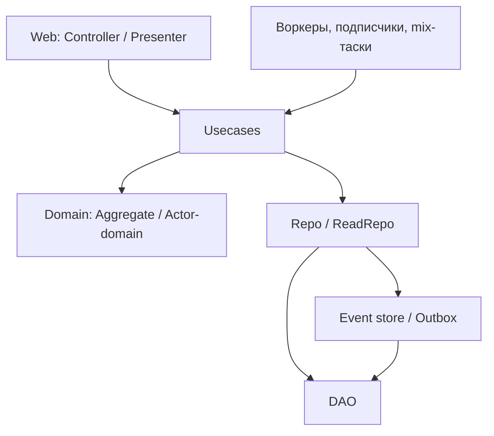

# Архитектура приложения

- **Область.** `lib/my_app/**`, `lib/my_app_web/**`, `config/**`: namespaces, boundary,
  actor-срезы, usecases, DI, композиционный корень, конфигурация библиотеки.
- **Читать перед.** Новым BC, актором или usecase; переносом модулей между слоями; правкой
  DI, дерева `boundary` и конфигурации `:core`.
- **Словарь.** Плейсхолдеры и модальность — `deps/core/docs/rules/00-index.md`.

Границы самой библиотеки, контракт `Core.Config`, адаптеры брокеров и состав `Core.Web.*`
нормирует `deps/core/docs/rules/10-architecture.md`. Здесь — то, что обязано быть сделано
**на стороне приложения**.

## Top-level namespaces

| Namespace | Path | Назначение |
|---|---|---|
| `Core` | зависимость `:core` | shared-фундамент: `Prim`, `Enum`, `Codec`, `View`, `Context`, `Error`, `Es`, `Repo`, `Outbox`, `Mq`, `PubSub`, `Web`, `Helper` |
| `MyApp.Application` | `lib/my_app/application.ex` | композиционный корень: проверки конфигурации на старте и дерево процессов, включая процессы Core |
| `MyApp.Codec` | `lib/my_app/codec/` | Prim-профили `Prim.{Internal,External}`, entity-фасады `{Internal,External}`, реестр плагинов |
| `MyApp.Domain.<BC>` | `lib/my_app/domain/<bc>/` | bounded context: `common` + actor-срезы |
| `MyApp.Outbox` | `lib/my_app/outbox/` | OTP-дерево очереди: writer + поллер + cleaner |
| `MyApp.Projections` | `lib/my_app/projections.ex` | список проекций и опции их дерева (`17-otp-concurrency.md`, «Проекции и процессы агрегата») |
| `MyApp.PromEx` | `lib/my_app/prom_ex*` | плагины метрик и MFA-провайдеры списков |
| `MyApp.ContextFactory` | `lib/my_app/context_factory.ex` | сборка `%Context{}` вне web |
| `MyApp.DAO` | `lib/my_app/dao.ex` | единственный `Ecto.Repo` |
| `MyAppWeb` | `lib/my_app_web/` | HTTP-поверхности, плаги, презентеры |

Модуль верхнего уровня, не попавший в таблицу, — либо подсистема приложения (актуализация,
хранилище, интеграция), либо признак того, что слой выбран неверно.

## Обязательства перед библиотекой

Всё, что библиотека знает о приложении, лежит под её собственным ключом `config :core`. Ключи,
их обязательность и дефолты — `deps/core/docs/rules/10-architecture.md`, «Контракт конфигурации».

- `MyApp.DAO` MUST объявляться через `use Core.DAO`, а не `use Ecto.Repo`: иначе after-commit
  хуки (wake поллера outbox, эталон `Repo.Sc`) молча не выполняются, и ошибка проявится
  отложенной доставкой и перезаписью дочерних строк, а не падением.
- Состав реестра плагинов фасада, включая `Core.Outbox.Codec`, — `11-domain.md`, «Фасады и
  реестр плагинов».
- `otp_app` MUST лежать в `config.exs`: его читает `Core.Config.repo!/1` на компиляции каждого
  call site, и в `runtime.exs` он опоздает.
- `telemetry_prefix` MUST задаваться явно, даже когда совпадает с дефолтом `[otp_app()]`: он
  входит в имена telemetry-событий Core, и обработчики приложения, подписанные на них литералом
  имени, обязаны пережить смену `otp_app`. Имена метрик от него не зависят — их префикс задаёт
  `otp_app` модуля `use PromEx` (`PromEx.metric_prefix/2`) (`21-observability.md`).
- Клиент используемого брокера MUST быть объявлен в `deps` приложения: в библиотеке он
  `optional: true`, и без записи в `deps` адаптеров `Core.Mq.*` просто нет. После добавления или
  удаления клиента — `mix deps.compile core --force`, иначе адаптер останется в том состоянии, в
  каком его собрали.
- Ключи под `:my_app` — только подмена конвенции `<Behaviour>.Pg` (`13-repos.md`) и настройки
  подсистем самого приложения.

Старт MUST проверять конфигурацию до подъёма дерева — неверная конфигурация роняет старт, а не
всплывает на первом запросе (`17-otp-concurrency.md`):

```elixir
Core.Config.validate!()
Core.Security.Secret.ensure_configured!()
```

- Проверка адаптера MUST стоять на каждый используемый адаптер брокера и только на него:
  `Core.Mq.Stream.ensure_available!/0`, `Core.Mq.Kafka.ensure_available!/0`.
- При нескольких поллерах outbox (конфиг `pollers`) MUST стоять
  `Core.Outbox.validate_partition!/1` (`deps/core/docs/rules/14-events-outbox.md`).

## Boundary

| Boundary | `deps:` | Что внутри |
|---|---|---|
| `MyApp` | `[]` | app-слой + `Domain.*` + `Codec.*` |
| `MyAppWeb` | `[MyApp]` | web-слой |
| `MyApp.Application` | `[MyApp, MyAppWeb]` | композиционный корень (`top_level?: true`) |
| `MyApp.PromEx` | `[MyApp, MyAppWeb]` | обвязка наблюдаемости (`top_level?: true`) |

- `Core.*` в `deps:` MUST NOT перечисляться: `boundary` размечает модули этого приложения, а
  чужое OTP-приложение его проверками не покрыто.
- `Application` и `PromEx` выносятся в отдельные top-level boundary: только они сводят app-слой
  и web вместе (старт `Endpoint`, PromEx-плагин Phoenix с `endpoint:` / `router:`). Остальному
  app-слою ссылаться на `MyAppWeb` MUST NOT.
- Mix-таски лежат вне дерева `MyApp.*` — им нужен явный `use Boundary, classify_to: MyApp`.

Мельче резать не требуется: `Domain` и `Codec` развести нельзя — фасад знает плагины, плагины
зовут фасад, и это настоящий compile-time цикл, а `boundary` циклы запрещает. Проверяемая часть
инварианта MUST выноситься в архитектурный тест: web-слой не ссылается на `*Repo` и `DAO`.
Исключение — `Core.Repo.Sc`: это shadow copy контекста, а не репозиторий.

Проверяется: `mix compile --warnings-as-errors`, архитектурный тест (`19-testing.md`).

## Actor / role slices

Bounded context делится на `common` и actor-срезы. Это **actor-based** структура, а не
отдельные доменные модели.

| Часть | Что держит |
|---|---|
| `<BC>.Common` | агрегаты, Prim, события, кодеки событий, outbox-маппинг, репозитории и схемы |
| `<BC>.<Actor>` | usecases под свою роль; при надобности actor-domain и actor-specific Repo |

- Actor в предметном BC MAY не совпадать с типом учётной записи: это роль в контексте.
- Срез, который зовут не из web, а из воркеров, подписчиков и mix-тасок, MUST получать актора
  от `ContextFactory` (`11-domain.md`), а не собирать контекст на месте.
- Actor-специфичный репозиторий заводится там, где у среза **свой ACL-фильтр**; в остальных
  случаях срезы читают и пишут общий репозиторий из `Common` (`13-repos.md`).

## Usecases

Имя — `MyApp.Domain.<BC>.<Actor>.Usecases.<Aggregate>`. Конвенция тела:

1. Authz — до открытия транзакции.
2. Актор: `CurrentUser.get(context)` → `by` — там же, до транзакции.
3. Load → мутация домена → persist — внутри `Transact.run`.
4. `%Context{}` — последний из данных (`deps/core/docs/rules/20-agreements.md`, «Context — последний
   из данных»).

Authz и резолв актора MUST идти до открытия транзакции: проверка прав ходит в read-путь, а тот
в dev и prod MAY быть закеширован, и внепроцессный сайд-эффект внутри транзакции запрещён.
Транзакционности с самой командой проверка доступа не требует — отказ по правам это отказ до
начала работы.

Возвраты по CQS (`deps/core/docs/rules/20-agreements.md`):

| Вид | Возврат |
|---|---|
| Команда | `:ok \| {:error, Error.t()}` |
| Команда-создание | MAY `{:ok, <Aggregate>.ID.t()}` — идентификатор генерирует домен |
| Команда event-sourced агрегата | `{:ok, Version.t()}`; создание — `{:ok, {<Aggregate>.ID.t(), Version.t()}}` |
| Запрос | `{:ok, <Aggregate>.View.t()} \| {:error, Error.t()}` — read-путь отдаёт представление |

Идентификатор созданного агрегата и версия после записи — результат собственного выполнения
команды, а не отступление от CQS (`deps/core/docs/rules/20-agreements.md`, «Разделение изменения и
чтения (CQS)»): без id вызывающий искал бы созданный агрегат отдельным запросом, по версии граница
ждёт проекцию (`15-web-api.md`). Прочие данные агрегата команда не возвращает.

Резолв репозитория — `deps/core/docs/rules/13-repos.md`, «DI».

У команды **event-sourced** агрегата то же тело, но другой состав шагов: `get_decision` →
`Agg.execute/2` → `append` под одной транзакцией `Core.Es.Transact.run/2`, либо
`<Aggregate>.Process.execute` вместо неё. Версию после записи отдают оба пути: у
`Es.Transact.run` — поле `version` состояния из `Agg.execute/2`, у `Process.execute` — его
результат `{:ok, version}`. Отличия, которые видит
usecase (`13-repos.md`, «Event-sourced агрегат»):

- существование агрегата решает `decide` по `version: nil`, а не `:not_found` репозитория; явная
  `%Version{}` на незаведённом агрегате — ошибка домена, если `decide` команду отклоняет, и отказ
  предусловия `:version_mismatch`, если принимает;
- отказ хранилища (`:version_mismatch` с `source: :storage`) повторяется при любой ожидаемой
  версии, сверка ожидаемой версии (`source: :expected`) — нет; повтор даёт `Core.Es.Transact` или
  процесс агрегата (`13-repos.md`, «Повтор после отказа записи»);
- команду собирает usecase (`<Aggregate>.Cmd.<Name>` с `by` и `at` — `11-domain.md`);
- ответ клиенту, которому нужна свежая read-модель, ждёт проекцию — **после** commit, вне
  транзакции (`15-web-api.md`).

```elixir
def command(%Agg.ID{} = id, %Version{} = version, %Context{} = context) do
  with :ok <- check_user(~w(update)a, context),
       {:ok, by} <- CurrentUser.get(context) do
    Transact.run(DAO, fn ->
      with {:ok, agg} <- @repo.get(id, version, context),
           {:ok, agg} <- Actor.Agg.mutate(agg, by),
           {:ok, _saved} <- @repo.save(agg, context) do
        :ok
      end
    end)
  end
end
```

### Что можно внутри `Transact.run`

Транзакция удерживает соединение из пула и блокировки строк на всё время работы колбэка.

| Внутри `Transact.run` | Статус |
|---|---|
| запросы через `DAO` (repo и его flush событий и outbox) | MAY |
| enqueue фоновой задачи в той же транзакции | MAY — задача появится только при успешном commit |
| HTTP-вызовы, publish в брокер, обращения к объектному хранилищу | MUST NOT |
| кеш и прочие внепроцессные сайд-эффекты | MUST NOT |
| `:timer.sleep`, ожидание внешнего события, ожидание проекции | MUST NOT |
| команда процесса агрегата (`<Aggregate>.Process.execute`) | MUST NOT — она идёт своей транзакцией |

Побочный эффект после успешной записи — `Core.Helper.AfterCommit.register/1` либо отдельным
шагом вызывающего. Каскад с внешним вызовом посередине MUST разбиваться на отдельные
транзакции, а не оборачиваться одной вокруг всего.

Границы, которые ходят по сети, MUST звать `Core.Helper.Transact.warn_in_transaction/1`:
нарушение попадает в лог как `error`, а не всплывает деградацией пула под нагрузкой.

## Слои и зависимости



- Web вызывает usecases: мутации domain и вызовы repo / DAO из web — MUST NOT; разбор параметров
  в Prim и ожидание проекции — MAY (`15-web-api.md`).
- Воркеры, подписчики и mix-таски — такие же вызывающие, как web: оркестрация прогона, но не
  доменные мутации.
- Usecases оркестрируют domain и репозитории; authz живёт здесь.
- Domain не пишет в БД и не знает про Ecto.
- Repo пишет состояние и — при наличии — события с outbox в одной транзакции.
- Command-путь работает с агрегатом на доменных Prim, query-путь — с `<Aggregate>.View`
  из примитивных значений (`13-repos.md`).

## Связанные правила

- Домен, Codec, `ContextFactory` — `11-domain.md`
- Ошибки и их границы — `12-errors.md`
- Репозитории и DI — `13-repos.md`
- События и outbox — `14-events-outbox.md`
- Web API — `15-web-api.md`
- Дерево процессов — `17-otp-concurrency.md`
- Пайплайн проверок — `20-agreements.md`
