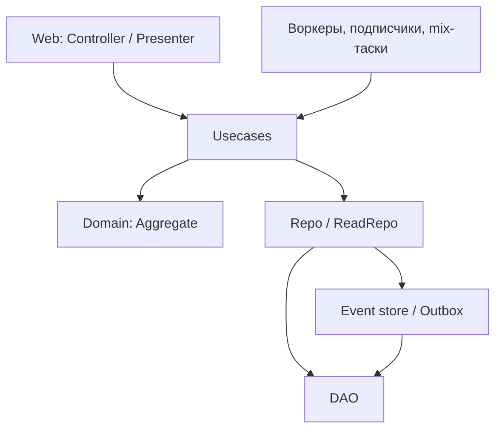

# Архитектура приложения

- **Область.** `lib/**`, `config/**`: namespaces, раскладка файлов, границы `boundary`, акторы,
  usecases, DI, композиционный корень, конфигурация библиотеки.
- **Читать перед.** Новым BC, актором, usecase или модулем; переносом модулей между слоями;
  правкой DI, дерева `boundary` и конфигурации `:core`.
- **Словарь.** Плейсхолдеры и модальность — `deps/core/docs/rules/00-index.md`.

Границы самой библиотеки, контракт `Core.Config`, адаптеры брокеров и состав `Core.Web.*`
нормирует `deps/core/docs/rules/10-architecture.md`. Здесь — то, что обязано быть сделано
**на стороне приложения**.

## Top-level namespaces

Потребитель — один Mix-проект с одним `otp_app` и одним `DAO`; umbrella не поддерживается.
`otp_app:` списком у `TagsCase` — частный случай ратчета, а не заявка на поддержку.

| Namespace | Path | Назначение |
|---|---|---|
| `Core` | зависимость `:core` | shared-фундамент: `Prim`, `Enum`, `Codec`, `View`, `Context`, `Error`, `Es`, `Repo`, `Outbox`, `Mq`, `PubSub`, `Web`, `Helper` |
| `MyAppApp` | `lib/my_app_app.ex`, `lib/my_app_app/` | композиционный корень — одна граница: список контекстов, дерево процессов, очередь, метрики, задачи релиза и mix-таски (см. «Корень и сток») |
| `MyApp.Codec` | `lib/my_app/codec.ex`, `lib/my_app/codec/` | граница кодека: Prim-профили `Prim.{Internal,External}`, entity-фасады `{Internal,External}`, реестр плагинов (см. «Boundary») |
| `MyApp.Domain.<BC>` | `lib/my_app/domain/<bc>.ex`, `lib/my_app/domain/<bc>/` | bounded context — граница верхнего уровня: оглавление — корень границы, каталоги агрегатов и уровня контекста (см. «Раскладка», «Boundary») |
| `MyApp.Infra` | `lib/my_app/infra.ex`, `lib/my_app/infra/` | граница-сток без зависимостей на домен: `DAO`, `StreamID` (см. «Корень и сток») |
| `MyApp.Authz` | `lib/my_app/authz.ex`, `lib/my_app/authz/` | порт проверки доступа: behaviour, макрос декларации, каталог ошибок отказа, заглушка (см. «Проверка доступа») |
| `MyApp.ContextFactory` | `lib/my_app/context_factory.ex` | фабрика контекста: сборка `%Context{}` единицы работы, включая плаг контекста web (`11-domain.md`, «Context») |
| `MyAppWeb` | `lib/my_app_web/` | HTTP-поверхности, плаги, презентеры |
| `MyAppIngest` | `lib/my_app_ingest.ex`, `lib/my_app_ingest/` | граница входа внешней системы (MAY): подписчики её брокера, разбор её формата, DLQ; зовёт usecases контекстов (см. «Boundary») |
| `MyAppTest` | `test/support/` | обвязка тестов: case-модули `MyAppTest.DataCase`, `MyAppTest.ConnCase`, дублёры (`19-testing.md`) |

Модуль верхнего уровня, не попавший в таблицу, — либо подсистема приложения (см. «Раскладка»),
либо признак того, что слой выбран неверно.

### Корень и сток

Корень `MyAppApp` держит то, что собирает приложение целиком и не принадлежит ни одному
контексту. Граница у него одна: дерево процессов, метрики и очередь ссылаются друг на друга, а
единственная граница, которой видны и контексты, и web, — корень.

| Модуль | Путь | Назначение |
|---|---|---|
| `MyAppApp` | `lib/my_app_app.ex` | корень границы: `use Boundary`, список объявлений контекстов `contexts/0` (`17-otp-concurrency.md`, «Объявления контекста») |
| `MyAppApp.Application` | `lib/my_app_app/application.ex` | проверки конфигурации на старте, дерево процессов, включая процессы Core, и сборка объявлений контекстов |
| `MyAppApp.PromEx` | `lib/my_app_app/prom_ex.ex`, `lib/my_app_app/prom_ex/` | плагины метрик и MFA-провайдеры списков |
| `MyAppApp.MetricsServer` | `lib/my_app_app/metrics_server.ex` | сервер метрик вне `Endpoint` (`21-observability.md`) |
| `MyAppApp.Release` | `lib/my_app_app/release.ex`, `lib/my_app_app/release/` | задачи релиза без Mix: миграции через `bin/my_app eval`; задачи оператора, общие для mix-таски и `bin/` |
| `Mix.Tasks.*` | `lib/mix/tasks/` | mix-таски приложения (см. «Boundary» и «Раскладка») |

Сток `MyApp.Infra` держит инфраструктуру, которой домен не нужен: от него зависят контексты,
подсистемы и корень, а сам он не зависит ни от кого.

| Модуль | Путь | Назначение |
|---|---|---|
| `MyApp.Infra.DAO` | `lib/my_app/infra/dao.ex` | единственный `Ecto.Repo` |
| `MyApp.Infra.StreamID` | `lib/my_app/infra/stream_id.ex` | namespace UUIDv5 идентификаторов из ключа (`13-repos.md`) |

## Раскладка

Путь файла от `lib/` MUST совпадать с именем модуля в snake_case:
`MyApp.Domain.<BC>.<Aggregate>.Repo` лежит в `lib/my_app/domain/<bc>/<aggregate>/repo.ex`. Имя
модуля — ключ поиска: файл находится по нему без обхода дерева, а модуль не по пути не найдёт ни
читатель, ни агент.

- Сверяется `Macro.underscore` имени модуля, а не обратное преобразование пути: аббревиатура
  `MyApp.HTTPClient` лежит в `lib/my_app/http_client.ex`.
- Верхнеуровневый модуль в файле MUST быть один. Вложенный `defmodule` следует за родителем и
  своего файла не требует — кроме события и команды: вложенные в семейство
  `<Aggregate>.Event` / `<Aggregate>.Cmd`, они MUST лежать каждое в своём файле (`13-repos.md`,
  «Событие и команда»). Одноимённые определения в ветках `if` — один модуль.
- Mix-таска MUST лежать по конвенции Mix — по имени задачи, а не по имени модуля:
  `Mix.Tasks.Foo.Bar` (задача `mix foo.bar`) — в `lib/mix/tasks/foo.bar.ex`.
- Дерево `test/` правилом не проверяется.

Проверяется: `deps/core/scripts/boundary_lint.exs --consumer` — правило `module-path`.

### Состав контекста

Bounded context `MyApp.Domain.<BC>` MUST раскладываться вертикалью по агрегату: всё об агрегате —
в его каталоге `<bc>/<aggregate>/`, а то, что не принадлежит одному агрегату, — в каталогах
уровня контекста по виду содержимого. Общая часть `<BC>.Common` и срезы инициаторов на уровне
контекста — MUST NOT: они разносят агрегат, его чтение и его usecases по разным деревьям, и правка
одного понятия идёт через все.

```text
lib/my_app/domain/<bc>.ex                  # оглавление — корень границы контекста
lib/my_app/domain/<bc>/
  <aggregate>.ex                           # агрегат
  <aggregate>/
    cmd.ex, cmd/<name>.ex                  # команды
    event.ex, event/<name>.ex              # события, кодек семейства — event/codec.ex
    errors.ex, outbox.ex                   # каталог ошибок, outbox-маппинг
    repo.ex, repo/pg.ex                    # репозиторий записи
    projection.ex, read_repo.ex, view.ex   # read-модель агрегата
    <name>.ex                              # воркер задачи, которую исполняет usecase агрегата
    <component>/                           # реакция, которая зовёт usecases агрегата
    usecases.ex                            # общее чтение нескольких акторов
    <actor>/usecases.ex                    # usecases актора
    <actor>/repo.ex, <actor>/read_repo.ex  # свой ACL-фильтр актора
    <actor>/view.ex                        # своя форма данных актора
  values/<value>.ex                        # значение без агрегата-владельца
  <concept>/                               # понятие контекста: модель нескольких агрегатов
  errors.ex                                # ошибки нескольких агрегатов
  authz.ex                                 # реализация порта проверки доступа — у контекста прав
  <read_model>/                            # read-модель не по агрегату — каталог по назначению
  <operation>/<actor>/usecases.ex          # операция над равноправными агрегатами
  reactions/<component>/                   # реакция, которая зовёт usecases нескольких агрегатов
  supervision.ex                           # объявления для корня: проекции, процессы, дети
```

- Актор — инициатор операций: роль пользователя или системный процесс (фоновые задачи, импорт,
  подписчики брокера). Его usecases над агрегатом — модуль `<Aggregate>.<Actor>.Usecases` в
  подкаталоге актора; чтение, общее нескольким акторам, — `<Aggregate>.Usecases`. Имя актора
  свободно: `Admin`, `Client`, `System`. Актор MAY не совпадать с типом учётной записи: это роль
  в контексте.
- Свои репозитории и View актора MAY лежать в его подкаталоге, только когда у актора свой
  ACL-фильтр или своя форма данных: таблица, проекция, схема и запись остаются общими
  (`13-repos.md`, «Репозитории актора»). В остальных случаях акторы читают и пишут общие модули
  каталога агрегата.
- Usecases актора, которые зовут не из web, а из воркеров, подписчиков и mix-тасок, MUST получать
  актора от `ContextFactory` (`11-domain.md`), а не собирать контекст на месте. Исключение —
  граница аксессора текущего пользователя (`11-domain.md`, «Context»).
- Значение без агрегата-владельца MUST лежать в `values/` — `MyApp.Domain.<BC>.Values.<Value>`,
  ошибки нескольких агрегатов — в `<BC>.Errors`, read-модель не по агрегату — каталогом по
  назначению рядом с агрегатами, реакция, которая зовёт usecases нескольких агрегатов, — в
  `reactions/`. Реакция и воркер одного агрегата лежат в его каталоге (`17-otp-concurrency.md`,
  «Место компонента», «Фоновые задания»).
- Модель, общая нескольким агрегатам контекста и не сводимая к одному значению (правила и
  шаблоны расчёта с их реестром, кодеками и ошибками), MUST лежать каталогом по понятию
  `<bc>/<concept>/` — `MyApp.Domain.<BC>.<Concept>.*`: в `values/` она не помещается, а под одним
  из агрегатов читалась бы его частью. Usecases, проекции и репозитория в нём нет — появились, и
  это агрегат или read-модель по назначению. Имя понятия MUST NOT занимать имя модуля, который
  нужен рядом: `Process` затеняет модуль Elixir и читается как процесс агрегата
  `<Aggregate>.Process` (`deps/core/docs/rules/20-agreements.md`, «Алиасы модулей»; ADR-0049).
- Часть приложения без агрегатов (хранилище файлов, интеграция с внешним сервисом) MUST быть
  подсистемой `MyApp.<Subsystem>` вне `Domain` — своей границей (см. «Boundary»), а не
  контекстом: контекст без агрегатов — граница без модели. Агрегат в подсистеме MUST NOT: появился
  агрегат — это bounded context. Порт подсистемой не является: контекстов он не видит, а работу
  делает его реализация (см. «Проверка доступа»).
- Техническое состояние без версии и событий (сессии, журнал прогонов, слот взаимоисключения) —
  не агрегат: оно лежит в подсистеме, его хранилище, кеш и чистка — один компонент
  (`17-otp-concurrency.md`, «Место компонента»), репозиторий —
  `MyApp.<Subsystem>.<Name>.Repo{,.Pg}` с резолвом через `Core.Config.repo!/1`.
- Тип, который вводит модель контекста и который его агрегат хранит в состоянии (пространство
  имён у разрешений), MUST лежать в каталоге этого агрегата, а общий нескольким агрегатам — в
  `values/`: это часть модели, и вынос в подсистему разрезал бы её ссылками в обе стороны. Билдер,
  который модель сама подключает (`use` в агрегатах контекста), — часть модели и лежит в контексте;
  реестр адаптеров одного контекста (каналы доставки уведомлений) MAY остаться в нём.
- Механизм над моделью, который зовут usecases контекстов (проверка доступа), MUST быть портом с
  реализацией в контексте модели, а не подсистемой: контекст модели сам зовёт механизм, и
  подсистема, которая читает модель, замкнула бы с ним цикл границ, а тест usecase через неё
  готовил бы данные чужой модели (см. «Проверка доступа»).
- Собственный тип подсистемы (ключ объекта хранилища файлов) остаётся в подсистеме, даже если его
  хранит агрегат: ссылка контекста на подсистему разрешена, и связь односторонняя. Значение,
  общее нескольким контекстам, лежит в контексте, который его вводит; остальные видят его через
  `exports` этого контекста (`11-domain.md`, «Prim и Enum»).
- Ключ, который агрегат не читает ни в состоянии, ни в решениях (`decide` / `evolve`), а называют
  только декларации механизма в usecases (пространство разрешений), MUST объявлять контекст в своём
  оглавлении — не агрегат (`<Aggregate>.ns/0`) и не реестр механизма: новый агрегат не правит
  центральный реестр, а порт не знает контекстов. Декларация называет ключ атомом, макрос порта
  сверяет его при компиляции (см. «Проверка доступа»).
- Линтер признак типа модели не проверяет: отступление — строка `DEBT.md`
  (`deps/core/docs/adr/0025-model-types-in-common.md`). Ссылку контекста на реализацию порта и
  необъявленный ключ ловит сборка (см. «Проверка доступа»).

Проверяется: `deps/core/scripts/boundary_lint.exs --consumer` — правило `bc-root`: часть
`<BC>.Common` и срез — namespace `<BC>.<X>.Usecases` с usecases по сценарию, который сам модулем не
объявлен. Нарушение одно на часть и ставится на её первый модуль по пути. Остаток среза без
usecases по сценарию (actor-репозиторий `<BC>.<Actor>.<Aggregate>.ReadRepo`, воркер среза) от
каталога агрегата по имени не отличить, и правило его не видит.

### Модуль-оглавление

У каждого контекста MUST быть модуль-оглавление `MyApp.Domain.<BC>` в `lib/my_app/domain/<bc>.ex` —
корень его границы: `use Boundary` с `deps` и `exports` (см. «Boundary») и объявления контекста,
которые читают на компиляции, — плагины кодека (`11-domain.md`, «Фасады и реестр плагинов») и
ключи пространств разрешений (см. «Проверка доступа»). Проекции, процессы агрегатов и детей для
корня приложения объявляет не оглавление, а `<BC>.Supervision` (`17-otp-concurrency.md`,
«Объявления контекста»). Без оглавления контекст не граница, а его состав читается только по
дереву каталогов. Оглавление лежит на уровне `domain/`,
рядом с каталогом контекста, а не внутри него.

`@moduledoc` оглавления SHOULD давать карту контекста: назначение, агрегаты, акторы, read-модели,
компоненты, ссылки на другие контексты.

```elixir
defmodule MyApp.Domain.Orders do
  @moduledoc """
  Заказы: оформление, оплата и отгрузка заказа клиента.

  - Агрегаты: `Order` (event-sourced), `Cart`.
  - Акторы: `Client` — оформление и отмена; `Admin` — ручная отгрузка; `System` — отмена
    неоплаченных по таймеру.
  - Read-модели: карточка заказа — в каталоге `Order`, очередь отгрузки `Backlog` — по назначению.
  - Компоненты: реакция на оплату счёта `Order.Payments`. Фоновые задачи: отмена `Order.Expiry`.
  - Другие контексты: цены и счета — `MyApp.Domain.Billing`, через его `exports`.
  """

  use Boundary,
    deps: [MyApp.Authz, MyApp.Codec, MyApp.ContextFactory, MyApp.Infra, MyApp.Domain.Billing],
    exports: [
      Order.Client.Usecases,
      Order.Admin.Usecases,
      Order.View,
      Order.ID,
      {Order.Event, []},
      Order.Outbox,
      Cart.Client.Usecases,
      Cart.ID,
      Supervision
    ]

  alias MyApp.Domain.Orders.Order

  @doc "Плагины кодека контекста; склеивает их `MyApp.Codec.plugins/0`."
  @spec codec_plugins() :: [module()]

  def codec_plugins, do: [Order.Event.Codec, Order.View.Codec]

  @doc "Пространства разрешений: описание и операции; склеивает их `MyAppApp.authz_namespaces/0`."
  @spec authz_namespaces() :: [{atom(), {String.t(), [atom()]}}]

  def authz_namespaces, do: [orders: {"Заказы и корзины клиентов", ~w(read create update)a}]
end
```

Проверяется: `deps/core/scripts/boundary_lint.exs --consumer` — правило `bc-index`: каталог
`lib/my_app/domain/<bc>/` без модуля `MyApp.Domain.<BC>` или оглавление без `use Boundary`; опции
границы и содержание `@moduledoc` не проверяются.

### Направления зависимостей

- Контекст, подсистема и точки входа MUST ссылаться на контекст только через его `exports` (см.
  «Boundary»): агрегат, репозиторий и read-модель контекста — его внутреннее устройство. Ссылка на
  модуль вне `exports` — предупреждение `boundary`, в пайплайне — ошибка сборки.
- Цикл между контекстами MUST NOT: взаимные ссылки — признак одной модели, и `boundary` ловит цикл
  сборкой. Цикл, который сейчас не развязать, MAY оформляться `dirty_xrefs` на одной стороне и
  строкой `DEBT.md` с причиной и условием снятия: склеить контексты или развернуть зависимость —
  решение карты контекстов. Ненужный `dirty_xrefs` `boundary` репортит сам, и исключение не
  переживает свою причину (`deps/core/docs/adr/0037-vertical-layout-context-boundary.md`).
- Внутри контекста направлений нет: каталоги агрегатов, акторов и уровня контекста — одна
  граница. Место операции над несколькими агрегатами — «Usecases».
- Контекст MAY звать подсистему `MyApp.<Subsystem>`, объявив её в `deps`: связь остаётся
  односторонней.
- Проверку доступа контекст MUST звать через порт `MyApp.Authz`, а не через контекст, который её
  реализует: в `deps` — порт, а не контекст прав (см. «Проверка доступа»).
- Сборка приложения и точки входа — закрытый состав границ: корень `MyAppApp` (дерево процессов,
  метрики, mix-таски, задачи релиза), `MyApp.Codec` (реестр плагинов), `MyAppWeb` и граница входа
  внешней системы `MyAppIngest` (MAY, см. «Boundary»). Точки входа — `MyAppWeb`, `MyAppIngest` и
  корень — зовут модули usecases контекстов; прочая граница вне контекстов видит контекст, как
  подсистема.
- Задача оператора, общая для mix-таски и `bin/` (стартовая инициализация, наполнение стенда),
  MUST лежать в `MyAppApp.Release.<Name>`, а не модулем верхнего уровня: модуль вне корня —
  подсистема, а не точка входа.

```elixir
# плохо — чужой контекст читает репозиторий контекста мимо его exports
defmodule MyApp.Domain.Orders.Order.Client.Usecases do
  alias MyApp.Domain.Billing.Invoice.ReadRepo
  require Core.Config
  @read_repo Core.Config.repo!(ReadRepo)
  def checkout(id, context), do: @read_repo.get(id, context)
end

# хорошо — через экспортированный модуль usecases
defmodule MyApp.Domain.Orders.Order.Client.Usecases do
  def checkout(id, context), do: MyApp.Domain.Billing.Invoice.Usecases.get(id, context)
end
```

Проверяется: `mix compile --warnings-as-errors` — нарушения `boundary` (см. «Boundary»).

### Отступление

Отступление MUST быть записано строкой в `DEBT.md` приложения и отмечено маркером в блоке
комментариев прямо над `defmodule`. Маркер называет правило и строку `DEBT.md`:

```elixir
# boundary-lint: allow module-path — DEBT.md, «Файл не по имени модуля»
defmodule MyApp.Domain.<BC>.<Aggregate>.Repo do
```

- Маркер гасит нарушения только своего правила и только в строках своего модуля: нарушение DI
  (`13-repos.md`) в том же модуле ловится по-прежнему. Исключения — `bc-index` и `bc-root`:
  нарушение `bc-index` принадлежит каталогу контекста, и его гасит маркер над любым `defmodule` в
  оглавлении и в файлах `lib/my_app/domain/<bc>/`; нарушение `bc-root` принадлежит части —
  `Common` или срезу, — и его гасит маркер над любым её модулем.
- Маркер без ссылки на раздел `DEBT.md` (`DEBT.md, «<раздел>»`) не гасит ничего; хвостовой
  комментарий строки кода маркером не считается.
- Список исключений в конфигурации линтера MUST NOT: он расходится с кодом, а маркер виден на
  ревью рядом с отступлением (`deps/core/docs/adr/0023-consumer-layout-enforced.md`).

| Правило маркера | Что проверяет |
|---|---|
| `module-path` | путь файла = имя модуля, один верхнеуровневый модуль в файле, конвенция Mix, событие и команда не вложены в семейство |
| `bc-index` | каталог контекста без модуля-оглавления, оглавление без `use Boundary` |
| `bc-root` | `Common` или срез на уровне контекста — раскладка до вертикали |
| `projection-layout` | проекция не ровно `<BC>.<ReadModel>.Projection`, отдельный модуль записи `*.Projector` под `ReadRepo` (`13-repos.md`, «Проекции read-модели») |
| `web-root` | модуль в корне `MyAppWeb` вне таблицы и не поверхность (`15-web-api.md`, «Раскладка») |

Проверяется: `deps/core/scripts/boundary_lint.exs --consumer` (шаг `boundary-check`,
`20-agreements.md`) — правила таблицы, только `lib/`.

## Обязательства перед библиотекой

Всё, что библиотека знает о приложении, лежит под её собственным ключом `config :core`. Ключи,
их обязательность и дефолты — `deps/core/docs/rules/10-architecture.md`, «Контракт конфигурации».

- `MyApp.Infra.DAO` MUST объявляться через `use Core.DAO`, а не `use Ecto.Repo`: иначе after-commit
  хуки (wake поллера outbox, эталон `Repo.Sc`) молча не выполняются, и ошибка проявится
  отложенной доставкой и перезаписью дочерних строк, а не падением.
- Состав реестра плагинов фасада, включая `Core.Outbox.Codec`, — `11-domain.md`, «Фасады и
  реестр плагинов».
- `otp_app` MUST лежать в `config.exs`: его читает `Core.Config.repo!/1` на компиляции каждого
  call site, и в `runtime.exs` он опоздает.
- `telemetry_prefix` MUST задаваться явно, даже когда совпадает с дефолтом `[otp_app()]`: он
  входит в имена telemetry-событий Core, и обработчики приложения, подписанные на них литералом
  имени, обязаны пережить смену `otp_app`. Имена метрик от него не зависят — их префикс задаёт
  `otp_app` модуля `use PromEx` (`PromEx.metric_prefix/2`) (`21-observability.md`).
- Клиент используемого брокера MUST быть объявлен в `deps` приложения: в библиотеке он
  `optional: true`, и без записи в `deps` адаптеров `Core.Mq.*` просто нет. После добавления или
  удаления клиента — `mix deps.compile core --force`, иначе адаптер останется в том состоянии, в
  каком его собрали.
- Ключи под `:my_app` — только подмена конвенции `<Behaviour>.Pg` (`13-repos.md`), выбор
  реализации порта (см. «Проверка доступа») и настройки подсистем самого приложения.

Старт MUST проверять конфигурацию до подъёма дерева — неверная конфигурация роняет старт, а не
всплывает на первом запросе (`17-otp-concurrency.md`):

```elixir
Core.Config.validate!()
Core.Security.Secret.ensure_configured!()
```

- Проверка адаптера MUST стоять на каждый используемый адаптер брокера и только на него:
  `Core.Mq.Stream.ensure_available!/0`, `Core.Mq.Kafka.ensure_available!/0`.
- Проверки старта компонента в `start/2` MUST NOT — они живут в его корне
  (`17-otp-concurrency.md`, «Компонент»); проверки очереди делает её дерево
  `Core.Outbox.Supervisor` (`14-events-outbox.md`, «Единственность поллера»).

## Файлы `config/`

Место значения задаёт момент, когда его читают: на компиляции, на старте релиза или только в
тестах.

| Файл | Что в нём |
|---|---|
| `config.exs` | `compile_env` и DI-подмены: `config :core` (`otp_app`, `telemetry_prefix`), подмена `<Behaviour>.Pg` (`13-repos.md`, «DI»), `.Cached` и TTL кеша (`16-caching.md`, «Конфигурация»), реализация и реестр порта `MyApp.Authz` (см. «Проверка доступа») |
| `runtime.exs` | env и тумблеры: `OUTBOX_*` (`14-events-outbox.md`, «Конфигурация»), тумблеры поддеревьев и опции процессов, `ES_PROJECTIONS_*` (`17-otp-concurrency.md`), тумблер инвалидатора кеша (`16-caching.md`) |
| `test.exs` | тестовый overlay: очередь выключена (`14-events-outbox.md`), кеш на `.Pg` (`16-caching.md`), тестовый plug HTTP-клиентов (`19-testing.md`, «Внешние зависимости»), мок порта `MyApp.Authz` (`19-testing.md`, «Проверка доступа»), сервер метрик и PromEx выключены (`21-observability.md`, «Сервер метрик») |
| `dev.exs`, `prod.exs` | настройки окружения без секретов и env: уровень логов, `debug_errors`, `force_ssl` |

Секреты площадок и чтение env в `dev.exs` / `prod.exs` MUST NOT, их место — `runtime.exs`:
`prod.exs` исполняется на сборке, и значение запекается в релиз — секрет попадает в артефакт, а env
берётся с машины сборки, а не с площадки; env в `dev.exs` — второй источник рядом с
`runtime.exs`, и они разойдутся. Локальные учётные данные разработки (пароль базы в контейнере)
секретом площадки не являются.

```elixir
# плохо — config/prod.exs: значение машины сборки, секрет в артефакте
config :my_app, MyApp.Infra.DAO, password: System.fetch_env!("DB_PASSWORD")

# хорошо — config/runtime.exs
if config_env() == :prod do
  config :my_app, MyApp.Infra.DAO, password: System.fetch_env!("DB_PASSWORD")
end
```

## Boundary

Каждый модуль `lib/` MUST принадлежать границе `boundary`: модуль вне границ Boundary репортит
предупреждением, и в пайплайне это ошибка сборки.

| Boundary | `deps:` | Что внутри |
|---|---|---|
| `MyApp.Domain.<BC>` | контексты, от которых зависит, `MyApp.Codec`, `MyApp.Infra`, `MyApp.Authz`, подсистемы | bounded context: корень — оглавление, состав `exports` — ниже |
| `MyApp.Codec` | — (`check: [out: false]`) | Prim-профили, entity-фасады, реестр плагинов |
| `MyApp.Infra` | `[]` | сток без зависимостей на домен: `DAO`, `StreamID` |
| `MyApp.Authz` | `[]`; `exports: [Errors]` | порт проверки доступа: behaviour, макрос декларации, каталог ошибок отказа, заглушка |
| `MyApp.ContextFactory` | владельцы ключей контекста: граница аксессора текущего пользователя — контекст учётной записи или `MyApp.Auth` | фабрика контекста: сборка `%Context{}` единицы работы |
| `MyApp.<Subsystem>` | контексты, которые она читает, `MyApp.Infra` | подсистема приложения |
| `MyAppWeb` | контексты, `MyApp.Codec`, `MyApp.ContextFactory`; `check: [aliases: true]` | web-слой |
| `MyAppIngest` | контексты, подсистемы, `MyApp.ContextFactory`; `check: [aliases: true]` | граница входа внешней системы: подписчики её брокера, разбор её формата, DLQ |
| `MyAppApp` | контексты, подсистемы, `MyApp.Infra`, `MyApp.Authz`, `MyAppWeb`, `MyAppIngest` | композиционный корень: `Application`, список контекстов, `PromEx`, `MetricsServer`, `Release`, mix-таски |
| `MyAppTest` | — (`check: [in: false, out: false]`) | обвязка тестов `test/support/` |

- Bounded context MUST быть границей верхнего уровня, а `MyApp` границей не является
  (`deps/core/docs/adr/0037-vertical-layout-context-boundary.md`).
- `exports` контекста — модули usecases (`<Aggregate>.<Actor>.Usecases`, `<Aggregate>.Usecases`,
  `<ReadModel>.<Actor>.Usecases`, `<Operation>.<Actor>.Usecases`), View, типы ID, значения и
  аксессор текущего пользователя, которые видят другие границы (`11-domain.md`, «Prim и Enum»,
  «Context»), каталог ошибок контекста (`12-errors.md`), модули событий и их семейства, модули
  outbox с топиком производителя (`14-events-outbox.md`, «Топики и запись в очередь»), плагины
  кодека, модуль объявлений `Supervision` (`17-otp-concurrency.md`, «Объявления контекста»),
  модули воркеров, которых ставят другие контексты (`17-otp-concurrency.md`, «Фоновые задания»);
  агрегат, репозиторий, схемы, проекция и ReadRepo в него не входят. Семейство событий MAY
  экспортироваться целиком — `{<Aggregate>.Event, []}`: члены, нагрузки и кодек семейства.
- `MyApp.Codec` MUST нести `check: [out: false]`: фасад знает плагины всех контекстов, контексты
  зовут фасад, и без него это цикл границ. Контексты объявляют `deps: [MyApp.Codec]`, кодек —
  ни одного.
- `MyApp.Infra` — сток: от него зависят контексты, подсистемы и корень, а `MyAppWeb` и
  `MyAppIngest` держать его в `deps` MUST NOT.
- `MyApp.Authz` — порт: от него зависят контексты и корень, а сам он MUST NOT держать в `deps` ни
  одного контекста — реализацию называет конфигурация, а не ссылка (см. «Проверка доступа»).
  Экспорт порта — каталог отказа `Errors`: ошибку строит реализация в контексте прав.
- `MyApp.ContextFactory` — подсистема; запрет границе аксессора зависеть от неё —
  `11-domain.md`, «Context».
- `MyAppWeb` и `MyAppIngest` MUST нести `check: [aliases: true]`: без этой опции `boundary` видит
  вызов `DAO.all/1`, но не модуль, переданный значением (`Transact.run(DAO, …)`), и точка входа
  дотягивается до `DAO` мимо сборки.
- Граница входа `MyAppIngest` MAY — она есть у приложения, которое принимает сообщения внешней
  системы: компоненты подписчиков её брокера, разбор её формата и DLQ отклонённого
  (`17-otp-concurrency.md`, «Место компонента»). Её `deps` MUST быть только контексты и
  подсистемы (владелец соединения с брокером, фабрика контекста): чужой формат разбирает сам
  вход, а не профили кодека приложения. Репозиторий деревьев библиотеки (`repo:` у
  `Core.Mq.Dlq.Writer`, `Core.Mq.Dlq.Reader`, `Core.Mq.Kafka.Reader`) приходит опцией компонента
  из `config/runtime.exs`, как `repo:` у `Oban`: литерал `MyApp.Infra.DAO` во входе — ссылка на
  сток.
- `Core.*` в `deps:` MUST NOT перечисляться: `boundary` размечает модули этого приложения, а
  чужое OTP-приложение его проверками не покрыто.
- Корень `MyAppApp` — единственная граница, которая сводит контексты и web вместе (старт
  `Endpoint`, PromEx-плагин Phoenix с `endpoint:` / `router:`). Зависеть от корня MUST NOT ни
  одной границе, контекстам и стоку ссылаться на `MyAppWeb` и `MyAppIngest` — тоже.
- Mix-таски лежат вне дерева `MyAppApp.*` — им нужен явный `use Boundary, classify_to: MyAppApp`.
- Обвязка `test/support/` без своей границы по имени MUST лежать в границе `MyAppTest` с
  `check: [in: false, out: false]`: `boundary` относит модуль к границе по префиксу имени, и
  case-модуль под `MyApp` или `MyAppWeb` оказался бы вне границ или в границе web со всеми её
  запретами.
- Цикл между контекстами и его оформление `dirty_xrefs` — «Направления зависимостей».

Ссылку web на `*Repo` и `DAO` ловит сборка: репозитории не входят в `exports` контекстов,
`MyApp.Infra` нет в `deps` web, а `check: [aliases: true]` видит и модуль, переданный значением.
Архитектурный тест на это не нужен — он был бы вторым механизмом на одно нарушение.
`Core.Repo.Sc` — shadow copy контекста, а не репозиторий, и библиотеку `boundary` не проверяет.

Проверяется: `mix compile --warnings-as-errors` — предупреждения `boundary` (`20-agreements.md`,
«Пайплайн проверок»).

## Проверка доступа

Проверка доступа — порт `MyApp.Authz`: behaviour проверки и макрос декларации, граница без `deps`
на контексты. Реализует порт контекст, который владеет моделью прав (роли, выданные разрешения), а
у приложения без такой модели — заглушка порта; реализацию выбирает композиционный корень. Ключи
пространств разрешений объявляет каждый контекст, корень склеивает их в реестр для реализации
(`deps/core/docs/adr/0042-authz-port.md`).

- Порт MUST держать behaviour `check/4` (типы учётной записи, ключ пространства, операции,
  `%Context{}`), макрос декларации и каталог ошибок отказа `MyApp.Authz.Errors`. У приложения без
  модели прав реализация — заглушка порта `MyApp.Authz.Stub`: контекст без агрегатов MUST NOT
  («Состав контекста»), а проверка, которой нужна модель, — уже реализация в контексте.
- Реализация в контексте прав — `MyApp.Domain.<BC>.Authz` в `lib/my_app/domain/<bc>/authz.ex` с
  `@behaviour MyApp.Authz`: модель она читает своими ReadRepo (`13-repos.md`, «Read-модель»). В
  `exports` реализация не входит — её называет только конфигурация.
- Декларация MUST стоять на каждом модуле usecases, который проверяет доступ, — модуле актора и
  модуле общего чтения `<Aggregate>.Usecases` («Usecases»): `use MyApp.Authz` с типом учётной
  записи `account:` и ключом пространства `namespace:`, общими для всех его usecases. Макрос даёт
  `check_user/2`, и usecase называет им операцию первым шагом, до транзакции («Usecases»).
- `account:` модуля общего чтения — список типов учётной записи акторов, чьё чтение он держит:
  реализация пропускает пользователя любого из них. Модуль актора MAY тоже назвать список, если
  роль в контексте держат учётные записи нескольких типов. Порт передаёт реализации список всегда.
- Usecase, которому кроме пространства модуля нужно второе (файлы заказа в пространстве файлов),
  называет его ключом `check_user/3`: дополнительные ключи MUST перечисляться опцией `namespaces:`
  декларации, и макрос генерирует по clause на каждый объявленный ключ — необъявленный даёт
  `FunctionClauseError`, а литерал ключа — предупреждение типов при сборке. Ключ пространства
  другого контекста в декларации MUST NOT: доступ к его данным проверяет его экспортированный
  usecase, а сверка ключа идёт по оглавлению своего контекста.
- Пространства своих агрегатов — описание и операции — MUST объявляться в оглавлении контекста
  функцией `authz_namespaces/0` (см. «Модуль-оглавление»). Декларация называет ключи своего
  контекста, и макрос сверяет их с `authz_namespaces/0` оглавления: ключ, которого контекст не
  объявил, — `CompileError`. Сверка MUST идти в теле модуля декларации, а не в теле макроса: только
  тогда правка оглавления пересобирает модули деклараций (ADR-0042).
- Операция в `check_user` MUST быть объявлена в пространстве: порт сверяет операции с реестром до
  вызова реализации, и необъявленная — `ArgumentError`, ошибка программиста. Сверку проходит и
  тест usecase с моком: мок подменяет реализацию, а не порт.
- Реестр MUST склеивать одна функция корня `MyAppApp.authz_namespaces/0` из оглавлений
  контекстов; ключ, объявленный двумя контекстами, — `CompileError` склейки. Реализация получает
  реестр функцией порта `MyApp.Authz.namespaces/0`, которая зовёт MFA корня из конфигурации: от
  корня не зависит ни одна граница («Boundary»). Каталог ролей (роль — набор пространств и
  операций) — модель контекста прав, а не порта: она лежит в его агрегатах и значениях и берёт
  пространства и операции из `namespaces/0` (ADR-0046).
- Реализацию и реестр MUST называть ключ `config :my_app, MyApp.Authz` в `config.exs` — `impl:` и
  `namespaces:`, мок порта — `config/test.exs` (`19-testing.md`, «Проверка доступа»). Порт MUST
  читать ключ в рантайме, а не `compile_env`: литерал реализации в порте — ссылка на контекст
  прав, которую репортит `boundary` (ADR-0042).
- `MyAppApp.Application.start/2` MUST звать `MyApp.Authz.validate!/0` до подъёма дерева: ключ
  читается в рантайме, и опечатку в `impl:` иначе нашёл бы первый запрос (`17-otp-concurrency.md`,
  «Дерево процессов»).
- Отказ MUST быть ошибкой каталога `MyApp.Authz.Errors`, которую `ErrorMapper` понимает без своей
  клозы (`12-errors.md`, «Границы»): нет права — `%Error{kind: :domain, code: :access_denied}`,
  403; учётной записи нет или она заблокирована — `%Error{kind: :domain, code: :unauthorized}`,
  401 по `auth_codes:`. Существование пользователя плаг не проверяет (`15-web-api.md`,
  «Аутентификация в плагах»), и отличить «кто ты» от «тебе нельзя» может только реализация порта.

```elixir
# плохо — контекст зовёт реализацию: Orders зависит от модели прав, тест usecase готовит её данные
use Boundary, deps: [MyApp.Codec, MyApp.Infra, MyApp.Domain.Rights]

with :ok <- MyApp.Domain.Rights.Authz.check(:client, :orders, ~w(update)a, context), do: ...

# хорошо — lib/my_app/domain/orders/order/client/usecases.ex: тип учётной записи и пространство —
# у актора, операция — у usecase; ключи :orders и :order_files объявлены в authz_namespaces/0
use MyApp.Authz,
  account: :client,
  namespace: :orders,
  namespaces: [:order_files]

def cancel(%Order.ID{} = id, %Version{} = version, %Context{} = context, opts \\ []) do
  with :ok <- check_user(~w(update)a, context), ...
end

def attach(%Order.ID{} = id, file, %Context{} = context) do
  with :ok <- check_user(~w(update)a, context),
       :ok <- check_user(:order_files, ~w(create)a, context), ...
end

# хорошо — lib/my_app/domain/orders/order/usecases.ex: общее чтение двух акторов
use MyApp.Authz,
  account: [:client, :admin],
  namespace: :orders
```

```elixir
# lib/my_app/authz.ex — ключи сверяет модуль декларации, реализацию берёт конфигурация в рантайме
@required ~w(account namespace)a
@optional ~w(namespaces)a

defmacro __using__(opts) do
  :ok = Opts.validate!(opts, @required, @optional, "MyApp.Authz")
  accounts = opts |> Keyword.fetch!(:account) |> List.wrap()
  namespace = Opts.atom!(opts, :namespace, "MyApp.Authz")
  namespaces = [namespace | Keyword.get(opts, :namespaces, [])]
  # оглавление MyApp.Domain.<BC> — по имени модуля декларации (путь = имя модуля, «Раскладка»)
  index = index_of(__CALLER__.module)

  checks =
    for ns <- namespaces do
      quote do
        defp check_user(unquote(ns), ops, context),
          do: MyApp.Authz.check(unquote(accounts), unquote(ns), ops, context)
      end
    end

  quote do
    MyApp.Authz.declared!(unquote(index).authz_namespaces(), unquote(namespaces), __MODULE__)

    defp check_user(ops, context), do: check_user(unquote(namespace), ops, context)

    unquote_splicing(checks)
  end
end

@doc "Проверить доступ реализацией, которую называет конфигурация; операции — из реестра."
@spec check([atom()], atom(), [atom()], Context.t()) :: :ok | {:error, Error.t()}

def check(accounts, namespace, ops, %Context{} = context) do
  :ok = declared_ops!(namespace, ops)
  impl().check(accounts, namespace, ops, context)
end

# ---

defp impl, do: :my_app |> Application.fetch_env!(__MODULE__) |> Keyword.fetch!(:impl)

# config/config.exs — реализацию выбирает корень
config :my_app, MyApp.Authz,
  impl: MyApp.Domain.Rights.Authz,
  namespaces: {MyAppApp, :authz_namespaces, []}

# lib/my_app_app.ex — реестр из оглавлений: ключ → {описание, операции}; дубль ключа — CompileError
@authz_namespaces MyApp.Authz.registry!(
                    MyApp.Domain.Billing.authz_namespaces() ++
                      MyApp.Domain.Orders.authz_namespaces()
                  )

def authz_namespaces, do: @authz_namespaces
```

Проверяется: `mix compile --warnings-as-errors` — ссылка контекста на реализацию и литерал
реализации в порте — предупреждения `boundary`; необъявленный и дублированный ключ — `CompileError`
макроса порта, ключ `check_user/3` вне декларации — предупреждение типов; необъявленная операция —
`ArgumentError` порта в тесте usecase.

## Usecases

Модуль usecases MUST называться `MyApp.Domain.<BC>.<Aggregate>.<Actor>.Usecases` и лежать в
подкаталоге актора `<bc>/<aggregate>/<actor>/usecases.ex`: usecases одного актора над одним
агрегатом — функции этого модуля. Чтение, общее нескольким акторам, — модуль
`<Aggregate>.Usecases` в `<bc>/<aggregate>/usecases.ex`: модули акторов его функции не копируют.
Read-модель по назначению держит свои модули так же — `<ReadModel>.<Actor>.Usecases` и
`<ReadModel>.Usecases` в её каталоге.

Операция над равноправными агрегатами SHOULD лежать в каталоге уровня контекста по имени операции —
`MyApp.Domain.<BC>.<Operation>.<Actor>.Usecases` в `<bc>/<operation>/<actor>/usecases.ex`, а не в
модуле одного из агрегатов: второй агрегат из имени не виден, и операцию ищут не там, где она
лежит.

- Операция над равноправными агрегатами — запись (`append` / `insert` / `update` / `save` /
  `delete`) в два агрегата и больше, ни один из которых не подчинён другому. Чтение соседа — не
  запись. Подчинённость определяется происхождением id: id подчинённого выводится из id главного,
  главный хранит id подчинённого, или подчинённый хранит id главного и без него не существует
  (черновик операции над агрегатом). Запись в главный и подчинённый — одна операция: она лежит в
  модуле usecases актора в каталоге того агрегата, чей id пришёл командой, — отметка в главном о
  действии над подчинённым — часть операции над подчинённым.
- Хелпер чтения, общий для usecases агрегата (найти позицию, собрать контекст проверки), MAY
  лежать в `<Aggregate>.Query` в каталоге агрегата: он только читает, а load и save остаются в
  самом usecase (`deps/core/docs/rules/20-agreements.md`, «Load/save агрегата — в одной функции»).
- Одна транзакция MUST писать один контекст, а usecase с записью агрегатов двух контекстов —
  MUST NOT: агрегат и репозиторий другого контекста не входят в его `exports`, а его usecase внутри
  своей транзакции связывает инварианты двух моделей одним откатом. Вторая запись — задача второго
  контекста, поставленная в той же транзакции его экспортированной функцией постановки («Что можно
  внутри `Transact.run`»), или реакция второго контекста на событие первого
  (`17-otp-concurrency.md`, «Место компонента»). Задача — когда первый контекст уже зависит от
  второго, реакция — когда второму нужны данные первого (`17-otp-concurrency.md`, «Фоновые
  задания»). Нужна атомарная запись двух контекстов — это одна модель, и контексты склеиваются
  (`deps/core/docs/adr/0038-one-context-per-transaction.md`).
- Задача оператора, которая заводит данные нескольких контекстов (стартовая инициализация
  `MyAppApp.Release.<Name>`), зовёт usecase каждого контекста его транзакцией, а взаимоисключение
  параллельного старта реплик держит сессионная блокировка `Core.Helper.Lock.with_advisory!/4`
  вокруг всех вызовов — не одна транзакция с `advisory_xact!/3`. Прерванный запуск доводит
  повторный: шаги задачи MUST быть идемпотентны (ADR-0048).
- Команда event-sourced агрегата MUST принимать `wait: :none | pos_integer()` последней опцией
  (`opts \\ []`, по умолчанию `:none`) и по ней после commit, вне транзакции, ждать проекцию
  литеральным `Projection.await/3` — `deps/core/docs/rules/22-projections.md`, «Read-after-write»:
  `Prefer` понимает каждая команда event-sourced агрегата (`15-web-api.md`, «Ожидание проекции»), а
  другой вызывающий, который после записи читает read-модель, — тем же `wait:`; вида вызывающего
  правило не различает. Команда агрегата без read-модели `wait:` не принимает: ждать нечего, и её
  исход — всегда `:accepted`.
- Команда над несколькими event-sourced агрегатами ждёт проекцию того агрегата, чьё представление
  отдаёт, и называет его в `@doc`; в `{:accepted, id, version}` — его ID и версия.
- Экспортированный запрос, который зовёт другой контекст, MAY принимать тот же `wait:` и ждать
  проекцию **до** чтения: реакция на событие агрегата другого контекста читает его read-модель
  только этим запросом, а проекция и ReadRepo в `exports` не входят. Не дождался — ошибка ожидания,
  а не устаревшее представление (`deps/core/docs/rules/22-projections.md`, «Read-after-write»).
- Чтение доменного состояния агрегата без отставания проекции (решение другого контекста по
  состоянию учётной записи) — read-модель без таблицы над write-репозиторием агрегата и её
  экспортированный запрос (`13-repos.md`, «Read-модель»), а не экспорт репозитория.

```elixir
# плохо — оформление меняет корзину и заказ, а лежит в модуле корзины
defmodule MyApp.Domain.Orders.Cart.Client.Usecases do
  def checkout(cart_id, context), do: ...
end

# хорошо — операция над равноправными агрегатами — каталог по её имени
defmodule MyApp.Domain.Orders.Checkout.Client.Usecases do
  def checkout(cart_id, context), do: ...
end
```

```elixir
# плохо — транзакция отмены заказа аннулирует и счёт контекста Billing
Transact.run(DAO, fn ->
  with {:ok, _saved} <- @repo.save(order, context),
       do: MyApp.Domain.Billing.Invoice.System.Usecases.void(order.invoice_id, by, context)
end)

# хорошо — счёт аннулирует задача контекста Billing: её ставит его экспортированная функция, и
# задача появится только при commit заказа
Transact.run(DAO, fn ->
  with {:ok, _saved} <- @repo.save(order, context),
       do: MyApp.Domain.Billing.Invoice.Void.enqueue(order.invoice_id, by)
end)
```

Конвенция тела:

1. Проверка доступа — `check_user/2` декларации актора, до открытия транзакции.
2. Актор: `CurrentUser.get(context)` → `by` — там же, до транзакции.
3. Load → мутация домена → persist — внутри `Transact.run`.
4. `%Context{}` — последний из данных (`deps/core/docs/rules/20-agreements.md`, «Context — последний
   из данных»).

Проверка доступа и резолв актора MUST идти до открытия транзакции: проверка ходит в read-путь
модели прав, а тот в dev и prod MAY быть закеширован, и внепроцессный сайд-эффект внутри транзакции
запрещён. Транзакционности с самой командой проверка доступа не требует — отказ по правам это отказ
до начала работы. Доступ usecase MUST проверять через порт (см. «Проверка доступа»), а не чтением
модели прав.

Возвраты по CQS (`deps/core/docs/rules/20-agreements.md`):

| Вид | Возврат |
|---|---|
| Команда | `:ok \| {:error, Error.t()}` |
| Команда-создание | MAY `{:ok, <Aggregate>.ID.t()}` — идентификатор генерирует домен |
| Команда event-sourced агрегата | `{:ok, {:projected, <ReadModel>.View.t()}} \| {:ok, {:accepted, <Aggregate>.ID.t(), Version.t()}}` |
| Создание, удаление и upsert event-sourced агрегата | `{:ok, {:projected \| :accepted, <Aggregate>.ID.t(), Version.t()}}` |
| Команда event-sourced агрегата без read-модели | `{:ok, {:accepted, <Aggregate>.ID.t(), Version.t()}}` |
| Запрос | `{:ok, <ReadModel>.View.t()} \| {:error, Error.t()}` — read-путь отдаёт представление |

Идентификатор созданного агрегата и версия после записи — результат собственного выполнения
команды, а не отступление от CQS (`deps/core/docs/rules/20-agreements.md`, «Разделение изменения и
чтения (CQS)»): без id вызывающий искал бы созданный агрегат отдельным запросом, а версию клиент
шлёт следующим `If-Match`. Прочие данные агрегата команда не возвращает.

Исход ожидания у команды event-sourced агрегата — тег результата:

- `:projected` — проекция дождалась: команда отдаёт представление, прочитанное после commit
  запросом чтения актора, — это исключение из CQS (`deps/core/docs/rules/20-agreements.md`, там
  же); создание отдаёт `{id, version}` и в этом исходе — почему не представление, ADR-0027;
  удаление и upsert — тоже `{id, version}`: после удаления читать нечего, а upsert — создание или
  команда в зависимости от состояния, и форма исхода не должна от него зависеть;
- `:accepted` — `wait: :none`, `:projection_timeout`, `:projection_rebuilding` или отказ чтения
  представления после commit: запись применена, read-модель её ещё не видит или вызывающему её не
  отдаёт, и это успех, а не ошибка; повтор команды по нему MUST NOT
  (`deps/core/docs/rules/22-projections.md`, «Read-after-write»).

Резолв репозитория — `deps/core/docs/rules/13-repos.md`, «DI».

У команды **event-sourced** агрегата то же тело, но другой состав шагов: `get_decision` →
`Agg.execute/2` → `append` под одной транзакцией `Core.Es.Transact.run/2`, либо
`<Aggregate>.Process.execute` вместо неё. Версию после записи отдают оба пути: у
`Es.Transact.run` — поле `version` состояния из `Agg.execute/2`, у `Process.execute` — его
результат `{:ok, version}`. Отличия, которые видит
usecase (`13-repos.md`, «Event-sourced агрегат»):

- существование агрегата решает `decide` по `version: nil`, а не `:not_found` репозитория; явная
  `%Version{}` на незаведённом агрегате — ошибка домена, если `decide` команду отклоняет, и отказ
  предусловия `:version_mismatch`, если принимает;
- отказ хранилища (`:version_mismatch` с `source: :storage`) повторяется при любой ожидаемой
  версии, сверка ожидаемой версии (`source: :expected`) — нет; повтор даёт `Core.Es.Transact` или
  процесс агрегата (`13-repos.md`, «Повтор после отказа записи»);
- команду собирает usecase (`<Aggregate>.Cmd.<Name>` с `by` и `at` — `11-domain.md`);
- проекцию по `wait:` ждёт сам usecase — **после** commit, вне транзакции
  (`deps/core/docs/rules/22-projections.md`, «Read-after-write»).

```elixir
def command(%Agg.ID{} = id, %Version{} = version, %Context{} = context) do
  with :ok <- check_user(~w(update)a, context),
       {:ok, by} <- CurrentUser.get(context) do
    Transact.run(DAO, fn ->
      with {:ok, agg} <- @repo.get(id, version, context),
           {:ok, agg} <- Agg.mutate(agg, by),
           {:ok, _saved} <- @repo.save(agg, context) do
        :ok
      end
    end)
  end
end
```

```elixir
# event-sourced создание — {id, version} в обоих исходах ожидания; запись — `get_decision` и
# `append` под `Es.Transact.run` в `write_open/3`, хелпер `awaited/2` —
# `deps/core/docs/rules/22-projections.md`, «Read-after-write»
def open(%Agg.Name{} = name, %Context{} = context, opts \\ []) do
  with :ok <- check_user(~w(create)a, context),
       {:ok, by} <- CurrentUser.get(context),
       {:ok, {id, version}} <- write_open(name, by, context),
       do: {:ok, {awaited(id, Keyword.get(opts, :wait, :none)), id, version}}
end
```

### Что можно внутри `Transact.run`

Транзакция удерживает соединение из пула и блокировки строк на всё время работы колбэка.

| Внутри `Transact.run` | Статус |
|---|---|
| запросы через `DAO` (repo и его flush событий и outbox) | MAY |
| enqueue фоновой задачи в той же транзакции | MAY — задача появится только при успешном commit |
| HTTP-вызовы, publish в брокер, обращения к объектному хранилищу | MUST NOT |
| кеш и прочие внепроцессные сайд-эффекты | MUST NOT |
| `:timer.sleep`, ожидание внешнего события, ожидание проекции | MUST NOT |
| команда процесса агрегата (`<Aggregate>.Process.execute`) | MUST NOT — она идёт своей транзакцией |

Побочный эффект после успешной записи — `Core.Helper.AfterCommit.register/1` либо отдельным
шагом вызывающего. Каскад с внешним вызовом посередине MUST разбиваться на отдельные
транзакции, а не оборачиваться одной вокруг всего.

Границы, которые ходят по сети, MUST звать `Core.Helper.Transact.warn_in_transaction/1`:
нарушение попадает в лог как `error`, а не всплывает деградацией пула под нагрузкой.

## Слои и зависимости


```mermaid
flowchart TB
  Web["Web: Controller / Presenter"]
  Worker["Воркеры, подписчики, mix-таски"]
  UC["Usecases"]
  Domain["Domain: Aggregate"]
  Repo["Repo / ReadRepo"]
  Store["Event store / Outbox"]
  DAO["DAO"]

  Web --> UC
  Worker --> UC
  UC --> Domain
  UC --> Repo
  Repo --> Store
  Repo --> DAO
  Store --> DAO
```

- Web вызывает usecases: мутации domain и вызовы repo / DAO из web — MUST NOT; разбор параметров
  в Prim и режима ожидания `wait:` из `Prefer` — MAY (`15-web-api.md`). Проекцию web не ждёт: её
  нет в `exports` контекста, и ждёт usecase.
- Воркеры, подписчики и mix-таски — такие же вызывающие, как web: оркестрация прогона, но не
  доменные мутации.
- Usecases оркестрируют domain и репозитории; доступ проверяют здесь, через порт `MyApp.Authz`.
- Domain не пишет в БД и не знает про Ecto.
- Repo пишет состояние и — при наличии — события с outbox в одной транзакции.
- Command-путь работает с агрегатом на доменных Prim, query-путь — с `<ReadModel>.View`
  из примитивных значений (`13-repos.md`).

## Связанные правила

- Домен, Codec, `ContextFactory` — `11-domain.md`
- Ошибки и их границы — `12-errors.md`
- Репозитории и DI — `13-repos.md`
- События и outbox — `14-events-outbox.md`
- Web API — `15-web-api.md`
- Дерево процессов — `17-otp-concurrency.md`
- Пайплайн проверок — `20-agreements.md`
