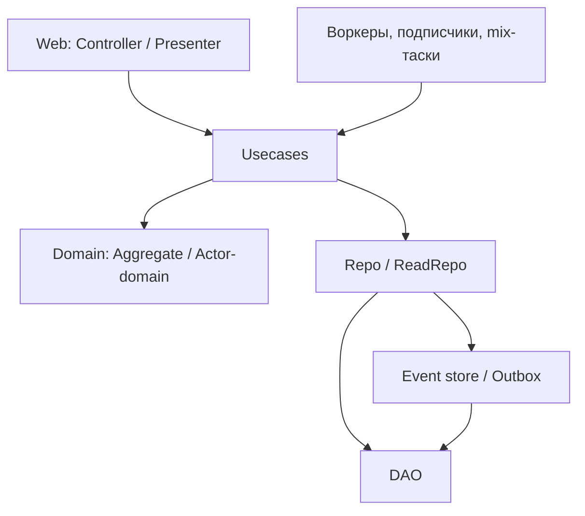

# Архитектура приложения

- **Область.** `lib/**`, `config/**`: namespaces, раскладка файлов, boundary, actor-срезы,
  usecases, DI, композиционный корень, конфигурация библиотеки.
- **Читать перед.** Новым BC, актором, usecase или модулем; переносом модулей между слоями;
  правкой DI, дерева `boundary` и конфигурации `:core`.
- **Словарь.** Плейсхолдеры и модальность — `deps/core/docs/rules/00-index.md`.

Границы самой библиотеки, контракт `Core.Config`, адаптеры брокеров и состав `Core.Web.*`
нормирует `deps/core/docs/rules/10-architecture.md`. Здесь — то, что обязано быть сделано
**на стороне приложения**.

## Top-level namespaces

Потребитель — один Mix-проект с одним `otp_app` и одним `DAO`; umbrella не поддерживается.
`otp_app:` списком у `TagsCase` — частный случай ратчета, а не заявка на поддержку.

| Namespace | Path | Назначение |
|---|---|---|
| `Core` | зависимость `:core` | shared-фундамент: `Prim`, `Enum`, `Codec`, `View`, `Context`, `Error`, `Es`, `Repo`, `Outbox`, `Mq`, `PubSub`, `Web`, `Helper` |
| `MyApp.Application` | `lib/my_app/application.ex` | композиционный корень: проверки конфигурации на старте и дерево процессов, включая процессы Core |
| `MyApp.Codec` | `lib/my_app/codec/` | Prim-профили `Prim.{Internal,External}`, entity-фасады `{Internal,External}`, реестр плагинов |
| `MyApp.Domain.<BC>` | `lib/my_app/domain/<bc>.ex`, `lib/my_app/domain/<bc>/` | bounded context: модуль-оглавление, `Common` + срезы (см. «Раскладка») |
| `MyApp.Outbox` | `lib/my_app/outbox/` | OTP-дерево очереди: writer + поллер + cleaner |
| `MyApp.Projections` | `lib/my_app/projections.ex` | список проекций и опции их дерева (`17-otp-concurrency.md`, «Проекции и процессы агрегата») |
| `MyApp.Processes` | `lib/my_app/processes.ex` | список процессов агрегатов и их опции (`17-otp-concurrency.md`, «Проекции и процессы агрегата») |
| `MyApp.PromEx` | `lib/my_app/prom_ex*` | плагины метрик и MFA-провайдеры списков |
| `MyApp.ContextFactory` | `lib/my_app/context_factory.ex` | сборка `%Context{}` вне web |
| `MyApp.DAO` | `lib/my_app/dao.ex` | единственный `Ecto.Repo` |
| `MyApp.StreamID` | `lib/my_app/stream_id.ex` | namespace UUIDv5 идентификаторов из ключа (`13-repos.md`) |
| `MyApp.MetricsServer` | `lib/my_app/metrics_server.ex` | сервер метрик вне `Endpoint` (`21-observability.md`) |
| `MyApp.Release` | `lib/my_app/release.ex`, `lib/my_app/release/` | задачи релиза без Mix: миграции через `bin/my_app eval`; задачи оператора, общие для mix-таски и `bin/` |
| `Mix.Tasks.*` | `lib/mix/tasks/` | mix-таски приложения (см. «Boundary» и «Раскладка») |
| `MyAppWeb` | `lib/my_app_web/` | HTTP-поверхности, плаги, презентеры |

Модуль верхнего уровня, не попавший в таблицу, — либо подсистема приложения (см. «Раскладка»),
либо признак того, что слой выбран неверно.

## Раскладка

Путь файла от `lib/` MUST совпадать с именем модуля в snake_case:
`MyApp.Domain.<BC>.Common.<Aggregate>.Repo` лежит в
`lib/my_app/domain/<bc>/common/<aggregate>/repo.ex`. Имя модуля — ключ поиска: файл находится по
нему без обхода дерева, а модуль не по пути не найдёт ни читатель, ни агент.

- Сверяется `Macro.underscore` имени модуля, а не обратное преобразование пути: аббревиатура
  `MyApp.HTTPClient` лежит в `lib/my_app/http_client.ex`.
- Верхнеуровневый модуль в файле MUST быть один. Вложенный `defmodule` следует за родителем и
  своего файла не требует — кроме события и команды: вложенные в семейство
  `<Aggregate>.Event` / `<Aggregate>.Cmd`, они MUST лежать каждое в своём файле (`13-repos.md`,
  «Событие и команда»). Одноимённые определения в ветках `if` — один модуль.
- Mix-таска MUST лежать по конвенции Mix — по имени задачи, а не по имени модуля:
  `Mix.Tasks.Foo.Bar` (задача `mix foo.bar`) — в `lib/mix/tasks/foo.bar.ex`.
- Дерево `test/` правилом не проверяется.

Проверяется: `deps/core/scripts/boundary_lint.exs --consumer` — правило `module-path`.

### Состав контекста

Bounded context `MyApp.Domain.<BC>` MUST состоять из `<BC>.Common` и срезов; модуль в корне
контекста — вне `Common` и срезов — MUST NOT: четвёртый сегмент имени называет часть контекста, и
такой модуль читается как срез. Модуль без привязки к инициатору лежит в `Common`, модуль одного
инициатора — в его срезе.

```elixir
# плохо — агрегат и каталог ошибок в корне контекста
defmodule MyApp.Domain.<BC>.<Aggregate> do
defmodule MyApp.Domain.<BC>.Errors do

# хорошо
defmodule MyApp.Domain.<BC>.Common.<Aggregate> do
defmodule MyApp.Domain.<BC>.Common.<Aggregate>.Errors do
```

Срез — namespace, модулем он не объявляется: объявленный модуль `MyApp.Domain.<BC>.<X>` при `X` не
`Common` — модуль в корне контекста. Нарушение ставится на объявление; ссылки на такой модуль и на
модули под ним правила направлений не считают — правка одна, перенос модуля.

Проверяется: `deps/core/scripts/boundary_lint.exs --consumer` — правило `bc-root`.

- Срез — операции одного инициатора: роли пользователя или системного процесса (фоновые задачи,
  импорт, подписчики брокера). Имя среза — по инициатору и свободно: `Admin`, `Client`; `System` —
  пример среза системного процесса. Состав частей — «Actor / role slices».
- Часть приложения без агрегатов (хранилище файлов, интеграция с внешним сервисом, реестр прав)
  MUST быть подсистемой `MyApp.<Subsystem>` вне `Domain`, а не контекстом: контекст без агрегатов
  — модуль в корне `Domain` без модели. Агрегат в подсистеме MUST NOT: появился агрегат — это
  bounded context.
- Техническое состояние без версии и событий (сессии, журнал прогонов, слот взаимоисключения) —
  не агрегат: оно лежит в подсистеме, его хранилище, кеш и чистка — один компонент
  (`17-otp-concurrency.md`, «Место компонента»), репозиторий —
  `MyApp.<Subsystem>.<Name>.Repo{,.Pg}` с резолвом через `Core.Config.repo!/1`.
- Тип, который вводит модель контекста и который его агрегат хранит в состоянии (пространство
  имён у разрешений), MUST лежать в `<BC>.Common` этого контекста: это часть модели, и вынос в
  подсистему разрезал бы её ссылками в обе стороны. Механизм над моделью (макрос DSL, проверка,
  реестр механизма) SHOULD быть подсистемой: он читает модель, а модель его не знает. Правило
  режет по модулю: DSL, общий для usecases всех контекстов, делится на типы модели в `Common` и
  механизм в подсистеме. Билдер, который модель сама подключает (`use` в агрегатах контекста), —
  часть модели и лежит в `Common`; реестр адаптеров одного контекста (каналы доставки уведомлений)
  MAY остаться в его `Common`.
- Собственный тип подсистемы (ключ объекта хранилища файлов) остаётся в подсистеме, даже если его
  хранит агрегат: ссылка `Common` → подсистема разрешена, и связь односторонняя. Значение, общее
  нескольким контекстам, лежит в `Common` контекста, который его вводит; остальные видят его через
  этот `Common` (`11-domain.md`, «Prim и Enum»).
- Ключ механизма, который агрегат не читает ни в состоянии, ни в решениях (`decide` / `evolve`), а
  читают только механизм и его декларации в usecases, MUST лежать у механизма, а не в агрегате
  (`<Aggregate>.ns/0` — в реестре механизма): иначе `Common` каждого контекста ссылается на типы
  механизма, и контексты замыкаются в цикл. Декларация называет ключ реестра атомом, механизм
  проверяет его при компиляции.
- Линтер эти признаки не проверяет: отступление — строка `DEBT.md`
  (`deps/core/docs/adr/0025-model-types-in-common.md`).

### Модуль-оглавление

У каждого контекста MUST быть модуль-оглавление `MyApp.Domain.<BC>` в `lib/my_app/domain/<bc>.ex` —
точка входа, из которой видно, из чего контекст состоит; без неё состав читается только по дереву
каталогов. Оглавление лежит на уровне `domain/`, рядом с каталогом контекста, а не внутри него:
правило «модуль в корне контекста — MUST NOT» («Состав контекста») оно не нарушает.

`@moduledoc` оглавления SHOULD давать карту контекста: назначение, агрегаты, срезы и их
инициаторов, read-модели, компоненты, ссылки на другие контексты.

```elixir
defmodule MyApp.Domain.Orders do
  @moduledoc """
  Заказы: оформление, оплата и отгрузка заказа клиента.

  - Агрегаты (`Common`): `Order` (event-sourced), `Cart`.
  - Срезы: `Client` — оформление и отмена; `Admin` — ручная отгрузка; `System` — отмена
    неоплаченных по таймеру.
  - Read-модели: карточка заказа `Order` в `Common`, очередь отгрузки `Backlog` в `Admin`.
  - Компоненты: подписчик оплат `Payments` в `System`.
  - Фоновые задачи: `Oban.Worker` отмены `Expiry` в `System`.
  - Другие контексты: цены и счета — `MyApp.Domain.Billing`, через его `Common`.
  """
end
```

Проверяется: `deps/core/scripts/boundary_lint.exs --consumer` — правило `bc-index`: каталог
`lib/my_app/domain/<bc>/` без модуля `MyApp.Domain.<BC>`; содержание `@moduledoc` не проверяется.

### Направления зависимостей

- `Common` MUST NOT ссылаться на срезы своего контекста: общая модель не зависит от конкретного
  инициатора. Нужное `Common` и срезу переезжает в `Common`; модуль `Common`, который по назначению
  принадлежит срезу (компонент, который зовёт его usecases, проекция read-модели среза), переезжает
  в срез.
- Контекст MUST NOT ссылаться на срезы чужого контекста — только на его `Common`: срез — операции
  чужого инициатора, и ссылка на него связывает контексты ролями, а не моделью.
- Срез MUST NOT ссылаться на соседний срез своего контекста: это операции другого инициатора, и
  общее у них — модель, а не чужие операции. Общее двум срезам переезжает в `Common`; операция,
  которую запускают два инициатора, — свой usecase в каждом срезе над общим доменом в `Common`.
- Подсистема `MyApp.<Subsystem>` MUST NOT ссылаться на срезы контекстов — только на их `Common`:
  для контекста она такой же чужой, а ссылка на срез через подсистему обходила бы оба правила выше —
  срез звал бы чужой срез через посредника. Контекст ссылается на подсистему свободно: срезов у неё
  нет.
- Два контекста SHOULD NOT ссылаться друг на друга: взаимные ссылки — признак одной модели, и
  решение — склеить контексты или развернуть зависимость — принимается на ревью. Линтер циклы
  между контекстами не проверяет (`deps/core/docs/adr/0025-model-types-in-common.md`).
- Сборка приложения и точки входа MAY ссылаться на любой срез любого контекста: они либо собирают
  срезы по назначению — корни компонентов, плагины представлений в реестре фасада, проекции,
  `watch_list/0` корней, — либо, как web, зовут usecases. Состав закрыт: `MyAppWeb` и `Mix.Tasks.*`
  с вложенными; `MyApp.Application` и `MyApp.Projections` — сами модули, без вложенных;
  `MyApp.Codec`, `MyApp.PromEx`, `MyApp.Release` — вместе с вложенными.
  Прочий модуль вне `Domain` — из таблицы namespaces или нет, в том числе модуль с другим корнем в
  `lib/` — видит контекст, как подсистема; `MyAppWeb` и `Mix.Tasks.*` узнаются по имени.
- Задача оператора, общая для mix-таски и `bin/` (стартовая инициализация, наполнение стенда),
  MUST лежать в `MyApp.Release.<Name>`, а не модулем верхнего уровня: иначе она подсистема, и её
  вызовы usecases — нарушение.

```elixir
# плохо — Common зовёт срез своего контекста, usecase — срез чужого
defmodule MyApp.Domain.Orders.Common.Order.Projection do
  alias MyApp.Domain.Orders.Admin.Usecases
  def project(event), do: Usecases.Order.refresh(event)
end

defmodule MyApp.Domain.Orders.Client.Usecases.Checkout do
  alias MyApp.Domain.Billing.Admin.Usecases
  def run(id, context), do: Usecases.Invoice.run(id, context)
end

# плохо — подсистема зовёт срез: мимо foreign-slice через посредника
defmodule MyApp.Mailer.Digest do
  alias MyApp.Domain.Orders.Admin.Usecases
  def build(id, context), do: Usecases.Order.summary(id, context)
end

# хорошо — чужой контекст и подсистема видят контекст через его Common
defmodule MyApp.Domain.Orders.Client.Usecases.Checkout do
  alias MyApp.Domain.Billing.Common.Invoice.ReadRepo
  require Core.Config
  @read_repo Core.Config.repo!(ReadRepo)
  def run(id, context), do: @read_repo.get(id, context)
end

defmodule MyApp.Mailer.Digest do
  alias MyApp.Domain.Orders.Common.Order.ReadRepo
  require Core.Config
  @read_repo Core.Config.repo!(ReadRepo)
  def build(id, context), do: @read_repo.get(id, context)
end
```

Ссылка разрешается с учётом `alias` (в том числе `alias A.{B, C}` и `as:`), `__MODULE__` и полного
имени; нарушение ставится на строку вызова, а не на `alias`. Корень приложения берётся из имени
модуля, где стоит ссылка.

Проверяется: `deps/core/scripts/boundary_lint.exs --consumer` — правила `common-slice`,
`foreign-slice`, `sibling-slice` и `subsystem-slice`, ссылки из модулей `MyApp.Domain.<BC>` и
подсистем в `lib/`.

### Отступление

Отступление MUST быть записано строкой в `DEBT.md` приложения и отмечено маркером в блоке
комментариев прямо над `defmodule`. Маркер называет правило и строку `DEBT.md`:

```elixir
# boundary-lint: allow module-path — DEBT.md, «Файл не по имени модуля»
defmodule MyApp.Domain.<BC>.Common.<Aggregate>.Repo do
```

- Маркер гасит нарушения только своего правила и только в строках своего модуля: нарушение DI
  (`13-repos.md`) в том же модуле ловится по-прежнему. Исключение — `bc-index`: нарушение
  принадлежит каталогу контекста, а не модулю, и его гасит маркер над любым `defmodule` в файлах
  `lib/my_app/domain/<bc>/`.
- Маркер без ссылки на раздел `DEBT.md` (`DEBT.md, «<раздел>»`) не гасит ничего; хвостовой
  комментарий строки кода маркером не считается.
- Список исключений в конфигурации линтера MUST NOT: он расходится с кодом, а маркер виден на
  ревью рядом с отступлением (`deps/core/docs/adr/0023-consumer-layout-enforced.md`).

| Правило маркера | Что проверяет |
|---|---|
| `module-path` | путь файла = имя модуля, один верхнеуровневый модуль в файле, конвенция Mix, событие и команда не вложены в семейство |
| `common-slice` | `Common` ссылается на срез своего контекста |
| `foreign-slice` | контекст ссылается на срез чужого контекста |
| `sibling-slice` | срез ссылается на соседний срез своего контекста |
| `subsystem-slice` | подсистема ссылается на срез контекста |
| `bc-index` | каталог контекста без модуля-оглавления |
| `bc-root` | модуль в корне контекста |
| `projection-layout` | проекция не ровно в каталоге read-модели, отдельный модуль записи `*.Projector` под `ReadRepo` (`13-repos.md`, «Проекции read-модели») |
| `web-root` | модуль в корне `MyAppWeb` вне таблицы и не поверхность (`15-web-api.md`, «Раскладка») |

Проверяется: `deps/core/scripts/boundary_lint.exs --consumer` (шаг `boundary-check`,
`20-agreements.md`) — правила таблицы, только `lib/`.

## Обязательства перед библиотекой

Всё, что библиотека знает о приложении, лежит под её собственным ключом `config :core`. Ключи,
их обязательность и дефолты — `deps/core/docs/rules/10-architecture.md`, «Контракт конфигурации».

- `MyApp.DAO` MUST объявляться через `use Core.DAO`, а не `use Ecto.Repo`: иначе after-commit
  хуки (wake поллера outbox, эталон `Repo.Sc`) молча не выполняются, и ошибка проявится
  отложенной доставкой и перезаписью дочерних строк, а не падением.
- Состав реестра плагинов фасада, включая `Core.Outbox.Codec`, — `11-domain.md`, «Фасады и
  реестр плагинов».
- `otp_app` MUST лежать в `config.exs`: его читает `Core.Config.repo!/1` на компиляции каждого
  call site, и в `runtime.exs` он опоздает.
- `telemetry_prefix` MUST задаваться явно, даже когда совпадает с дефолтом `[otp_app()]`: он
  входит в имена telemetry-событий Core, и обработчики приложения, подписанные на них литералом
  имени, обязаны пережить смену `otp_app`. Имена метрик от него не зависят — их префикс задаёт
  `otp_app` модуля `use PromEx` (`PromEx.metric_prefix/2`) (`21-observability.md`).
- Клиент используемого брокера MUST быть объявлен в `deps` приложения: в библиотеке он
  `optional: true`, и без записи в `deps` адаптеров `Core.Mq.*` просто нет. После добавления или
  удаления клиента — `mix deps.compile core --force`, иначе адаптер останется в том состоянии, в
  каком его собрали.
- Ключи под `:my_app` — только подмена конвенции `<Behaviour>.Pg` (`13-repos.md`) и настройки
  подсистем самого приложения.

Старт MUST проверять конфигурацию до подъёма дерева — неверная конфигурация роняет старт, а не
всплывает на первом запросе (`17-otp-concurrency.md`):

```elixir
Core.Config.validate!()
Core.Security.Secret.ensure_configured!()
```

- Проверка адаптера MUST стоять на каждый используемый адаптер брокера и только на него:
  `Core.Mq.Stream.ensure_available!/0`, `Core.Mq.Kafka.ensure_available!/0`.
- Проверки старта компонента в `start/2` MUST NOT — они живут в его корне
  (`17-otp-concurrency.md`, «Компонент»): `Core.Outbox.check_singleton!/1` и
  `Core.Outbox.validate_partition!/1` зовёт корень очереди (`14-events-outbox.md`, «Единственность
  поллера»).

## Файлы `config/`

Место значения задаёт момент, когда его читают: на компиляции, на старте релиза или только в
тестах.

| Файл | Что в нём |
|---|---|
| `config.exs` | `compile_env` и DI-подмены: `config :core` (`otp_app`, `telemetry_prefix`), подмена `<Behaviour>.Pg` (`13-repos.md`, «DI»), `.Cached` и TTL кеша (`16-caching.md`, «Конфигурация») |
| `runtime.exs` | env и тумблеры: `OUTBOX_*` (`14-events-outbox.md`, «Конфигурация»), тумблеры поддеревьев и опции процессов, `ES_PROJECTIONS_*` (`17-otp-concurrency.md`), тумблер инвалидатора кеша (`16-caching.md`) |
| `test.exs` | тестовый overlay: очередь выключена (`14-events-outbox.md`), кеш на `.Pg` (`16-caching.md`), тестовый plug HTTP-клиентов (`19-testing.md`, «Внешние зависимости»), сервер метрик и PromEx выключены (`21-observability.md`, «Сервер метрик») |
| `dev.exs`, `prod.exs` | настройки окружения без секретов и env: уровень логов, `debug_errors`, `force_ssl` |

Секреты площадок и чтение env в `dev.exs` / `prod.exs` MUST NOT, их место — `runtime.exs`:
`prod.exs` исполняется на сборке, и значение запекается в релиз — секрет попадает в артефакт, а env
берётся с машины сборки, а не с площадки; env в `dev.exs` — второй источник рядом с
`runtime.exs`, и они разойдутся. Локальные учётные данные разработки (пароль базы в контейнере)
секретом площадки не являются.

```elixir
# плохо — config/prod.exs: значение машины сборки, секрет в артефакте
config :my_app, MyApp.DAO, password: System.fetch_env!("DB_PASSWORD")

# хорошо — config/runtime.exs
if config_env() == :prod do
  config :my_app, MyApp.DAO, password: System.fetch_env!("DB_PASSWORD")
end
```

## Boundary

| Boundary | `deps:` | Что внутри |
|---|---|---|
| `MyApp` | `[]` | app-слой + `Domain.*` + `Codec.*` |
| `MyAppWeb` | `[MyApp]` | web-слой |
| `MyApp.Application` | `[MyApp, MyAppWeb]` | композиционный корень (`top_level?: true`) |
| `MyApp.PromEx` | `[MyApp, MyAppWeb]` | обвязка наблюдаемости (`top_level?: true`) |

- `Core.*` в `deps:` MUST NOT перечисляться: `boundary` размечает модули этого приложения, а
  чужое OTP-приложение его проверками не покрыто.
- `Application` и `PromEx` выносятся в отдельные top-level boundary: только они сводят app-слой
  и web вместе (старт `Endpoint`, PromEx-плагин Phoenix с `endpoint:` / `router:`). Остальному
  app-слою ссылаться на `MyAppWeb` MUST NOT.
- Mix-таски лежат вне дерева `MyApp.*` — им нужен явный `use Boundary, classify_to: MyApp`.

Мельче резать не требуется: `Domain` и `Codec` развести нельзя — фасад знает плагины, плагины
зовут фасад, и это настоящий compile-time цикл, а `boundary` циклы запрещает. Проверяемая часть
инварианта MUST выноситься в архитектурный тест: web-слой не ссылается на `*Repo` и `DAO`.
Исключение — `Core.Repo.Sc`: это shadow copy контекста, а не репозиторий.

Проверяется: `mix compile --warnings-as-errors`, архитектурный тест (`19-testing.md`).

## Actor / role slices

Bounded context делится на `Common` и срезы инициаторов («Раскладка», «Состав контекста»). Это
**actor-based** структура, а не отдельные доменные модели.

| Часть | Что держит |
|---|---|
| `<BC>.Common` | всё без привязки к инициатору: агрегаты, значения, события, кодеки, outbox-маппинг, репозитории записи и схемы, read-модели с компонентами их кешей |
| `<BC>.<Actor>` | операции одного инициатора: usecases, его воркеры, подписчики и компоненты; при надобности actor-domain, свой репозиторий записи и своя read-модель |

- Actor в предметном BC MAY не совпадать с типом учётной записи: это роль в контексте.
- Срез, который зовут не из web, а из воркеров, подписчиков и mix-тасок, MUST получать актора
  от `ContextFactory` (`11-domain.md`), а не собирать контекст на месте.
- Репозиторий записи и read-модель лежат в `Common`. Свой ACL-фильтр среза — actor-репозиторий в
  срезе поверх общей модели (для чтения — actor-ReadRepo без своей таблицы и проекции); своя форма
  данных — своя read-модель среза. В остальных случаях срезы читают и пишут общие модули из
  `Common` (`13-repos.md`, «Actor-репозиторий»).
- Место компонента — срез его инициатора, подсистема или каталог read-модели
  (`17-otp-concurrency.md`, «Место компонента»).

## Usecases

Модуль usecases MUST называться `MyApp.Domain.<BC>.<Actor>.Usecases.<Usecase>`: `<Usecase>` —
имя usecase, по умолчанию имя агрегата, над которым он работает (`Usecases.Order`). Операция над
несколькими агрегатами SHOULD быть своим usecase со своим модулем, а не ложиться в модуль одного из
них: второй агрегат из имени не виден, и usecase ищут не там, где он лежит.

- Операция над несколькими агрегатами — запись (`append` / `insert` / `update` / `save` / `delete`)
  в два агрегата и больше, ни один из которых не подчинён другому. Чтение соседа — не запись.
  Подчинённость определяется происхождением id: id подчинённого выводится из id главного, главный
  хранит id подчинённого, или подчинённый хранит id главного и без него не существует (черновик
  операции над агрегатом). Запись в главный и подчинённый — одна операция: она лежит в
  `Usecases.<Aggregate>` того агрегата, чей id пришёл командой, — отметка в главном о действии над
  подчинённым — часть операции над подчинённым.
- Хелпер чтения, общий для usecases одного среза (найти позицию, собрать контекст проверки), MAY
  лежать в `<Actor>.Usecases.<Aggregate>.Query`: он только читает, а load и save остаются в самом
  usecase (`deps/core/docs/rules/20-agreements.md`, «Load/save агрегата — в одной функции»).
- Usecase, который пишет агрегаты двух контекстов, лежит в срезе контекста, который уже зависит от
  второго, и пишет второй через его `Common` (репозиторий, агрегат): ссылка на срез второго —
  `foreign-slice`.
- Команда над несколькими event-sourced агрегатами возвращает версию того агрегата, чью проекцию
  ждёт граница (`15-web-api.md`, «Ожидание проекции»), и называет его в `@doc`.
- Ждать проекцию usecase MUST NOT — это решение вызывающего:
  `deps/core/docs/rules/22-projections.md`, «Read-after-write»; у HTTP — `15-web-api.md`,
  «Ожидание проекции».

```elixir
# плохо — оформление меняет корзину и заказ, а лежит в модуле корзины
defmodule MyApp.Domain.Orders.Client.Usecases.Cart do
  def checkout(cart_id, context), do: ...
end

# хорошо
defmodule MyApp.Domain.Orders.Client.Usecases.Checkout do
  def run(cart_id, context), do: ...
end
```

Конвенция тела:

1. Authz — до открытия транзакции.
2. Актор: `CurrentUser.get(context)` → `by` — там же, до транзакции.
3. Load → мутация домена → persist — внутри `Transact.run`.
4. `%Context{}` — последний из данных (`deps/core/docs/rules/20-agreements.md`, «Context — последний
   из данных»).

Authz и резолв актора MUST идти до открытия транзакции: проверка прав ходит в read-путь, а тот
в dev и prod MAY быть закеширован, и внепроцессный сайд-эффект внутри транзакции запрещён.
Транзакционности с самой командой проверка доступа не требует — отказ по правам это отказ до
начала работы.

Возвраты по CQS (`deps/core/docs/rules/20-agreements.md`):

| Вид | Возврат |
|---|---|
| Команда | `:ok \| {:error, Error.t()}` |
| Команда-создание | MAY `{:ok, <Aggregate>.ID.t()}` — идентификатор генерирует домен |
| Команда event-sourced агрегата | `{:ok, Version.t()}`; создание — `{:ok, {<Aggregate>.ID.t(), Version.t()}}` |
| Запрос | `{:ok, <ReadModel>.View.t()} \| {:error, Error.t()}` — read-путь отдаёт представление |

Идентификатор созданного агрегата и версия после записи — результат собственного выполнения
команды, а не отступление от CQS (`deps/core/docs/rules/20-agreements.md`, «Разделение изменения и
чтения (CQS)»): без id вызывающий искал бы созданный агрегат отдельным запросом, по версии граница
ждёт проекцию (`15-web-api.md`). Прочие данные агрегата команда не возвращает.

Резолв репозитория — `deps/core/docs/rules/13-repos.md`, «DI».

У команды **event-sourced** агрегата то же тело, но другой состав шагов: `get_decision` →
`Agg.execute/2` → `append` под одной транзакцией `Core.Es.Transact.run/2`, либо
`<Aggregate>.Process.execute` вместо неё. Версию после записи отдают оба пути: у
`Es.Transact.run` — поле `version` состояния из `Agg.execute/2`, у `Process.execute` — его
результат `{:ok, version}`. Отличия, которые видит
usecase (`13-repos.md`, «Event-sourced агрегат»):

- существование агрегата решает `decide` по `version: nil`, а не `:not_found` репозитория; явная
  `%Version{}` на незаведённом агрегате — ошибка домена, если `decide` команду отклоняет, и отказ
  предусловия `:version_mismatch`, если принимает;
- отказ хранилища (`:version_mismatch` с `source: :storage`) повторяется при любой ожидаемой
  версии, сверка ожидаемой версии (`source: :expected`) — нет; повтор даёт `Core.Es.Transact` или
  процесс агрегата (`13-repos.md`, «Повтор после отказа записи»);
- команду собирает usecase (`<Aggregate>.Cmd.<Name>` с `by` и `at` — `11-domain.md`);
- ответ клиенту, которому нужна свежая read-модель, ждёт проекцию — **после** commit, вне
  транзакции (`15-web-api.md`).

```elixir
def command(%Agg.ID{} = id, %Version{} = version, %Context{} = context) do
  with :ok <- check_user(~w(update)a, context),
       {:ok, by} <- CurrentUser.get(context) do
    Transact.run(DAO, fn ->
      with {:ok, agg} <- @repo.get(id, version, context),
           {:ok, agg} <- Actor.Agg.mutate(agg, by),
           {:ok, _saved} <- @repo.save(agg, context) do
        :ok
      end
    end)
  end
end
```

### Что можно внутри `Transact.run`

Транзакция удерживает соединение из пула и блокировки строк на всё время работы колбэка.

| Внутри `Transact.run` | Статус |
|---|---|
| запросы через `DAO` (repo и его flush событий и outbox) | MAY |
| enqueue фоновой задачи в той же транзакции | MAY — задача появится только при успешном commit |
| HTTP-вызовы, publish в брокер, обращения к объектному хранилищу | MUST NOT |
| кеш и прочие внепроцессные сайд-эффекты | MUST NOT |
| `:timer.sleep`, ожидание внешнего события, ожидание проекции | MUST NOT |
| команда процесса агрегата (`<Aggregate>.Process.execute`) | MUST NOT — она идёт своей транзакцией |

Побочный эффект после успешной записи — `Core.Helper.AfterCommit.register/1` либо отдельным
шагом вызывающего. Каскад с внешним вызовом посередине MUST разбиваться на отдельные
транзакции, а не оборачиваться одной вокруг всего.

Границы, которые ходят по сети, MUST звать `Core.Helper.Transact.warn_in_transaction/1`:
нарушение попадает в лог как `error`, а не всплывает деградацией пула под нагрузкой.

## Слои и зависимости


```mermaid
flowchart TB
  Web["Web: Controller / Presenter"]
  Worker["Воркеры, подписчики, mix-таски"]
  UC["Usecases"]
  Domain["Domain: Aggregate / Actor-domain"]
  Repo["Repo / ReadRepo"]
  Store["Event store / Outbox"]
  DAO["DAO"]

  Web --> UC
  Worker --> UC
  UC --> Domain
  UC --> Repo
  Repo --> Store
  Repo --> DAO
  Store --> DAO
```

- Web вызывает usecases: мутации domain и вызовы repo / DAO из web — MUST NOT; разбор параметров
  в Prim и ожидание проекции — MAY (`15-web-api.md`).
- Воркеры, подписчики и mix-таски — такие же вызывающие, как web: оркестрация прогона, но не
  доменные мутации.
- Usecases оркестрируют domain и репозитории; authz живёт здесь.
- Domain не пишет в БД и не знает про Ecto.
- Repo пишет состояние и — при наличии — события с outbox в одной транзакции.
- Command-путь работает с агрегатом на доменных Prim, query-путь — с `<ReadModel>.View`
  из примитивных значений (`13-repos.md`).

## Связанные правила

- Домен, Codec, `ContextFactory` — `11-domain.md`
- Ошибки и их границы — `12-errors.md`
- Репозитории и DI — `13-repos.md`
- События и outbox — `14-events-outbox.md`
- Web API — `15-web-api.md`
- Дерево процессов — `17-otp-concurrency.md`
- Пайплайн проверок — `20-agreements.md`
