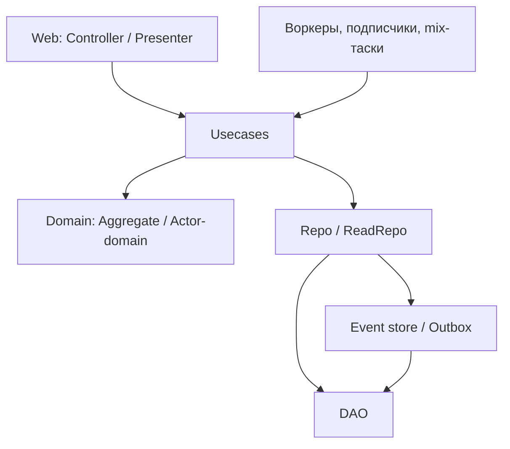

# Архитектура приложения

- **Область.** `lib/**`, `config/**`: namespaces, раскладка файлов, границы `boundary`, акторы,
  usecases, DI, композиционный корень, конфигурация библиотеки.
- **Читать перед.** Новым BC, актором, usecase или модулем; переносом модулей между слоями;
  правкой DI, дерева `boundary` и конфигурации `:core`.
- **Словарь.** Плейсхолдеры и модальность — `deps/core/docs/rules/00-index.md`.

Границы самой библиотеки, контракт `Core.Config`, адаптеры брокеров и состав `Core.Web.*`
нормирует `deps/core/docs/rules/10-architecture.md`. Здесь — то, что обязано быть сделано
**на стороне приложения**.

## Top-level namespaces

Потребитель — один Mix-проект с одним `otp_app` и одним `DAO`; umbrella не поддерживается.
`otp_app:` списком у `TagsCase` — частный случай ратчета, а не заявка на поддержку.

| Namespace | Path | Назначение |
|---|---|---|
| `Core` | зависимость `:core` | shared-фундамент: `Prim`, `Enum`, `Codec`, `View`, `Context`, `Error`, `Es`, `Repo`, `Outbox`, `Mq`, `PubSub`, `Web`, `Helper` |
| `MyApp.Application` | `lib/my_app/application.ex` | композиционный корень: проверки конфигурации на старте и дерево процессов, включая процессы Core |
| `MyApp.Codec` | `lib/my_app/codec.ex`, `lib/my_app/codec/` | граница кодека: Prim-профили `Prim.{Internal,External}`, entity-фасады `{Internal,External}`, реестр плагинов (см. «Boundary») |
| `MyApp.Domain.<BC>` | `lib/my_app/domain/<bc>.ex`, `lib/my_app/domain/<bc>/` | bounded context — граница верхнего уровня: оглавление — корень границы, каталоги агрегатов и уровня контекста (см. «Раскладка», «Boundary») |
| `MyApp.Outbox` | `lib/my_app/outbox/` | OTP-дерево очереди: writer + поллер + cleaner |
| `MyApp.Projections` | `lib/my_app/projections.ex` | список проекций и опции их дерева (`17-otp-concurrency.md`, «Проекции и процессы агрегата») |
| `MyApp.Processes` | `lib/my_app/processes.ex` | список процессов агрегатов и их опции (`17-otp-concurrency.md`, «Проекции и процессы агрегата») |
| `MyApp.PromEx` | `lib/my_app/prom_ex*` | плагины метрик и MFA-провайдеры списков |
| `MyApp.ContextFactory` | `lib/my_app/context_factory.ex` | сборка `%Context{}` вне web |
| `MyApp.DAO` | `lib/my_app/dao.ex` | единственный `Ecto.Repo` |
| `MyApp.StreamID` | `lib/my_app/stream_id.ex` | namespace UUIDv5 идентификаторов из ключа (`13-repos.md`) |
| `MyApp.MetricsServer` | `lib/my_app/metrics_server.ex` | сервер метрик вне `Endpoint` (`21-observability.md`) |
| `MyApp.Release` | `lib/my_app/release.ex`, `lib/my_app/release/` | задачи релиза без Mix: миграции через `bin/my_app eval`; задачи оператора, общие для mix-таски и `bin/` |
| `Mix.Tasks.*` | `lib/mix/tasks/` | mix-таски приложения (см. «Boundary» и «Раскладка») |
| `MyAppWeb` | `lib/my_app_web/` | HTTP-поверхности, плаги, презентеры |

Модуль верхнего уровня, не попавший в таблицу, — либо подсистема приложения (см. «Раскладка»),
либо признак того, что слой выбран неверно.

## Раскладка

Путь файла от `lib/` MUST совпадать с именем модуля в snake_case:
`MyApp.Domain.<BC>.<Aggregate>.Repo` лежит в `lib/my_app/domain/<bc>/<aggregate>/repo.ex`. Имя
модуля — ключ поиска: файл находится по нему без обхода дерева, а модуль не по пути не найдёт ни
читатель, ни агент.

- Сверяется `Macro.underscore` имени модуля, а не обратное преобразование пути: аббревиатура
  `MyApp.HTTPClient` лежит в `lib/my_app/http_client.ex`.
- Верхнеуровневый модуль в файле MUST быть один. Вложенный `defmodule` следует за родителем и
  своего файла не требует — кроме события и команды: вложенные в семейство
  `<Aggregate>.Event` / `<Aggregate>.Cmd`, они MUST лежать каждое в своём файле (`13-repos.md`,
  «Событие и команда»). Одноимённые определения в ветках `if` — один модуль.
- Mix-таска MUST лежать по конвенции Mix — по имени задачи, а не по имени модуля:
  `Mix.Tasks.Foo.Bar` (задача `mix foo.bar`) — в `lib/mix/tasks/foo.bar.ex`.
- Дерево `test/` правилом не проверяется.

Проверяется: `deps/core/scripts/boundary_lint.exs --consumer` — правило `module-path`.

### Состав контекста

Bounded context `MyApp.Domain.<BC>` MUST раскладываться вертикалью по агрегату: всё об агрегате —
в его каталоге `<bc>/<aggregate>/`, а то, что не принадлежит одному агрегату, — в каталогах
уровня контекста по виду содержимого. Общая часть `<BC>.Common` и срезы инициаторов на уровне
контекста — MUST NOT: они разносят агрегат, его чтение и его usecases по разным деревьям, и правка
одного понятия идёт через все.

```text
lib/my_app/domain/<bc>.ex                  # оглавление — корень границы контекста
lib/my_app/domain/<bc>/
  <aggregate>.ex                           # агрегат
  <aggregate>/
    cmd.ex, cmd/<name>.ex                  # команды
    event.ex, event/<name>.ex              # события, кодек семейства — event/codec.ex
    errors.ex, outbox.ex                   # каталог ошибок, outbox-маппинг
    repo.ex, repo/pg.ex                    # репозиторий записи
    projection.ex, read_repo.ex, view.ex   # read-модель агрегата
    usecases.ex                            # общее чтение нескольких акторов
    <actor>/usecases.ex                    # usecases актора
    <actor>/read_repo.ex, <actor>/view.ex  # свой ACL-фильтр или своя форма данных актора
  values/<value>.ex                        # значение без агрегата-владельца
  errors.ex                                # ошибки нескольких агрегатов
  <read_model>/                            # read-модель не по агрегату — каталог по назначению
  <operation>/<actor>/usecases.ex          # операция над равноправными агрегатами
  reactions/<name>.ex                      # реакция, которая зовёт usecases нескольких агрегатов
```

- Актор — инициатор операций: роль пользователя или системный процесс (фоновые задачи, импорт,
  подписчики брокера). Его usecases над агрегатом — модуль `<Aggregate>.<Actor>.Usecases` в
  подкаталоге актора; чтение, общее нескольким акторам, — `<Aggregate>.Usecases`. Имя актора
  свободно: `Admin`, `Client`, `System`. Актор MAY не совпадать с типом учётной записи: это роль
  в контексте.
- Свой ReadRepo и View актора MAY лежать в его подкаталоге, только когда у актора свой ACL-фильтр
  или своя форма данных: таблица, проекция и схема остаются общими (`13-repos.md`, «Read-модель»).
  В остальных случаях акторы читают и пишут общие модули каталога агрегата.
- Usecases актора, которые зовут не из web, а из воркеров, подписчиков и mix-тасок, MUST получать
  актора от `ContextFactory` (`11-domain.md`), а не собирать контекст на месте.
- Значение без агрегата-владельца MUST лежать в `values/` — `MyApp.Domain.<BC>.Values.<Value>`,
  ошибки нескольких агрегатов — в `<BC>.Errors`, read-модель не по агрегату — каталогом по
  назначению рядом с агрегатами, реакция на события нескольких агрегатов — в `reactions/`
  (`17-otp-concurrency.md`, «Место компонента»).
- Часть приложения без агрегатов (хранилище файлов, интеграция с внешним сервисом, реестр прав)
  MUST быть подсистемой `MyApp.<Subsystem>` вне `Domain` — своей границей (см. «Boundary»), а не
  контекстом: контекст без агрегатов — граница без модели. Агрегат в подсистеме MUST NOT: появился
  агрегат — это bounded context.
- Техническое состояние без версии и событий (сессии, журнал прогонов, слот взаимоисключения) —
  не агрегат: оно лежит в подсистеме, его хранилище, кеш и чистка — один компонент
  (`17-otp-concurrency.md`, «Место компонента»), репозиторий —
  `MyApp.<Subsystem>.<Name>.Repo{,.Pg}` с резолвом через `Core.Config.repo!/1`.
- Тип, который вводит модель контекста и который его агрегат хранит в состоянии (пространство
  имён у разрешений), MUST лежать в каталоге этого агрегата, а общий нескольким агрегатам — в
  `values/`: это часть модели, и вынос в подсистему разрезал бы её ссылками в обе стороны.
  Механизм над моделью (макрос DSL, проверка, реестр механизма) SHOULD быть подсистемой: он читает
  модель, а модель его не знает. Правило режет по модулю: DSL, общий для usecases всех контекстов,
  делится на типы модели в контексте и механизм в подсистеме. Билдер, который модель сама
  подключает (`use` в агрегатах контекста), — часть модели и лежит в контексте; реестр адаптеров
  одного контекста (каналы доставки уведомлений) MAY остаться в нём.
- Собственный тип подсистемы (ключ объекта хранилища файлов) остаётся в подсистеме, даже если его
  хранит агрегат: ссылка контекста на подсистему разрешена, и связь односторонняя. Значение,
  общее нескольким контекстам, лежит в контексте, который его вводит; остальные видят его через
  `exports` этого контекста (`11-domain.md`, «Prim и Enum»).
- Ключ механизма, который агрегат не читает ни в состоянии, ни в решениях (`decide` / `evolve`), а
  читают только механизм и его декларации в usecases, MUST лежать у механизма, а не в агрегате
  (`<Aggregate>.ns/0` — в реестре механизма): иначе каждый контекст ссылается на типы механизма, и
  контексты замыкаются в цикл. Декларация называет ключ реестра атомом, механизм проверяет его при
  компиляции.
- Линтер признаки типа модели, механизма и ключа не проверяет: отступление — строка `DEBT.md`
  (`deps/core/docs/adr/0025-model-types-in-common.md`).

Проверяется: `deps/core/scripts/boundary_lint.exs --consumer` — правило `bc-root`: часть
`<BC>.Common` и срез — namespace `<BC>.<X>.Usecases` с usecases по сценарию, который сам модулем не
объявлен. Нарушение одно на часть и ставится на её первый модуль по пути. Остаток среза без
usecases по сценарию (actor-репозиторий `<BC>.<Actor>.<Aggregate>.ReadRepo`, воркер среза) от
каталога агрегата по имени не отличить, и правило его не видит.

### Модуль-оглавление

У каждого контекста MUST быть модуль-оглавление `MyApp.Domain.<BC>` в `lib/my_app/domain/<bc>.ex` —
корень его границы: `use Boundary` с `deps` и `exports` (см. «Boundary»). Без него контекст не
граница, а его состав читается только по дереву каталогов. Оглавление лежит на уровне `domain/`,
рядом с каталогом контекста, а не внутри него.

`@moduledoc` оглавления SHOULD давать карту контекста: назначение, агрегаты, акторы, read-модели,
компоненты, ссылки на другие контексты.

```elixir
defmodule MyApp.Domain.Orders do
  @moduledoc """
  Заказы: оформление, оплата и отгрузка заказа клиента.

  - Агрегаты: `Order` (event-sourced), `Cart`.
  - Акторы: `Client` — оформление и отмена; `Admin` — ручная отгрузка; `System` — отмена
    неоплаченных по таймеру.
  - Read-модели: карточка заказа — в каталоге `Order`, очередь отгрузки `Backlog` — по назначению.
  - Компоненты: подписчик оплат `Payments`, фоновая задача отмены `Expiry`.
  - Другие контексты: цены и счета — `MyApp.Domain.Billing`, через его `exports`.
  """

  use Boundary,
    deps: [MyApp.Codec, MyApp.Infra, MyApp.Domain.Billing],
    exports: [
      Order.Client.Usecases,
      Order.Admin.Usecases,
      Order.View,
      Order.ID,
      {Order.Event, []},
      Cart.Client.Usecases,
      Cart.ID
    ]
end
```

Проверяется: `deps/core/scripts/boundary_lint.exs --consumer` — правило `bc-index`: каталог
`lib/my_app/domain/<bc>/` без модуля `MyApp.Domain.<BC>` или оглавление без `use Boundary`; опции
границы и содержание `@moduledoc` не проверяются.

### Направления зависимостей

- Контекст, подсистема и точки входа MUST ссылаться на контекст только через его `exports` —
  модули usecases, View, типы ID и события (см. «Boundary»): агрегат, репозиторий и read-модель
  контекста — его внутреннее устройство. Ссылка на модуль вне `exports` — предупреждение
  `boundary`, в пайплайне — ошибка сборки.
- Цикл между контекстами MUST NOT: взаимные ссылки — признак одной модели, и `boundary` ловит цикл
  сборкой. Цикл, который сейчас не развязать, MAY оформляться `dirty_xrefs` на одной стороне и
  строкой `DEBT.md` с причиной и условием снятия: склеить контексты или развернуть зависимость —
  решение карты контекстов. Ненужный `dirty_xrefs` `boundary` репортит сам, и исключение не
  переживает свою причину (`deps/core/docs/adr/0037-vertical-layout-context-boundary.md`).
- Внутри контекста направлений нет: каталоги агрегатов, акторов и уровня контекста — одна
  граница. Место операции над несколькими агрегатами — «Usecases».
- Контекст MAY звать подсистему `MyApp.<Subsystem>`, объявив её в `deps`: связь остаётся
  односторонней.
- Точки входа — `MyAppWeb` и `Mix.Tasks.*` — зовут модули usecases контекстов.
- Задача оператора, общая для mix-таски и `bin/` (стартовая инициализация, наполнение стенда),
  MUST лежать в `MyApp.Release.<Name>`, а не модулем верхнего уровня: модуль вне таблицы
  namespaces — подсистема, а не точка входа.

```elixir
# плохо — чужой контекст читает репозиторий контекста мимо его exports
defmodule MyApp.Domain.Orders.Order.Client.Usecases do
  alias MyApp.Domain.Billing.Invoice.ReadRepo
  require Core.Config
  @read_repo Core.Config.repo!(ReadRepo)
  def checkout(id, context), do: @read_repo.get(id, context)
end

# хорошо — через экспортированный модуль usecases
defmodule MyApp.Domain.Orders.Order.Client.Usecases do
  def checkout(id, context), do: MyApp.Domain.Billing.Invoice.Usecases.get(id, context)
end
```

Проверяется: `mix compile --warnings-as-errors` — нарушения `boundary` (см. «Boundary»).

### Отступление

Отступление MUST быть записано строкой в `DEBT.md` приложения и отмечено маркером в блоке
комментариев прямо над `defmodule`. Маркер называет правило и строку `DEBT.md`:

```elixir
# boundary-lint: allow module-path — DEBT.md, «Файл не по имени модуля»
defmodule MyApp.Domain.<BC>.<Aggregate>.Repo do
```

- Маркер гасит нарушения только своего правила и только в строках своего модуля: нарушение DI
  (`13-repos.md`) в том же модуле ловится по-прежнему. Исключения — `bc-index` и `bc-root`:
  нарушение `bc-index` принадлежит каталогу контекста, и его гасит маркер над любым `defmodule` в
  оглавлении и в файлах `lib/my_app/domain/<bc>/`; нарушение `bc-root` принадлежит части —
  `Common` или срезу, — и его гасит маркер над любым её модулем.
- Маркер без ссылки на раздел `DEBT.md` (`DEBT.md, «<раздел>»`) не гасит ничего; хвостовой
  комментарий строки кода маркером не считается.
- Список исключений в конфигурации линтера MUST NOT: он расходится с кодом, а маркер виден на
  ревью рядом с отступлением (`deps/core/docs/adr/0023-consumer-layout-enforced.md`).

| Правило маркера | Что проверяет |
|---|---|
| `module-path` | путь файла = имя модуля, один верхнеуровневый модуль в файле, конвенция Mix, событие и команда не вложены в семейство |
| `bc-index` | каталог контекста без модуля-оглавления, оглавление без `use Boundary` |
| `bc-root` | `Common` или срез на уровне контекста — раскладка до вертикали |
| `projection-layout` | проекция не ровно `<BC>.<ReadModel>.Projection`, отдельный модуль записи `*.Projector` под `ReadRepo` (`13-repos.md`, «Проекции read-модели») |
| `web-root` | модуль в корне `MyAppWeb` вне таблицы и не поверхность (`15-web-api.md`, «Раскладка») |

Проверяется: `deps/core/scripts/boundary_lint.exs --consumer` (шаг `boundary-check`,
`20-agreements.md`) — правила таблицы, только `lib/`.

## Обязательства перед библиотекой

Всё, что библиотека знает о приложении, лежит под её собственным ключом `config :core`. Ключи,
их обязательность и дефолты — `deps/core/docs/rules/10-architecture.md`, «Контракт конфигурации».

- `MyApp.DAO` MUST объявляться через `use Core.DAO`, а не `use Ecto.Repo`: иначе after-commit
  хуки (wake поллера outbox, эталон `Repo.Sc`) молча не выполняются, и ошибка проявится
  отложенной доставкой и перезаписью дочерних строк, а не падением.
- Состав реестра плагинов фасада, включая `Core.Outbox.Codec`, — `11-domain.md`, «Фасады и
  реестр плагинов».
- `otp_app` MUST лежать в `config.exs`: его читает `Core.Config.repo!/1` на компиляции каждого
  call site, и в `runtime.exs` он опоздает.
- `telemetry_prefix` MUST задаваться явно, даже когда совпадает с дефолтом `[otp_app()]`: он
  входит в имена telemetry-событий Core, и обработчики приложения, подписанные на них литералом
  имени, обязаны пережить смену `otp_app`. Имена метрик от него не зависят — их префикс задаёт
  `otp_app` модуля `use PromEx` (`PromEx.metric_prefix/2`) (`21-observability.md`).
- Клиент используемого брокера MUST быть объявлен в `deps` приложения: в библиотеке он
  `optional: true`, и без записи в `deps` адаптеров `Core.Mq.*` просто нет. После добавления или
  удаления клиента — `mix deps.compile core --force`, иначе адаптер останется в том состоянии, в
  каком его собрали.
- Ключи под `:my_app` — только подмена конвенции `<Behaviour>.Pg` (`13-repos.md`) и настройки
  подсистем самого приложения.

Старт MUST проверять конфигурацию до подъёма дерева — неверная конфигурация роняет старт, а не
всплывает на первом запросе (`17-otp-concurrency.md`):

```elixir
Core.Config.validate!()
Core.Security.Secret.ensure_configured!()
```

- Проверка адаптера MUST стоять на каждый используемый адаптер брокера и только на него:
  `Core.Mq.Stream.ensure_available!/0`, `Core.Mq.Kafka.ensure_available!/0`.
- Проверки старта компонента в `start/2` MUST NOT — они живут в его корне
  (`17-otp-concurrency.md`, «Компонент»): `Core.Outbox.check_singleton!/1` и
  `Core.Outbox.validate_partition!/1` зовёт корень очереди (`14-events-outbox.md`, «Единственность
  поллера»).

## Файлы `config/`

Место значения задаёт момент, когда его читают: на компиляции, на старте релиза или только в
тестах.

| Файл | Что в нём |
|---|---|
| `config.exs` | `compile_env` и DI-подмены: `config :core` (`otp_app`, `telemetry_prefix`), подмена `<Behaviour>.Pg` (`13-repos.md`, «DI»), `.Cached` и TTL кеша (`16-caching.md`, «Конфигурация») |
| `runtime.exs` | env и тумблеры: `OUTBOX_*` (`14-events-outbox.md`, «Конфигурация»), тумблеры поддеревьев и опции процессов, `ES_PROJECTIONS_*` (`17-otp-concurrency.md`), тумблер инвалидатора кеша (`16-caching.md`) |
| `test.exs` | тестовый overlay: очередь выключена (`14-events-outbox.md`), кеш на `.Pg` (`16-caching.md`), тестовый plug HTTP-клиентов (`19-testing.md`, «Внешние зависимости»), сервер метрик и PromEx выключены (`21-observability.md`, «Сервер метрик») |
| `dev.exs`, `prod.exs` | настройки окружения без секретов и env: уровень логов, `debug_errors`, `force_ssl` |

Секреты площадок и чтение env в `dev.exs` / `prod.exs` MUST NOT, их место — `runtime.exs`:
`prod.exs` исполняется на сборке, и значение запекается в релиз — секрет попадает в артефакт, а env
берётся с машины сборки, а не с площадки; env в `dev.exs` — второй источник рядом с
`runtime.exs`, и они разойдутся. Локальные учётные данные разработки (пароль базы в контейнере)
секретом площадки не являются.

```elixir
# плохо — config/prod.exs: значение машины сборки, секрет в артефакте
config :my_app, MyApp.DAO, password: System.fetch_env!("DB_PASSWORD")

# хорошо — config/runtime.exs
if config_env() == :prod do
  config :my_app, MyApp.DAO, password: System.fetch_env!("DB_PASSWORD")
end
```

## Boundary

Каждый модуль `lib/` MUST принадлежать границе `boundary`: модуль вне границ Boundary репортит
предупреждением, и в пайплайне это ошибка сборки.

| Boundary | `deps:` | Что внутри |
|---|---|---|
| `MyApp.Domain.<BC>` | контексты, от которых зависит, `MyApp.Codec`, `MyApp.Infra`, подсистемы | bounded context: корень — оглавление, `exports` — модули usecases, View, типы ID, события, плагины кодека |
| `MyApp.Codec` | — (`check: [out: false]`) | Prim-профили, entity-фасады, реестр плагинов |
| `MyApp.Infra` | `[]` | сток без зависимостей на домен: `DAO`, `StreamID` |
| `MyApp.<Subsystem>` | контексты, которые она читает, `MyApp.Infra` | подсистема приложения |
| `MyAppWeb` | контексты, `MyApp.Codec` | web-слой |
| `MyApp.Application` | контексты, `MyAppWeb`, `MyApp.Infra` | композиционный корень |
| `MyApp.PromEx` | контексты, `MyAppWeb` | обвязка наблюдаемости |

- Bounded context MUST быть границей верхнего уровня, а `MyApp` границей не является
  (`deps/core/docs/adr/0037-vertical-layout-context-boundary.md`).
- `exports` контекста — модули usecases (`<Aggregate>.<Actor>.Usecases`, `<Aggregate>.Usecases`),
  View, типы ID, модули событий и их семейства, плагины кодека; агрегат, репозиторий, схемы,
  проекция и ReadRepo в него не входят. Семейство событий MAY экспортироваться целиком —
  `{<Aggregate>.Event, []}`: члены, нагрузки и кодек семейства.
- `MyApp.Codec` MUST нести `check: [out: false]`: фасад знает плагины всех контекстов, контексты
  зовут фасад, и без него это цикл границ. Контексты объявляют `deps: [MyApp.Codec]`, кодек —
  ни одного.
- `MyApp.Infra` — сток: от него зависят контексты, а `MyAppWeb` держать его в `deps` MUST NOT.
- `Core.*` в `deps:` MUST NOT перечисляться: `boundary` размечает модули этого приложения, а
  чужое OTP-приложение его проверками не покрыто.
- `Application` и `PromEx` — отдельные границы: только они сводят контексты и web вместе (старт
  `Endpoint`, PromEx-плагин Phoenix с `endpoint:` / `router:`). Контекстам и стоку ссылаться на
  `MyAppWeb` MUST NOT.
- Mix-таски лежат вне дерева `MyApp.*` — им нужен явный
  `use Boundary, classify_to: MyApp.Application`.
- Цикл между контекстами и его оформление `dirty_xrefs` — «Направления зависимостей».

Проверяемая часть инварианта MUST выноситься в архитектурный тест: web-слой не ссылается на
`*Repo` и `DAO`. Исключение — `Core.Repo.Sc`: это shadow copy контекста, а не репозиторий.

Проверяется: `mix compile --warnings-as-errors`, архитектурный тест (`19-testing.md`).

## Usecases

Модуль usecases MUST называться `MyApp.Domain.<BC>.<Actor>.Usecases.<Usecase>`: `<Usecase>` —
имя usecase, по умолчанию имя агрегата, над которым он работает (`Usecases.Order`). Операция над
несколькими агрегатами SHOULD быть своим usecase со своим модулем, а не ложиться в модуль одного из
них: второй агрегат из имени не виден, и usecase ищут не там, где он лежит.

- Операция над несколькими агрегатами — запись (`append` / `insert` / `update` / `save` / `delete`)
  в два агрегата и больше, ни один из которых не подчинён другому. Чтение соседа — не запись.
  Подчинённость определяется происхождением id: id подчинённого выводится из id главного, главный
  хранит id подчинённого, или подчинённый хранит id главного и без него не существует (черновик
  операции над агрегатом). Запись в главный и подчинённый — одна операция: она лежит в
  `Usecases.<Aggregate>` того агрегата, чей id пришёл командой, — отметка в главном о действии над
  подчинённым — часть операции над подчинённым.
- Хелпер чтения, общий для usecases одного среза (найти позицию, собрать контекст проверки), MAY
  лежать в `<Actor>.Usecases.<Aggregate>.Query`: он только читает, а load и save остаются в самом
  usecase (`deps/core/docs/rules/20-agreements.md`, «Load/save агрегата — в одной функции»).
- Usecase, который пишет агрегаты двух контекстов, лежит в срезе контекста, который уже зависит от
  второго, и пишет второй через его `Common` (репозиторий, агрегат): ссылка на срез второго —
  `foreign-slice`.
- Команда над несколькими event-sourced агрегатами возвращает версию того агрегата, чью проекцию
  ждёт граница (`15-web-api.md`, «Ожидание проекции»), и называет его в `@doc`.
- Ждать проекцию usecase MUST NOT — это решение вызывающего:
  `deps/core/docs/rules/22-projections.md`, «Read-after-write»; у HTTP — `15-web-api.md`,
  «Ожидание проекции».

```elixir
# плохо — оформление меняет корзину и заказ, а лежит в модуле корзины
defmodule MyApp.Domain.Orders.Client.Usecases.Cart do
  def checkout(cart_id, context), do: ...
end

# хорошо
defmodule MyApp.Domain.Orders.Client.Usecases.Checkout do
  def run(cart_id, context), do: ...
end
```

Конвенция тела:

1. Authz — до открытия транзакции.
2. Актор: `CurrentUser.get(context)` → `by` — там же, до транзакции.
3. Load → мутация домена → persist — внутри `Transact.run`.
4. `%Context{}` — последний из данных (`deps/core/docs/rules/20-agreements.md`, «Context — последний
   из данных»).

Authz и резолв актора MUST идти до открытия транзакции: проверка прав ходит в read-путь, а тот
в dev и prod MAY быть закеширован, и внепроцессный сайд-эффект внутри транзакции запрещён.
Транзакционности с самой командой проверка доступа не требует — отказ по правам это отказ до
начала работы.

Возвраты по CQS (`deps/core/docs/rules/20-agreements.md`):

| Вид | Возврат |
|---|---|
| Команда | `:ok \| {:error, Error.t()}` |
| Команда-создание | MAY `{:ok, <Aggregate>.ID.t()}` — идентификатор генерирует домен |
| Команда event-sourced агрегата | `{:ok, Version.t()}`; создание — `{:ok, {<Aggregate>.ID.t(), Version.t()}}` |
| Запрос | `{:ok, <ReadModel>.View.t()} \| {:error, Error.t()}` — read-путь отдаёт представление |

Идентификатор созданного агрегата и версия после записи — результат собственного выполнения
команды, а не отступление от CQS (`deps/core/docs/rules/20-agreements.md`, «Разделение изменения и
чтения (CQS)»): без id вызывающий искал бы созданный агрегат отдельным запросом, по версии граница
ждёт проекцию (`15-web-api.md`). Прочие данные агрегата команда не возвращает.

Резолв репозитория — `deps/core/docs/rules/13-repos.md`, «DI».

У команды **event-sourced** агрегата то же тело, но другой состав шагов: `get_decision` →
`Agg.execute/2` → `append` под одной транзакцией `Core.Es.Transact.run/2`, либо
`<Aggregate>.Process.execute` вместо неё. Версию после записи отдают оба пути: у
`Es.Transact.run` — поле `version` состояния из `Agg.execute/2`, у `Process.execute` — его
результат `{:ok, version}`. Отличия, которые видит
usecase (`13-repos.md`, «Event-sourced агрегат»):

- существование агрегата решает `decide` по `version: nil`, а не `:not_found` репозитория; явная
  `%Version{}` на незаведённом агрегате — ошибка домена, если `decide` команду отклоняет, и отказ
  предусловия `:version_mismatch`, если принимает;
- отказ хранилища (`:version_mismatch` с `source: :storage`) повторяется при любой ожидаемой
  версии, сверка ожидаемой версии (`source: :expected`) — нет; повтор даёт `Core.Es.Transact` или
  процесс агрегата (`13-repos.md`, «Повтор после отказа записи»);
- команду собирает usecase (`<Aggregate>.Cmd.<Name>` с `by` и `at` — `11-domain.md`);
- ответ клиенту, которому нужна свежая read-модель, ждёт проекцию — **после** commit, вне
  транзакции (`15-web-api.md`).

```elixir
def command(%Agg.ID{} = id, %Version{} = version, %Context{} = context) do
  with :ok <- check_user(~w(update)a, context),
       {:ok, by} <- CurrentUser.get(context) do
    Transact.run(DAO, fn ->
      with {:ok, agg} <- @repo.get(id, version, context),
           {:ok, agg} <- Actor.Agg.mutate(agg, by),
           {:ok, _saved} <- @repo.save(agg, context) do
        :ok
      end
    end)
  end
end
```

### Что можно внутри `Transact.run`

Транзакция удерживает соединение из пула и блокировки строк на всё время работы колбэка.

| Внутри `Transact.run` | Статус |
|---|---|
| запросы через `DAO` (repo и его flush событий и outbox) | MAY |
| enqueue фоновой задачи в той же транзакции | MAY — задача появится только при успешном commit |
| HTTP-вызовы, publish в брокер, обращения к объектному хранилищу | MUST NOT |
| кеш и прочие внепроцессные сайд-эффекты | MUST NOT |
| `:timer.sleep`, ожидание внешнего события, ожидание проекции | MUST NOT |
| команда процесса агрегата (`<Aggregate>.Process.execute`) | MUST NOT — она идёт своей транзакцией |

Побочный эффект после успешной записи — `Core.Helper.AfterCommit.register/1` либо отдельным
шагом вызывающего. Каскад с внешним вызовом посередине MUST разбиваться на отдельные
транзакции, а не оборачиваться одной вокруг всего.

Границы, которые ходят по сети, MUST звать `Core.Helper.Transact.warn_in_transaction/1`:
нарушение попадает в лог как `error`, а не всплывает деградацией пула под нагрузкой.

## Слои и зависимости


```mermaid
flowchart TB
  Web["Web: Controller / Presenter"]
  Worker["Воркеры, подписчики, mix-таски"]
  UC["Usecases"]
  Domain["Domain: Aggregate / Actor-domain"]
  Repo["Repo / ReadRepo"]
  Store["Event store / Outbox"]
  DAO["DAO"]

  Web --> UC
  Worker --> UC
  UC --> Domain
  UC --> Repo
  Repo --> Store
  Repo --> DAO
  Store --> DAO
```

- Web вызывает usecases: мутации domain и вызовы repo / DAO из web — MUST NOT; разбор параметров
  в Prim и ожидание проекции — MAY (`15-web-api.md`).
- Воркеры, подписчики и mix-таски — такие же вызывающие, как web: оркестрация прогона, но не
  доменные мутации.
- Usecases оркестрируют domain и репозитории; authz живёт здесь.
- Domain не пишет в БД и не знает про Ecto.
- Repo пишет состояние и — при наличии — события с outbox в одной транзакции.
- Command-путь работает с агрегатом на доменных Prim, query-путь — с `<ReadModel>.View`
  из примитивных значений (`13-repos.md`).

## Связанные правила

- Домен, Codec, `ContextFactory` — `11-domain.md`
- Ошибки и их границы — `12-errors.md`
- Репозитории и DI — `13-repos.md`
- События и outbox — `14-events-outbox.md`
- Web API — `15-web-api.md`
- Дерево процессов — `17-otp-concurrency.md`
- Пайплайн проверок — `20-agreements.md`
